# Add Active Directory Federation Services (AD FS) as an Authentication Connector (OpenID Connect)

## Summary

This article outlines the process of adding Active Directory Federation Services (AD FS) to Netwrix Privilege Secure as an Authentication Connector via OpenID Connect (OIDC). The article is split into two sections, *Steps for AD FS* and *Steps for Netwrix Privilege Secure*. The AD FS section must be completed first.

## Instructions

### Steps for Active Directory Federation Services (AD FS)

1. Launch **AD FS Management** on the AD FS server:

   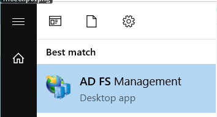

2. Right-click on **Application Groups** and select **Add Application Group…**

   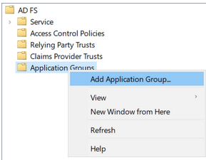

3. Select **Native application accessing a web API** and enter "SbPAM (OIDC)" as the **Name**, then click **Next**.

   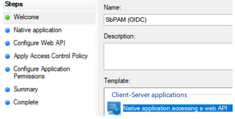

4. Copy the **Client Identifier** value; you will need that when configuring Netwrix Privilege Secure.

   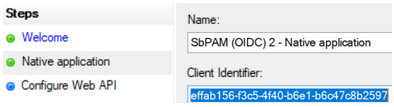

5. For the **Redirect URI**, use the Netwrix Privilege Secure server's URL followed by `/callback`. For example: `https://<sbpam-server>:6500/callback`. Click **Add**, then **Next**.

   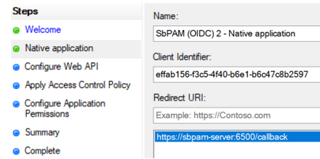

6. For the **Identifier** of the Web API, use the Netwrix Privilege Secure server's URL. Click **Add**, then click **Next**.

   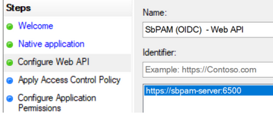

7. For **Apply Access Control Policy**, leave all defaults and then click **Next**.

   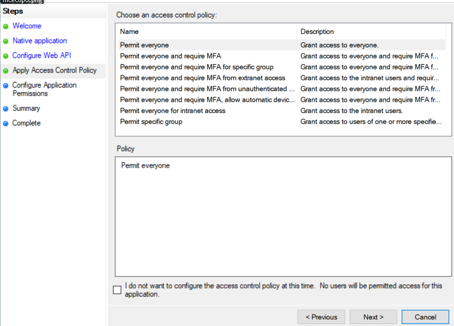

8. For **Configure Application Permissions**, enable the following and then click **Next**:

   - `allatclaims`
   - `openid`
   - `profile`

   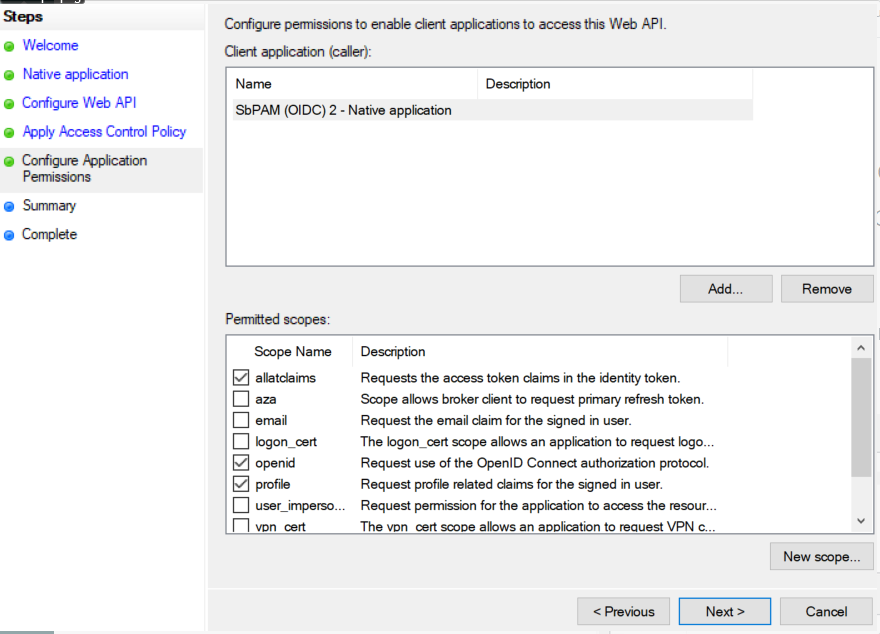

9. Review the Summary, then click **Finish**.

10. Double-click on the newly created Application Group, then double-click on the Web API application, then navigate to the **Issuance Transform Rules** tab. Click **Add Rule...**

    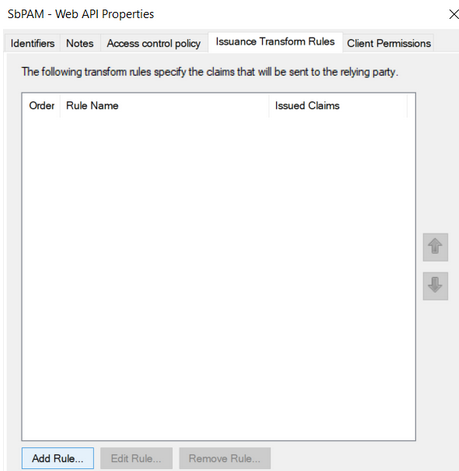

11. From the dropdown, select **Send Claims Using a Custom Rule** and click **Next**.

    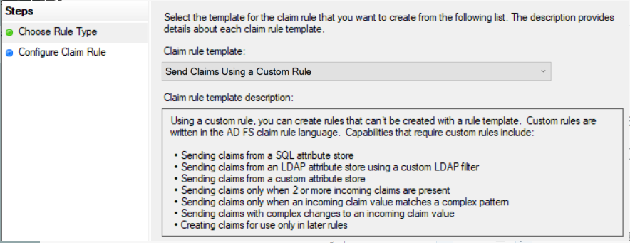

12. Name the rule "Send attributes", and add the following custom rule:

    ```text
    x:[]
      => issue(claim = x);
    ```

    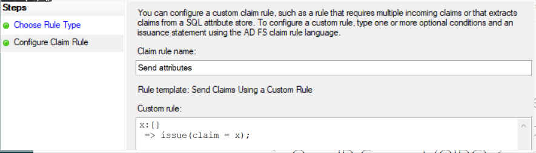

    Click **Finish**, **Apply**, **OK**, then **OK** again. You can now close **AD FS**.

13. Open **PowerShell** as an administrator, and run the following commands to enable CORS for communication between the Netwrix Privilege Secure server and AD FS:

    Before running the commands, make sure you capture any existing CORS settings since the `Set-AdfsResponseHeaders` command will replace the existing values with the provided value.

    ```powershell
    Set-AdfsResponseHeaders -EnableCORS $true
    Set-AdfsResponseHeaders -CORSTrustedOrigins https://<sbpam-server>:6500
    ```

14. This completes the AD FS configuration portion of the guide.

### Steps for Netwrix Privilege Secure

Once the *Steps for AD FS* have been completed, take the following steps in Netwrix Privilege Secure to add AD FS as an Authentication Connector via OIDC.

1. As a Netwrix Privilege Secure administrator, navigate in Netwrix Privilege Secure to **Configuration > Authentication**, and click the green **"+"** button to add a new Authentication Connector.

2. Give the new connector a name, description (optional), and a Connector Type of "OpenID Connect".

   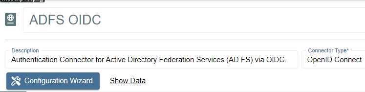

3. Click on **Configuration Wizard**.

4. On the wizard's **Configure Client** page, enter the following values:

   - **Issue URI:** `https://<adfs-server>.domain.com/adfs`
   - **Client Id:** The Client ID noted in the previous steps for **AD FS**.
   - **Callback Address:** `https://<sbpam-server>:6500/callback`
   - **CORS:** `https://<sbpam-server>:6500`

   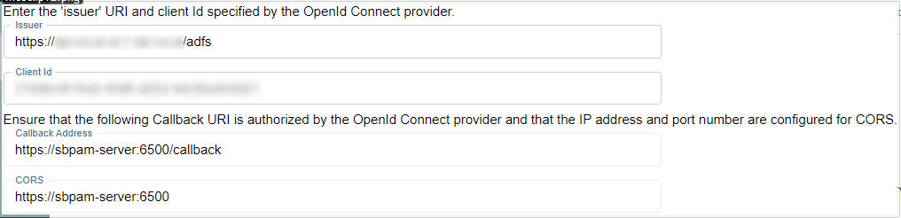

5. Click **Test Connection**. If brought to a log-in page, click **Back** in your web browser and then **Next** in the Netwrix Privilege Secure wizard. If the page refreshes and brings you back to the Netwrix Privilege Secure wizard, you should also click **Next** to proceed.

6. On the **Test Login** page, click **Login**. You'll be brought to an AD FS log-in page. Log in with Active Directory credentials, and you'll be brought back to the same page of the Netwrix Privilege Secure wizard. Click **Next**.

7. Click **Get User Data**. Locate a mapping you would like to use when users sign in to Netwrix Privilege Secure using AD FS, such as an email address or UPN.

   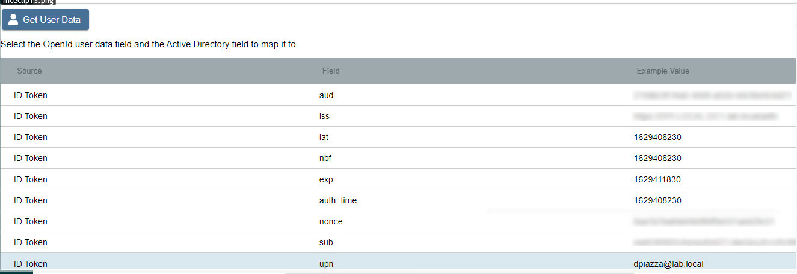

   Click on the mapping, click **Select**, select the matching Active Directory mapping from the displayed dropdown, then click **Finish**.

   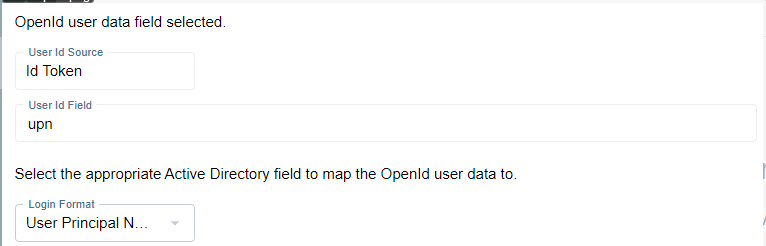

8. The last step is to navigate to specific users in Netwrix Privilege Secure's **Users & Groups** menu, and assign the AD FS OIDC authenticator.

   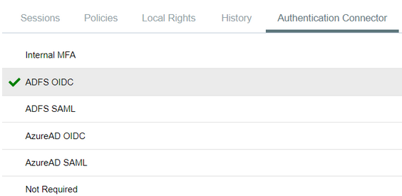

When using the OIDC log-in option, the user will be redirected to log in to AD FS. Upon successful authentication, the user will be redirected to the Netwrix Privilege Secure UI as their now logged-in user.
