# Add Active Directory Federation Services (AD FS) as an Authentication Connector (SAML)

## Summary

This article outlines the process of adding Active Directory Federation Services (AD FS) to Netwrix Privilege Secure as an Authentication Connector via SAML. The article is split into two sections, *Steps for AD FS* and *Steps for Netwrix Privilege Secure*. Complete the AD FS section first.

## Instructions

### Steps for Active Directory Federation Services (AD FS)

1. Launch **AD FS Management** on the AD FS server:
   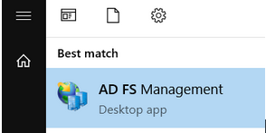

2. Right-click on **Application Groups** and select **Add Application Group…**  
   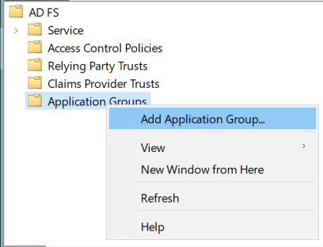

3. Select **Native application accessing a web API** and enter "SbPAM (SAML)" as the **Name**, then click **Next**.  
   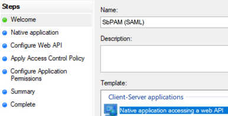

4. Copy the **Client Identifier** value; you will need that when configuring Netwrix Privilege Secure.  
   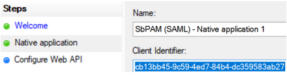

5. For the **Redirect URI**, use the following URI with the hostname of the SbPAM server customized to match your environment. For example: `https://<sbpam-server>:6500/samlSigninCallback`. Click **Add**, then **Next**.  
   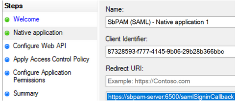

6. For the **Identifier** of the Web API, enter `sbpamsaml.stealthbits.com`, click **Add**, then click **Next**.  
   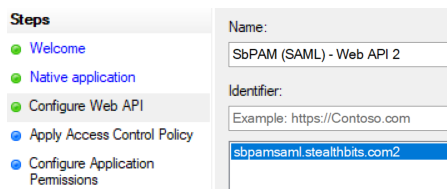

7. For **Apply Access Control Policy**, leave all defaults and then click **Next**.  
   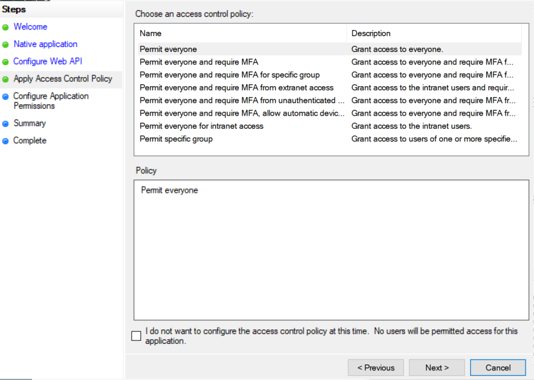

8. For **Configure Application Permissions**, enable the following and then click **Next**:
   - `allatclaims`
   - `email`
   - `openid`
   - `profile`  
   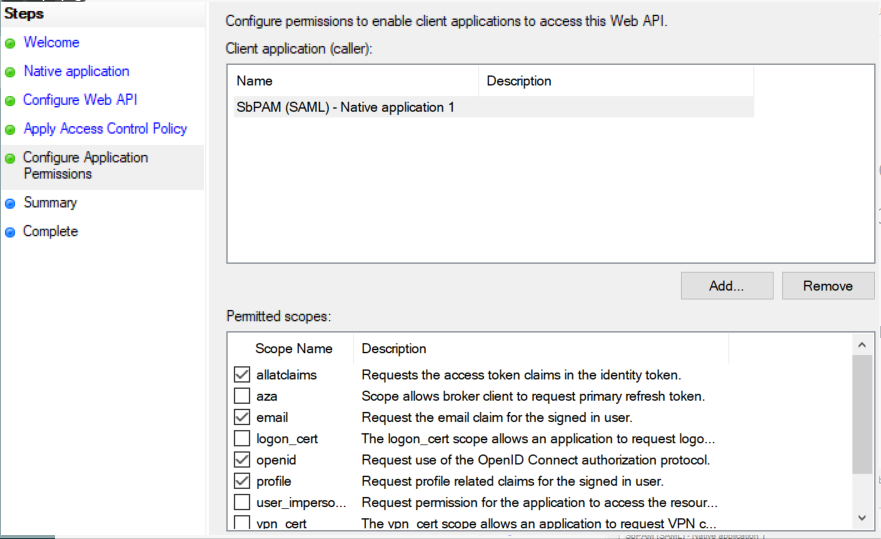

9. Click **Next** on the remaining pages until the wizard completes.

10. In the left sidebar of **AD FS**, click on the **Relying Party Trusts** folder. In the right sidebar, click **Add Relying Party Trust...**  
    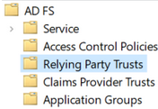

11. Select **Claims aware** and click **Next**.  
    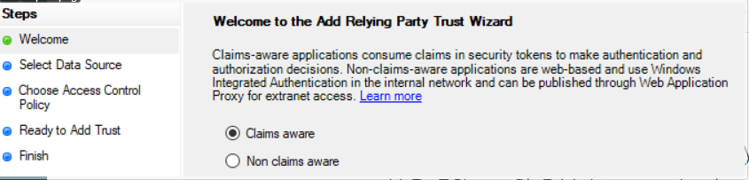

12. For **Select Data Source**, select **Enter data about the relying party manually** and click **Next**.

13. For **Specify Display Name**, enter "SbPAM (SAML)" and click **Next**.

14. For **Configure Certificate**, leave the default values and click **Next**.

15. For **Configure URL**, check **Enable support for the SAML 2.0 WebSSO protocol** and enter your AD FS server's FQDN followed by `/adfs/ls`. For example: `https://adfs-server.domain.com/adfs/ls`. Click **Next**.  
    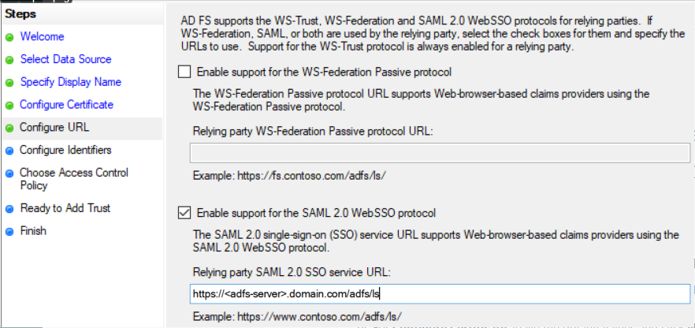

16. For **Configure Identifiers**, use the value `sbpamsaml.stealthbits.com`, click **Add**, then click **Next**.  
    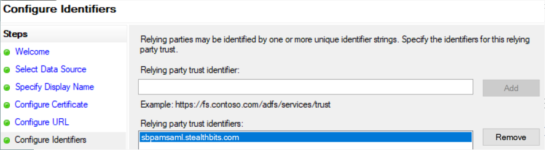

17. Leave **Choose Access Control Policy** as default values and click **Next**, then click **Next** through the remaining pages to finish the wizard.

18. When the wizard closes, a window for **Issuance Transform Rules** will automatically open. Click **Add Rule...**.

19. Select **Send LDAP Attributes as Claims**, and click **Next**.  
    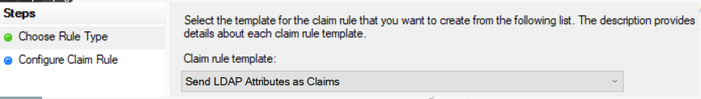

20. Name the rule "Send attributes", select "Active Directory" as the **Attribute store**, map the following **LDAP Attributes** to **Outgoing Claim Types**, click **Finish**, then click **Apply** and **OK**:
    - `SAM-Account-Name` → `Name`
    - `User-Principal-Name` → `UPN`
    - `E-Mail-Addresses` → `E-Mail Address`  
    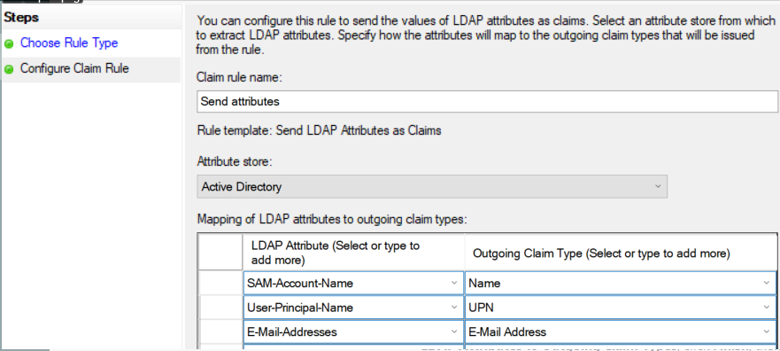

21. Double-click on the **Relying Party Trust** created in the previous steps (named "SbPAM (SAML)"), and navigate to the **Endpoints** tab.  
    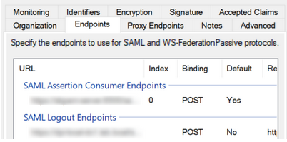

    Add the following endpoints (click **Add SAML...**):

    - Endpoint type: SAML Assertion Consumer  
      Binding: POST  
      Index: 0  
      Trusted URL: `https://<sbpam-server>:6500/samlSigninCallback`  
      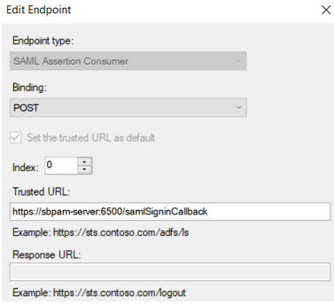

    - Endpoint type: SAML Logout  
      Binding: POST  
      Index: 0  
      Trusted URL: `https://<adfs-server>.domain.com/adfs/ls/?wa=wsignout1.0&wreply=https://<sbpam-server>:6500`  
      Response URL: `https://<sbpam-server>:6500/login`  
      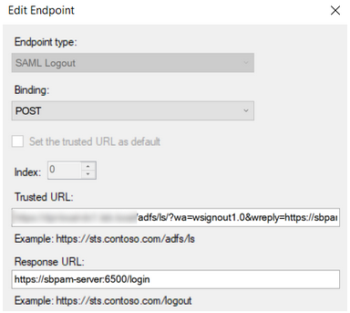

    Click **OK**, **Apply**, then **OK**.

22. This completes the AD FS configuration portion of the guide.

### Steps for Netwrix Privilege Secure

Once the *Steps for AD FS* have been completed, take the following steps in Netwrix Privilege Secure to add AD FS as an Authentication Connector via SAML.

1. As a Netwrix Privilege Secure admin, navigate in Netwrix Privilege Secure to **Configuration > Authentication**, and click the green **"+"** button to add a new Authentication Connector.

2. Give the new connector a name, description (optional), and a Connector Type of "SAML".  
   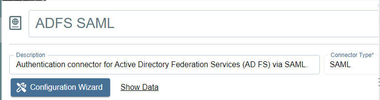

3. Click on **Configuration Wizard**.

4. On the wizard's **Configure Client** page, enter the following values:
   - Signin URI: `https://<adfs-server>.domain.com/adfs/ls`
   - Callback Address: `https://<sbpam-server>:6500/samlSigninCallback`
   - CORS: `https://<sbpam-server>:6500`  
   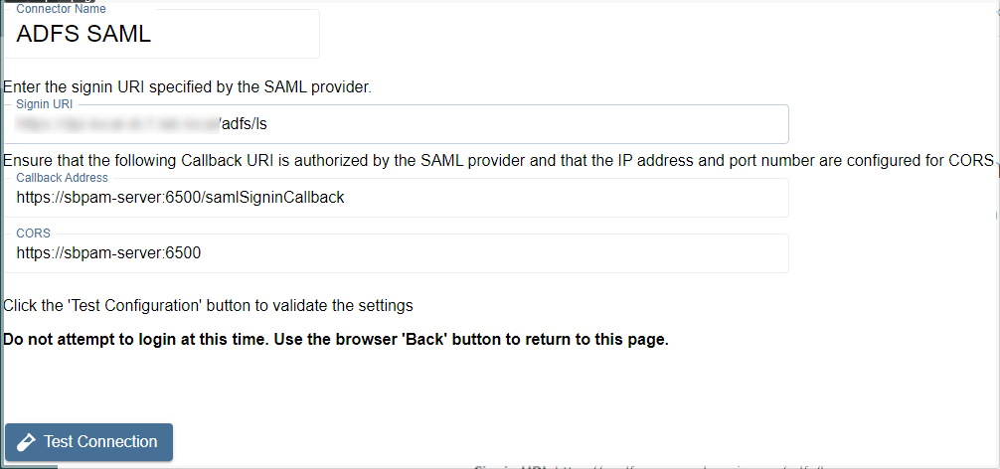

   Click **Test Connection**. If brought to a log-in page, click **Back** in your web browser and then **Next** in the Netwrix Privilege Secure wizard. If the page refreshes and brings you back to the Netwrix Privilege Secure wizard, click **Next** to proceed.

5. Select "Unspecified" for the **Name ID Policy**, and add a certificate if required. Then, click **Login** and sign in to AD FS using Active Directory credentials.  
   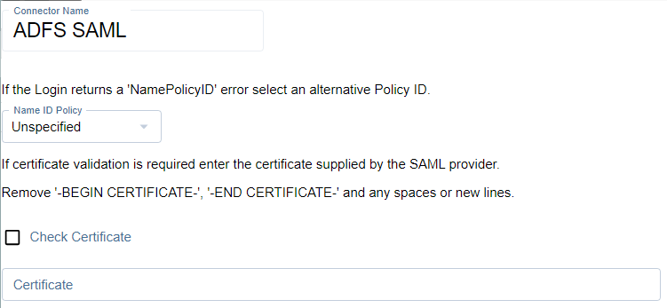

   When redirected back to this page after signing in to AD FS, if the message at the bottom reads "Login was successful" then click **Next**.

6. Locate a mapping you would like to use when users sign in to Netwrix Privilege Secure using AD FS, such as an email address or UPN.  
   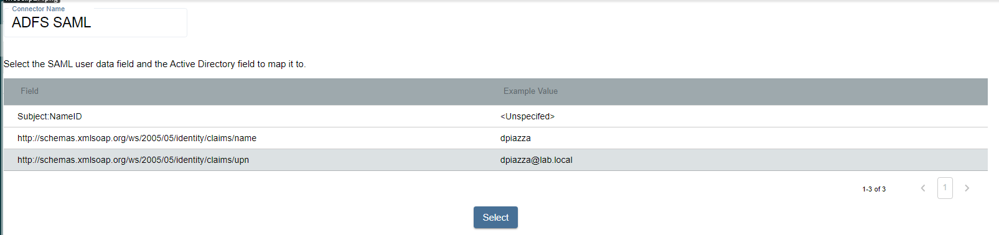

   Click on the mapping, click **Select**, select the matching Active Directory mapping from the displayed dropdown, then click **Next**.  
   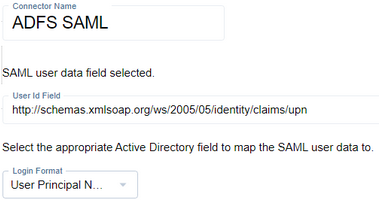

7. For the **Signout URI** and **Signout Callback URI**, use the following values:
   - Signout URI: `https://<adfs-server>.domain.com/adfs/ls/?wa=wsignout1.0&wreply=`
   - Signout Callback URI: `https://<sbpam-server>:6500`  
   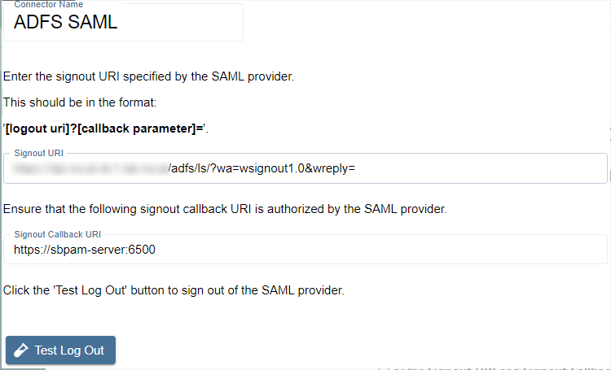

   Click **Test Log Out**, then **Finish** to complete the wizard. AD FS has now been added to Netwrix Privilege Secure (via SAML) as an Authentication Connector.

8. The last step is to navigate to specific users in Netwrix Privilege Secure's **Users & Groups** menu, and assign the AD FS SAML authenticator.  
   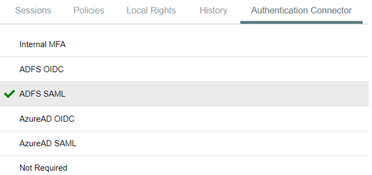

When using the SAML log-in option, the user will be redirected to sign in to AD FS. Upon successful authentication, the user will be redirected to the Netwrix Privilege Secure UI as their now signed-in user.
