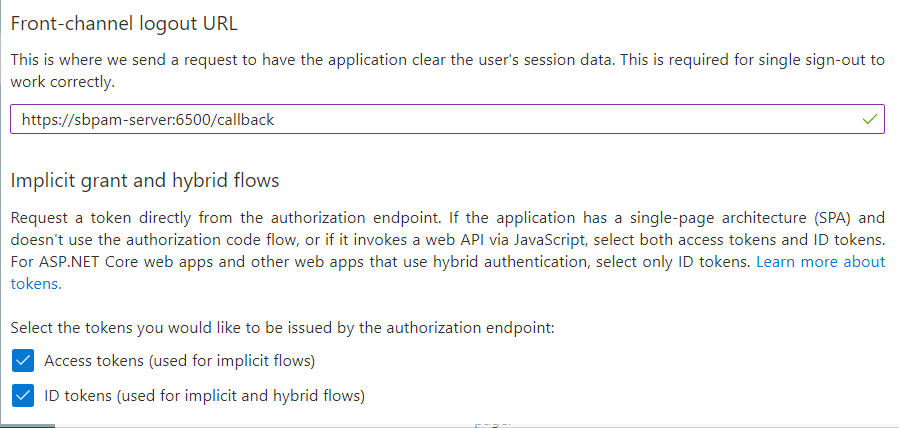
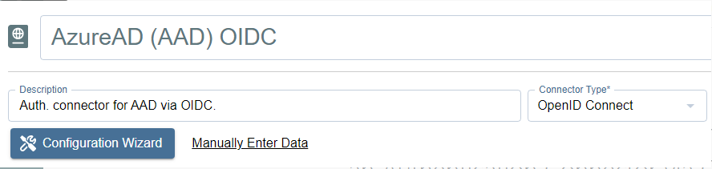
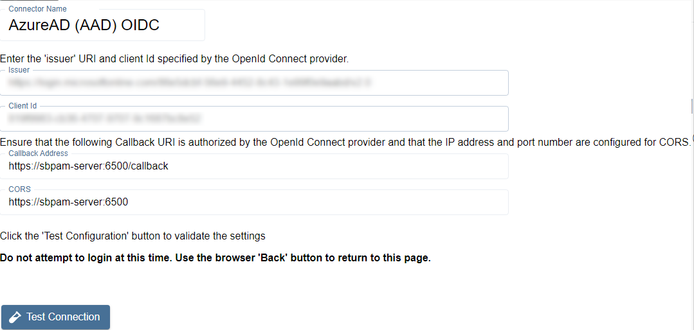
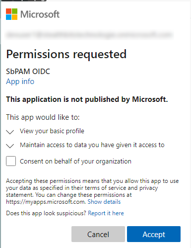
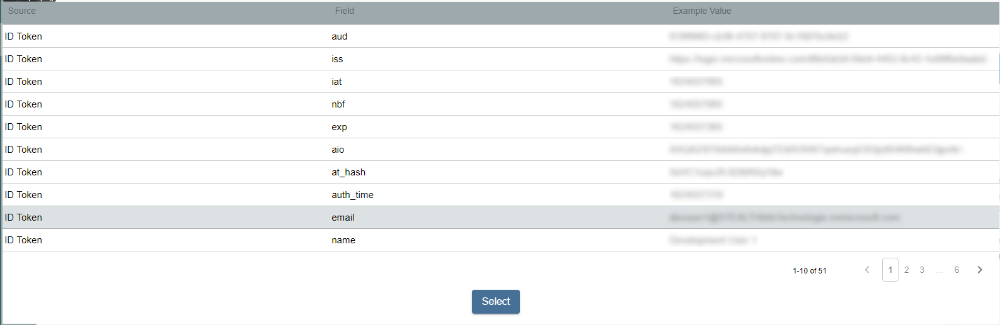
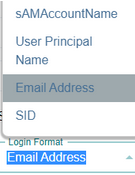
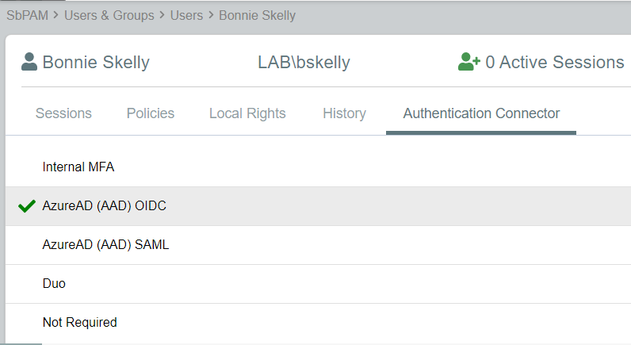
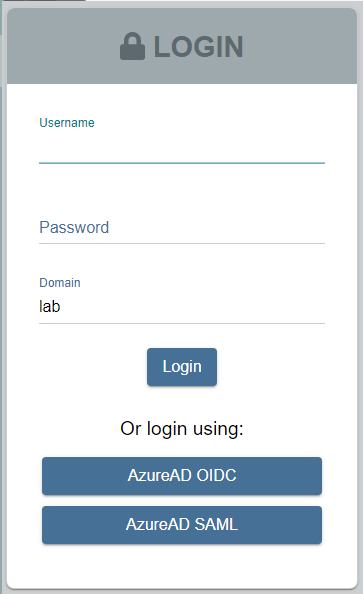

# Add Microsoft Entra ID as an Authentication Connector (OpenID Connect)

## Overview

This article outlines the process of adding Microsoft Entra ID (formerly Azure AD) to Netwrix Privilege Secure as an Authentication Connector via OpenID Connect (OIDC). The article is divided into two sections: **Steps for Microsoft Entra ID** and **Steps for Netwrix Privilege Secure**. Complete the Microsoft Entra ID section first.

## Instructions

### Steps for Microsoft Entra ID

Perform the following steps in Microsoft Entra ID as an administrator to prepare an app registration for use with Netwrix Privilege Secure.

1. Navigate to `https://portal.azure.com/` and sign in to Microsoft Entra ID as an administrator. Create an Enterprise Application.
2. Click **Azure Active Directory** from the left sidebar, then click **App Registrations**. Next, click **New Registration** near the top of the page.
3. Enter a name for the app. For **Redirect URI**, enter the following, replacing `your-sbpam-server-hostname` with the hostname of your Netwrix Privilege Secure server:

   ```
   https://your-sbpam-server-hostname:6500/callback
   ```

   

4. Click **Register**. After registration completes, you will be redirected to the new app's **Overview** page.
5. In the left sidebar, click **Authentication**. Scroll down and enter the same **Callback Address** from Step 3 in the **Front-channel logout URL** field.  
   Enable the following checkboxes:
   - **Access tokens (used for implicit flows)**
   - **ID tokens (used for implicit and hybrid flows)**

   

6. Click **Save** at the top of the page, then return to the app's **Overview** page.
7. Click **Endpoints** near the top of the page. Copy the **OpenID Connect metadata document** URL and open it in a new browser tab.  
   This will display JSON data. To make it easier to read, consider using a JSON browser extension such as **JSON Formatter** for Chromium-based browsers.
8. While viewing the JSON data, find the **Issuer** key. **Copy only the value between the forward slashes**, not the entire line. In this case, it will be a URL.  
   For example:

   ```text
   https://login.microsoftonline.com/<IssuerKey>/v2.0
   ```

9. Close the **Endpoints** sidebar and save the **Application (client) ID** from the **Overview** page.

### Steps for Netwrix Privilege Secure

After completing the **Steps for Microsoft Entra ID**, perform the following steps in Netwrix Privilege Secure to add Microsoft Entra ID as an Authentication Connector via OpenID Connect (OIDC).

1. As a Netwrix Privilege Secure administrator, navigate to **Configuration > Authentication** and click the green **+** button to add a new Authentication Connector.
2. Enter a name and (optionally) a description for the new connector. Set the **Connector Type** to **OpenID Connect**.

   

3. Click **Configuration Wizard**.
4. On the wizard's **Configure Client** page, enter the **Issuer** and **Client ID** (from the **Steps for Microsoft Entra ID**) in the respective fields.

   

5. Click **Test Connection**.  
   On the Microsoft Entra ID sign-in page that loads, **do not sign in**. Once you have verified that the sign-in page loaded properly, click the back button in your browser to return to Netwrix Privilege Secure. The connection test is successful if Microsoft Entra ID did not display an error.
6. Click **Next** to advance in the Authentication Connector Configuration Wizard. You will now be on the **Test Login** page.
7. Click **Login** and sign in as any Microsoft Entra ID user (this does not need to be an administrator). You will be prompted to accept the app's requested permissions. Check **Consent on behalf of your organization** and click **Accept**.

   

8. Click **Next** in the wizard. You will now be on the **Configure Id Mapping** page.
9. Click **Get User Data**.  
   Netwrix Privilege Secure will use the access token to retrieve user data from the OpenID Connect provider. The OpenID Connect provider requires a User Id Field for sign-in.  
   Specify which field in Active Directory should map to that User Id Field, so that Netwrix Privilege Secure can automatically fill in the required credentials at login. The value provided is used to sign in to the multi-factor authenticator (MFA) when a user logs in to the Netwrix Privilege Secure Console.  
   To connect a user from the OpenID Connect provider to a user in the Netwrix Privilege Secure copy of the AD data, map a field in the provider list to a field in the Netwrix Privilege Secure host user table. The exact fields to map will vary between providers and according to the user’s AD configuration.  
   The table displays the retrieved data that can be used for the host user lookup. Select from the displayed records a field that corresponds to a value in your AD configuration. For example, if the AD data contains email addresses, select any of the fields that contain email addresses.  
   **There must be a property for each user in on-premises Active Directory and Microsoft Entra ID that matches. Often, this is an email address.**

   > **IMPORTANT:** Make sure to use a field that has an `ID TOKEN` source, rather than `ACCESS TOKEN`.

   

   Once the desired field has been found, click on it and then click **Select**.
10. You will now be back in the Authentication Connector Configuration Wizard, on the **Configure Id Mapping** page. Make sure the **Login Format** dropdown matches the ID Token field selected from Microsoft Entra ID in the previous step.  
    For example, if you chose **Email** for the field in the previous step, then this dropdown should also be **Email Address**.

    

11. Click **Finish** on the summary modal, and then **Save** for the authentication connector.
12. You can now assign this authentication connector to a user via the **Authentication Connector** tab for a user accessed in Netwrix Privilege Secure's **Users & Groups** page.

    

    Users with this authentication connector assignment can now use this authentication connector option on the Netwrix Privilege Secure log-in screen.

    

    When using the OpenID Connect log-in option, the user will be redirected to sign in to Microsoft Entra ID. Upon successful authentication, the user will be redirected to the Netwrix Privilege Secure UI as their signed-in user.
