# Add  Microsoft Entra ID as an Authentication Connector (SAML)

## Summary

This article outlines the process of adding Microsoft Entra ID (formerly Azure AD) to Netwrix Privilege Secure as an Authentication Connector via SAML. The article is split into two sections, Steps for Microsoft Entra ID and Steps for Netwrix Privilege Secure. The Microsoft Entra ID section must be completed first.

## Instructions

### Steps for Microsoft Entra ID

1. In a web browser, navigate to https://portal.azure.com/ and sign-in as an admin. You’ll need to create an Enterprise Application and gather several pieces of information to complete the Netwrix Privilege Secure **Configuration Wizard** steps later in this article.
2. In Azure, click **Azure Active Directory** from the left sidebar. Then, click **Enterprise Applications** from the left sidebar.
3. Click **New Application** near the top of the **Enterprise Applications** page, followed by **Create Your Own Application** on the page that follows.

   Give the app any name, and set the radio button to **Integrate any other application you don't find in the gallery (Non-gallery)**. Click **Create**.

   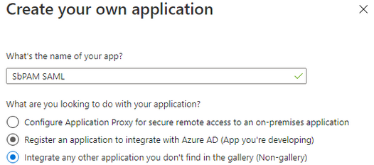

4. You’ll be redirected to the new app’s **Overview** page.

   In the left sidebar, select **Single sign-on**, then select **SAML**.

   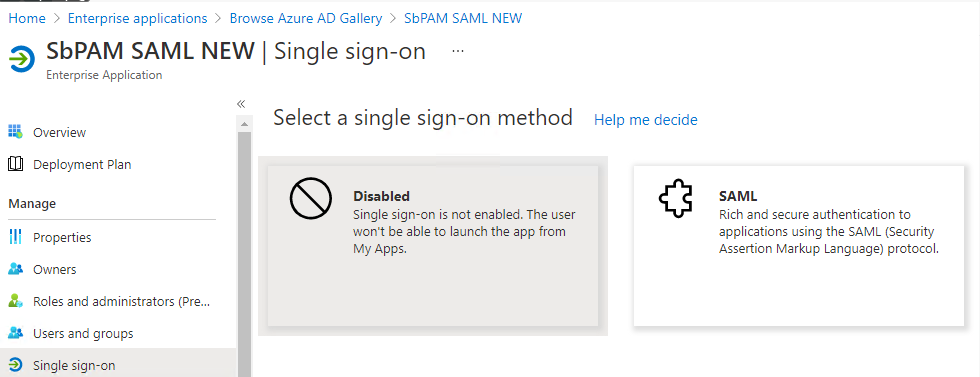

5. For Step 1 in this wizard (**Basic SAML Configuration**), click **Edit**.

   Change the **Identifier (Entity ID)** to `sbpamsaml.stealthbits.com`, and set it to be the default.

   For the **Reply URL (Assertion Consumer Service URL)**, use the following URL (changing the hostname to the hostname used to access Netwrix Privilege Secure via a web browser):

   ```
   https://<sbpam-hostname>:6500/samlSigninCallback
   ```

   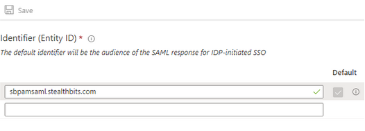

   Click **Save** after making changes, and then close the editor for **Basic SAML Configuration**.

6. Scroll down to section 3, and download the **Certificate (Base64)**.

   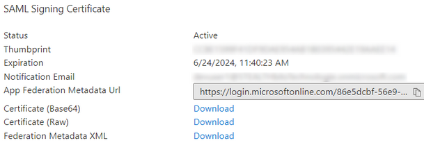

7. Scroll down to section 4, and copy the **Login URL** for later use.

   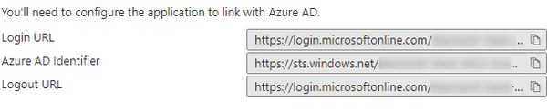

8. In the left sidebar, click on **Users and Groups**. Add a Microsoft Entra ID user to this page (**Add user/group** button near the top).

   This user should be accessible to whoever will complete the Steps for Netwrix Privilege Secure, as they need to be able to log in to this user to complete the Authentication Connector Configuration Wizard for SAML in Netwrix Privilege Secure.

9. Sign-out of Microsoft Entra ID.

10. At this point, you should have the following pieces of information for use in the Steps for Netwrix Privilege Secure:

   - **Certificate (Base64)**
   - **Login URL**
   - **Microsoft Entra ID user** (associated with the Enterprise Application and can be logged-in to by whoever will complete the Netwrix Privilege Secure portion of this article)

---

### Steps for Netwrix Privilege Secure

1. As a Netwrix Privilege Secure admin, navigate in Netwrix Privilege Secure to **Configuration > Authentication**, and click the green **"+"** button to add a new Authentication Connector.
2. Give the new connector a name, description (optional), and a Connector Type of "SAML".

   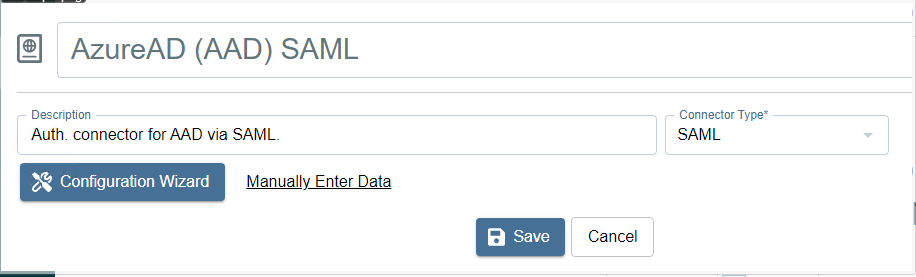

3. Click on **Configuration Wizard**.
4. On the **Configure Client** page of that wizard, use the **Login URL** in the **Signin URI** field (the **Login URL** was obtained in the Steps for Microsoft Entra ID). All fields should now be filled in.

   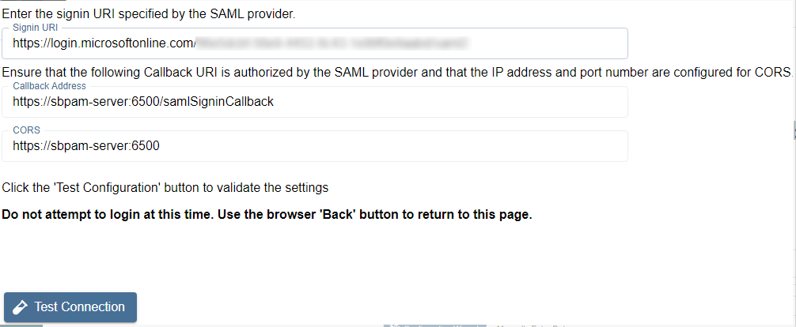

5. Click **Test Connection**.

   On the page that loads (Microsoft Entra ID sign-in page), **DO NOT SIGN-IN**. Instead, once you've verified that the sign-in page loaded properly, click the back button in the browser to return to Netwrix Privilege Secure (the connection test was successful if Microsoft Entra ID didn't display an error).

6. Click **Next** to advance in the Authentication Connector Configuration Wizard. You’ll now be on the wizard's **Test Login** page.
7. Open the certificate obtained during the Steps for Microsoft Entra ID. Copy the text between `-----BEGIN CERTIFICATE-----` and `-----END CERTIFICATE-----` into the **Certificate** field in the Authentication Connector Configuration Wizard.
8. Click **Login**, and log in as the Microsoft Entra ID user associated with the Enterprise Application from Step 8 in the Steps for Microsoft Entra ID. Upon successful sign-in, you’ll be redirected back to the wizard in Netwrix Privilege Secure.

   If the sign-in was successful, the Provider User Name/Id will display. This is passed to the UserTokenController so that the user information can be extracted. Click **Next**.

9. You will now be on the **Configure Id Mapping** page.

   Netwrix Privilege Secure will use the access token to retrieve user data from the SAML provider. The SAML provider requires a User Id Field for sign-in. It is necessary to specify which field in Active Directory should map to that User Id Field, so that Netwrix Privilege Secure can automatically fill in the required credentials at log-in. The value provided is used to sign in to the multi-factor authenticator (MFA) when a user logs in to the Netwrix Privilege Secure Console.

   The table displays the retrieved data that can be used for the host user lookup. You must select from the displayed records a field that corresponds to a value in your AD configuration. For example, if the AD data contains email addresses, you can select any of the fields which contain email addresses.

   In simple terms, there needs to be a property for each user in on-prem Active Directory and Microsoft Entra ID that matches. Often, this is an email address.

   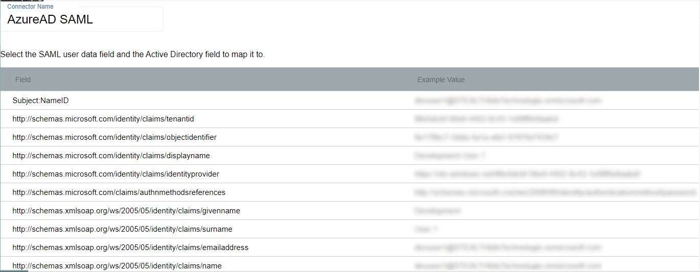

   Once the desired field has been found, click on it and then click **Select** (you may need to scroll down in the modal to see this button).

10. You will now be back in the Authentication Connector Configuration Wizard, on the **Configure Id Mapping** page. Make sure the **Login Format** dropdown is for a format that will match the ID Token field selected from Microsoft Entra ID in the previous step.

    For example, if you chose **Email** for the field in the previous step then this dropdown should also be **Email Address**.

    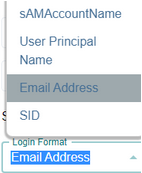

11. Click **Next**. On the next page, enter the following for the **Signout URI**:

    ```
    https://login.microsoftonline.com/common/oauth2/logout?post_logout_redirect_uri
    ```

    Click **Test Log Out** to sign out of the SAML provider. If the log out was performed correctly, click **Finish** then **Okay**, otherwise confirm the settings and try again.

    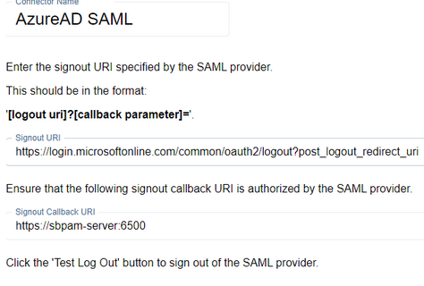

12. You can now assign this authentication connector to a user via the **Authentication Connector** tab for a user accessed in Netwrix Privilege Secure's **Users & Groups** page.

    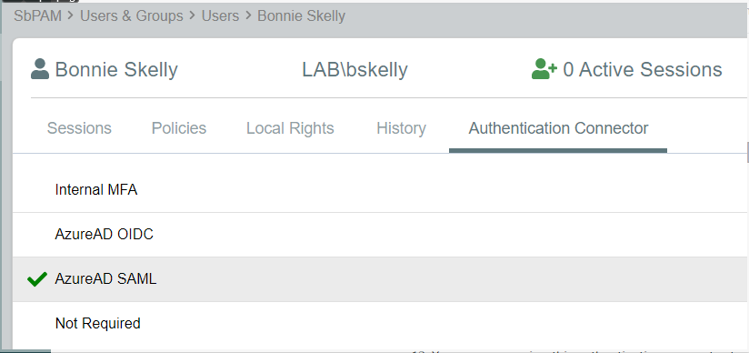

    Users with this authentication connector assignment can now use this authentication connector option on the Netwrix Privilege Secure log-in screen.

    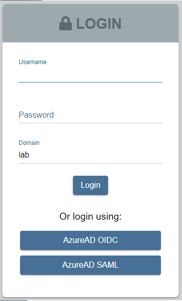

    When using the SAML log-in option, the user will be redirected to sign in to Microsoft Entra ID. Upon successful authentication, the user will be redirected to the Netwrix Privilege Secure UI as their now signed-in user.
