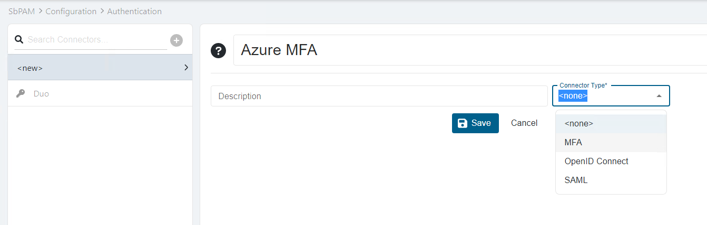
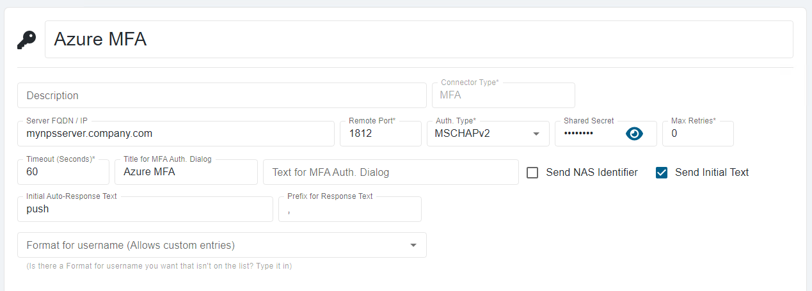

# Configuring a Custom RADIUS Authentication Connector

## Overview
Netwrix Privilege Secure (NPS) supports the configuration of Authentication Connectors for any RADIUS server.

> NOTE: In this article, the screenshots will illustrate how to configure an Authentication Connector for Azure MFA, but the same process generally applies.

## Before You Begin
Ensure that you have a RADIUS server installed and configured in your environment. For Azure MFA, refer to the relevant Microsoft documentation on configuring the NPS extension: https://docs.microsoft.com/en-us/azure/active-directory/authentication/howto-mfa-nps-extension. In general, refer to the appropriate product-specific documentation for your RADIUS server.

## Instructions
1. In Netwrix Privilege Secure (NPS), navigate to **Configuration > Authentication**. Select the **green plus sign** to create a new Authentication Connector.
2. Provide a name for the Connector and select the **MFA** Connector Type.  
   
3. Click **Save**, and then configure the connector with the appropriate values for your RADIUS server.  
   
4. Open the **appsettings.json** file. On a default installation, it will be located in the following path:

   ```
   C:\ProgramData\Stealthbits\PAM\WebService\appsettings.json
   ```

5. Add the following line before the **closing }**.

   ```json
   "StrictExternalAuth": "False"
   ```

   > NOTE: If there are other properties before the **closing }**, ensure that they are all separated by a single comma.

6. You may now assign the new RADIUS authentication connector to users and groups in SbPAM.
