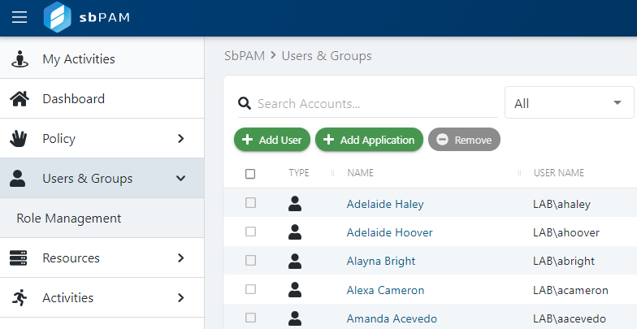
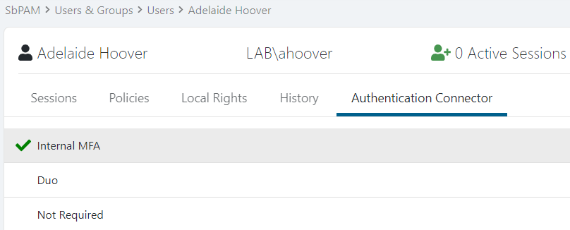

# Disable MFA for Users or Groups

## Summary

This article outlines how to disable Multi-factor Authentication (MFA) for individual users or groups of users in Netwrix Privilege Secure.

**IMPORTANT:** *Disabling MFA is not recommended per security best practices.*

## Instructions

1. Log in to Netwrix Privilege Secure as an Administrator, then navigate to **Users & Groups** in the sidebar navigation.

   

2. Click on a user or a group, then navigate to that principal's **Authentication Connector** tab.

   

3. Click **Not Required**, which will immediately disable the MFA requirement for the user or all users that are a member of the group.
