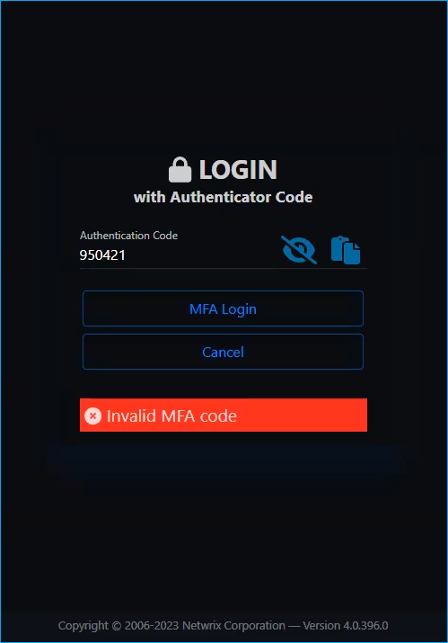

# Invalid Multi-Factor Authentication Code Error

## Symptoms

- When a user attempts to log in the **Netwrix Privilege Secure** console using the multi-factor authentication code, the page refreshes. The user is prompted to provide credentials again.
- A multi-factor authentication (MFA) code is deemed invalid. Login fails with the following error prompted:

```
Invalid MFA code
```

## Causes

The **Netwrix Privilege Secure** server and client have a system time discrepancy.

## Resolution

Review the system time in both NPS server and clients in your environment.

> **NOTE:** You can set the system time to sync with the OS time server automatically − in your server settings, select **Time & Language** > **Date & Time** > switch the **Set time automatically** switch on.

## Reference


