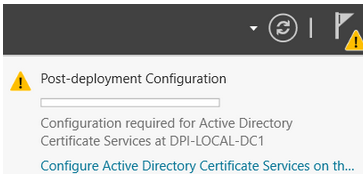
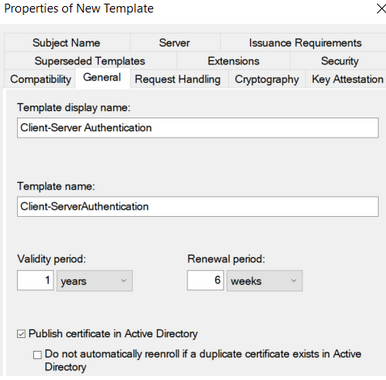
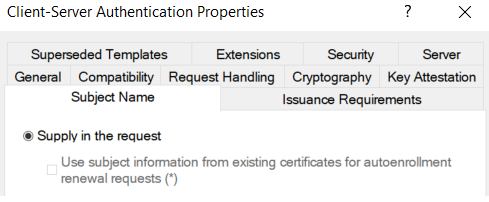
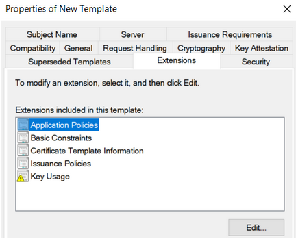
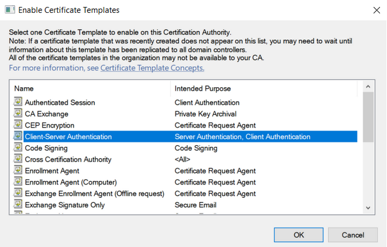
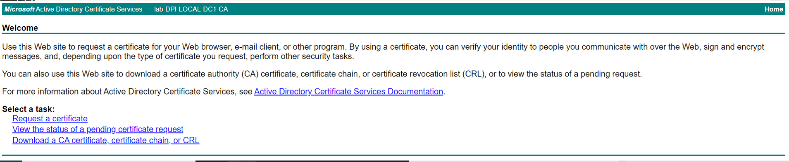
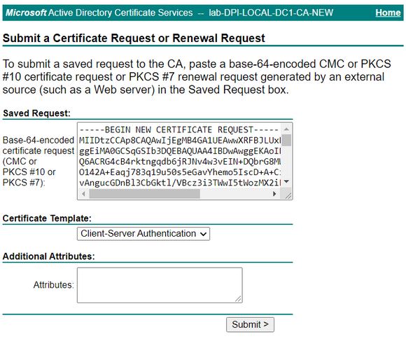
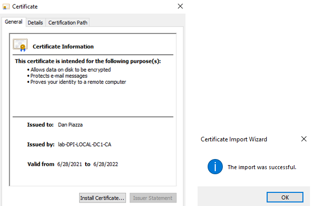
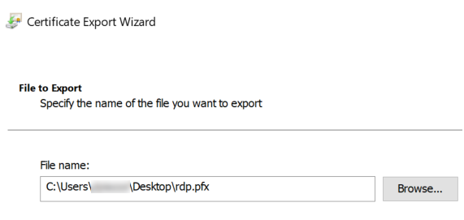
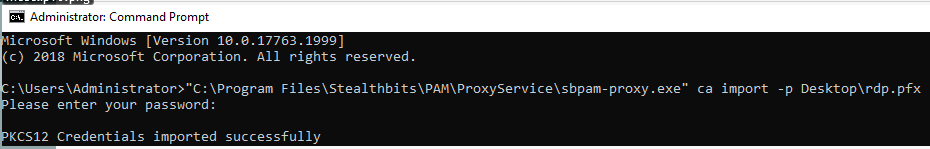

# Configure Proxy for RDP Connections - Install/Update Certificate to Prevent RDP Certificate Warnings

## Overview

This article outlines the process for installing or updating a certificate to prevent Remote Desktop Protocol (RDP) certificate warnings during SbPAM workflows.

## Prerequisites

- Windows Server must have the **Certification Authority** and **Certification Authority Web Enrollment** roles installed and configured. This ensures that the **Certification Authority** utility can be successfully launched and accessed via a web browser (`https://<servername>/certsrv`).

  > **IMPORTANT:** The Certification Authority's post-deployment configuration must be completed after installing both prerequisite roles.

  

- The domain must have the **Enrollment Policy** set to enable automatic enrollment and renewal. The **Certificate Enrollment Policy** for user and computer certificates is configured in the **Group Policy** snap-in under **Default Domain Policy** (or another group policy applied to all systems that will access an NPS server on a group-by-group basis). To configure this:

  1. On the Domain Controller, open the **Group Policy** snap-in.
  2. Navigate to **Computer Configuration > Policies > Windows Settings > Security Settings > Public Key Policies** and enable the **Certificate Services - Certificate Enrollment Policy**.

## Instructions

### Generate Certificate

> **NOTE:** If you already have a certificate to install, you can skip to the **Adding the Certificate to Each SbPAM Proxy Server** section below.

1. Open **Certification Authority**, open your CA, right-click **Certificate Templates**, and click **Manage**.
   

2. In the **Certificate Templates Console**, right-click **Workstation Authentication**, and click **Duplicate Template**.
   

3. On the **General** tab, change the name to **Client-Server Authentication** and enable the **Publish certificate in Active Directory** checkbox.
   

4. On the **Subject Name** tab, enable the **Supply in the request** radio button.
   

5. On the **Extensions** tab, select **Application Policies** and click **Edit**. Click **Add**, then select **Server Authentication**. Click **OK** until you return to the **Properties of New Template** dialog.
   

6. On the **Security** tab, select **Domain Computers** and enable the checkbox to allow **Autoenroll**. Click **OK** and then close the Certificate Templates Console.
   

7. Back in **Certification Authority**, right-click **Certificate Templates**, hover over **New**, and click **Certificate Template to Issue**.
   

8. Select **Client-Server Authentication** and click **OK**.
   

9. On the desktop, create a text file named **request.inf** with the following content (replace the **red** text with your server certificate name):

   ```plaintext
   [Version]
   Signature="$Windows NT$"
   [NewRequest]
   Subject = "CN=**sbpam-3.sblab.local**"
   KeySpec = 1
   KeyLength = 2048
   Exportable = TRUE
   MachineKeySet = FALSE
   SMIME = False
   PrivateKeyArchive = FALSE
   UserProtected = FALSE
   UseExistingKeySet = FALSE
   ProviderName = "Microsoft RSA SChannel Cryptographic Provider"
   ProviderType = 12
   RequestType = PKCS10
   KeyUsage = 0xa0
   HashAlgorithm = SHA256
   [Extensions]
   2.5.29.17 = "{text}"
   \_continue\_ = "dns=**sbpam-3.sblab.local**&"
   [EnhancedKeyUsageExtension]
   OID=1.3.6.1.5.5.7.3.1
   ```

10. Open Command Prompt as Administrator, change directory to the Desktop (or the location of your **request.inf** file), and run:

    ```plaintext
    certreq -new request.inf rdp.csr
    ```

    

11. To sign the certificate request, use your preferred signing mechanism. The following example uses Active Directory Certificate Services (`https://<servername>/certsrv`).
     

    Click **Request a certificate**, then click **advanced certificate request**.

12. Open the saved certificate signing request (**rdp.csr**) from the previous step in Notepad. Copy the certificate request into the **Saved Request** field. Select **Client-Server Authentication** from the **Certificate Template** dropdown. Click **Submit**.
    

    Leave other settings at default values, and click **Submit**.

13. Select **DER encoded** and click **Download certificate**.
    

14. Open the downloaded certificate and select **Install Certificate**. Proceed with all default values and complete the wizard.
    

15. To export the certificate, view certificates for the current user by launching **certmgr.msc** using the Windows **Run** menu.
    

    Right-click the installed certificate (the certificate using the **Client-Server Authentication** template) and click **Export...**.
    

16. In the **Certificate Export Wizard**, change the **Export Private Key** option to **Yes, export the private key**.
    

17. For **Export File Format**, select **Personal Information Exchange - PKCS #12 (.PFX)**. Select the following checkboxes:

    - Include all certificates in the certification path if possible
    - Enable certificate privacy

    

18. For **Security**, enter a password of your choosing and select the AES256-SHA256 encryption option (3DES is no longer recommended by NIST).

    > **IMPORTANT:** For **File to Export**, the file name **must** be **rdp.pfx**. If it is named anything else, importing the .pfx file on each proxy server will not work.
    

19. This certificate can now be imported to each SbPAM Proxy Server.

### Adding the Certificate to Each SbPAM Proxy Server

1. Copy **rdp.pfx** (from the previous steps) to each SbPAM Proxy Server.

2. On each SbPAM Proxy Server, run the following command via an elevated **Command Prompt**, and enter the certificate's password when prompted.

   > **IMPORTANT:** The path to **sbpam-proxy.exe** may be different depending on the install path you selected when installing SbPAM and/or distributed proxy services.

   ```plaintext
   "C:\Program Files\Stealthbits\PAM\ProxyService\sbpam-proxy.exe" ca import -p [PATH]\rdp.pfx
   ```

   

3. The new certificate has now been imported to an SbPAM Proxy Server. Repeat this process for all SbPAM Proxy Servers if using more than one. (The default installation of SbPAM uses one proxy service on the SbPAM server itself; however, additional proxy services can be distributed.)
