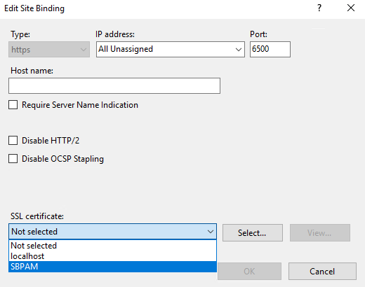
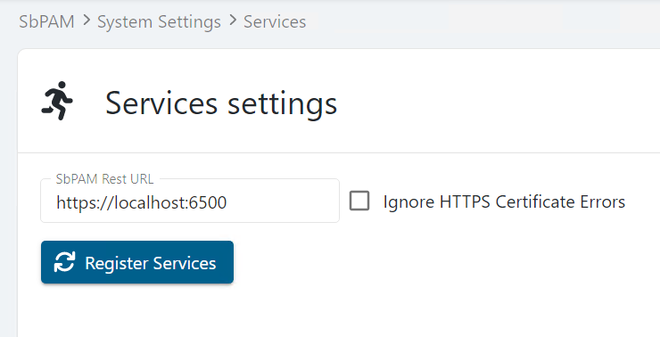

# Installing an IIS Certificate

## Overview
This article outlines the process of installing a valid certificate to the Netwrix Privilege Secure IIS website.

## Requirements
- The certificate should be for Client and Server Authentication and be from a trusted Certificate Authority (CA).
- The certificate needs to be in the Trusted Root on the Netwrix Privilege Secure server (with the private key), and in the Trusted Root on all clients accessing the Netwrix Privilege Secure website (without the private key).
- For High Availability (HA) deployments the certificate should have both server FQDN names in either Common Name (CN) or Subject Alternative Name (SAN) fields.

## Instructions
After receiving the certificate from a CA, the bindings for the Netwrix Privilege Secure website need to be updated in **Internet Information Services (IIS) Manager** on the Netwrix Privilege Secure server.

1. Open the **IIS Manager** on the Netwrix Privilege Secure server.  
2. In the left sidebar, navigate to the **Netwrix Privilege Secure Web Service** website, right-click, and click **Edit Bindings...**  


1. Double-click **https**.  
2. Select the **SSL certificate** for the DNS hostname of your Netwrix Privilege Secure server (the DNS name used as the Subject Alternative Name (SAN) in the cert).



After making these changes, restart the Netwrix Privilege Secure website by running the `iisreset` command in an elevated Command Prompt.

### Updating Service Configuration Files (Netwrix Privilege Secure 3.6 or later)
Netwrix Privilege Secure service configuration files will need to be updated to use the same DNS name as the certificate. These updates can be triggered via the Netwrix Privilege Secure UI. Navigate to the **System Settings** menu, and the **Services** node.  


Enter the FQDN that matches the name of your cert (e.g. `https://yourcert.company.com:6500`). Leave **Ignore HTTPS Certificate Errors** unchecked.
Click the **Register Services** button. A "Services registered" pop-up will appear when the necessary changes have been made.

### Updating Service Configuration Files (Netwrix Privilege Secure 3.5 or earlier)
Netwrix Privilege Secure service configuration files will need to be updated to use the same DNS name as the certificate. The following files will need to be edited:

```
C:\ProgramData\Stealthbits\PAM\ActionService\appsettings.user.json
C:\ProgramData\Stealthbits\PAM\EmailService\appsettings.user.json
C:\ProgramData\Stealthbits\PAM\ProxyService\appsettings.user.json
C:\ProgramData\Stealthbits\PAM\SchedulerService\appsettings.user.json
C:\ProgramData\Stealthbits\PAM\SIEMService\appsettings.user.json
```

In each file, locate the `Url` key and change its value so it matches the DNS name used in the certificate. In the following example, `localhost` should be changed to match the aforementioned DNS name (leaving the port specification unchanged):

```json
"Url":"https://localhost:6500"
```

After updating each config file, verify Netwrix Privilege Secure services are running properly by navigating to the **Service Nodes** page in the Netwrix Privilege Secure Web UI. The services should be all green:



If any services are red, Register Services by selecting your **username** in the top-right of the Netwrix Privilege Secure UI, click **Settings**, then click **Register Services**.
