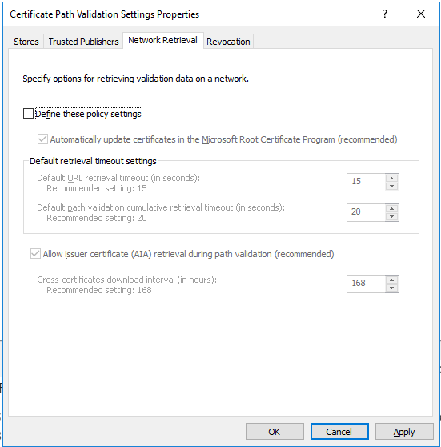
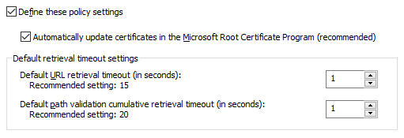

# Speeding up CRL Checks on Netwrix Privilege Secure Servers without Internet Connectivity

## Summary
If Netwrix Privilege Secure, or a Netwrix Privilege Secure proxy service, is installed on a server without internet connectivity, the proxy may be unable to initiate SSL handshakes. The following error message when registering a proxy service is indicative of this problem:

```text
TLS Authentication error One or more errors occurred. (Unable to read data from the transport connection: An established connection was aborted by the software in your host machine.)
```

You can resolve this issue by reducing the timeout setting in Windows that governs CRL (certificate revocation list) checks. Because these CRL checks require internet access, set the timeout to the minimum possible value when internet connectivity is not present.

## Instructions
This timeout setting is governed by a Group Policy. The following steps allow you to configure it:

1. Open Group Policy Editor: `gpedit.msc`
2. Navigate to `Computer Configuration > Windows Settings > Security Settings > Public Key Policies`  
   
3. Double-click on **Certificate Path Validation Settings** and go to the **Network Retrieval** tab.  
   
4. Check the **Define these policy settings** box, and reduce both **Default retrieval timeout settings** to `1`.  
   
5. Click **Apply** to save the configuration.
