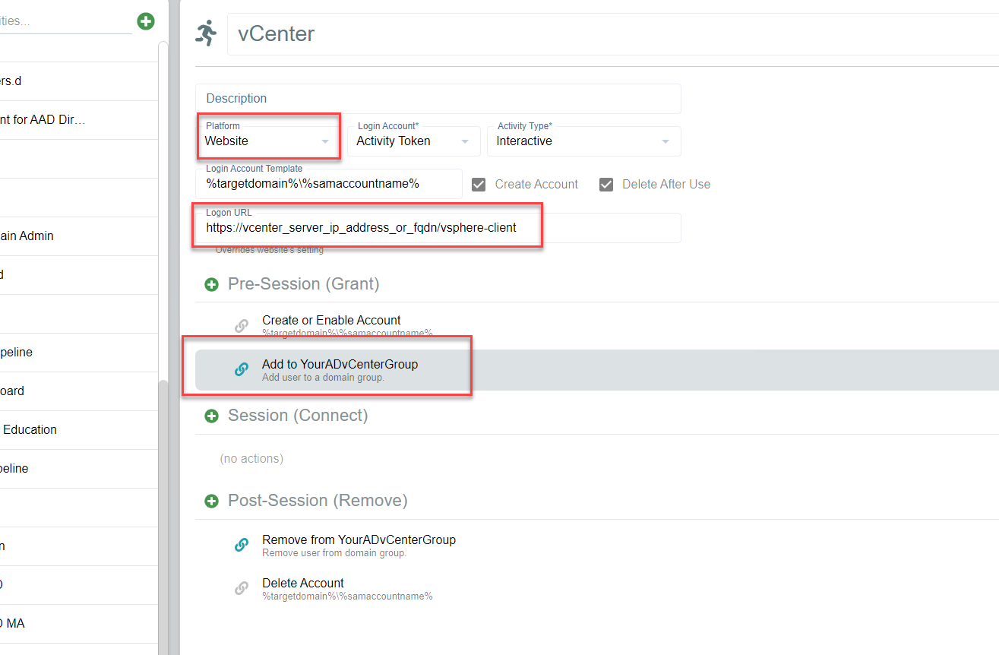
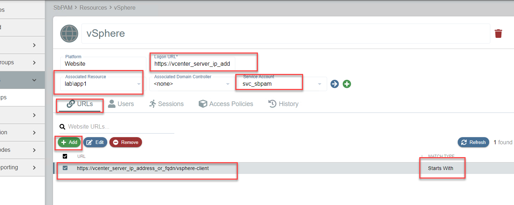
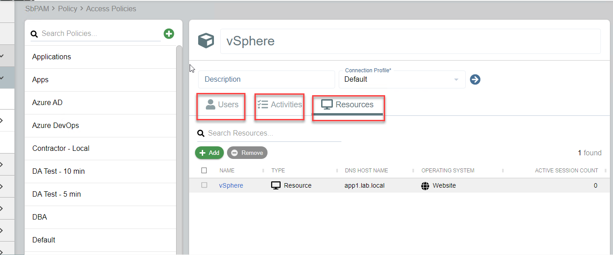

# Add VMware vCenter website to Browser Extension

## Summary

This article outlines the process of adding a VMware vCenter web application (website) to Netwrix Privilege Secure's Browser Extension, for quick and easy session provisioning.

## Instructions

1. **Create a VMware vCenter website Activity** (be sure to enter the URL normally used to log-in to vCenter, and any Active Directory (AD) group that would give the account permission to log-in). Note that this example is for an **Activity Token**, however **Managed Account** and **Requester** workflows are also supported.

   

2. **Create a Website Resource**. Enter the URL for vCenter, and also (if possible) choose a resource that is in the same AD domain as the vSphere host. This is to ensure that when an account is created and group permissions are granted to it, it will happen on a Domain Controller (DC) close to where vSphere would normally authenticate to. This prevents needing to wait for permissions to replicate when logging-in to vSphere.

   

3. **Create an Access Policy** that links a user to the vSphere Activity and the Website Resource.

   

4. There should now be a vSphere activity in the Netwrix Privilege Secure Browser Extension, with the ability to select it to create a session (click once) and then launch vSphere (click again).
