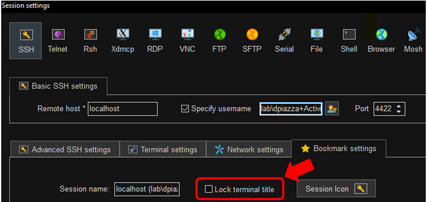
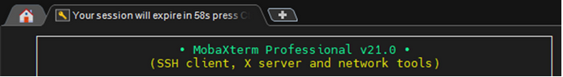

# Enable Session Extension Countdown Tab Display for Netwrix Privilege Secure SSH Sessions in MobaXTerm

## Summary

Netwrix Privilege Secure’s SSH Session Extension countdown does not display in the MobaXTerm tab bar unless a specific option has been disabled in the MobaXTerm session’s **Bookmark Settings**.

## Instructions

As shown in the screenshot below, the SSH session’s **"Lock terminal title"** setting should be disabled in the session’s **Bookmark Settings** within MobaXTerm.

1. In MobaXTerm, right-click the session in the **Sessions** sidebar.
2. Click **Edit Settings**.
3. Navigate to **Bookmark Settings**.
4. Disable the **"Lock terminal title"** setting.

If configured correctly, the session tab displays session expiration countdown messages per the settings in the Netwrix Privilege Secure Connection Profile assigned to the Access Profile granting the user the right to use the SSH Activity.

