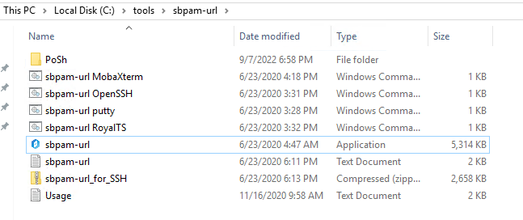
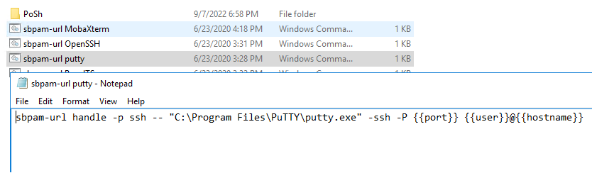
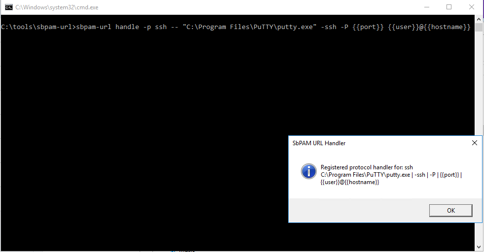
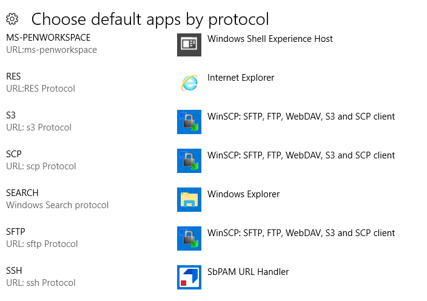

# Invoking Desktop SSH Client Automatically

## Overview

To automatically invoke a local SSH client for sessions, you need to register a URL handler on your desktop. This article provides step-by-step instructions to configure this handler using `sbpam-url`.

## Instructions

1. To register a URL handler on your desktop, begin using either of the following options:
   - Copy the `sbpam-url.exe` from the **Extras** folder to a specific folder.

     > **IMPORTANT:** It is important that the file location does not change after registering the command file.

   - Download a copy of the sbpam-url archive from: https://www.netwrix.com/download/sbpam-url.zip. Extract it to a specific static location on your file system (for example, not `Desktop`).

     > **NOTE:** If you download the `sbpam-url` file, it includes batch files that have known configurations for popular SSH clients.

     

2. Ensure that your preferred SSH app (for example, PuTTY) is installed and note its installation location.

3. Right-click the Windows command file corresponding to the application you wish to register. Ensure that it is configured with the correct installation directory you noted in the previous step. If it is not, edit the file with the correct path and save it.

   

4. Double-click the command file you previously opened to execute it.

   

5. The command file will modify the registry and register the application to the URL handler. Your registered SSH client will now be invoked automatically when starting SSH sessions from the Netwrix Privilege Secure user interface.

6. Ensure that your SSH handler is indicated in Windows' **Choose default apps by protocol** settings as **Netwrix Privilege Secure URL Handler**.

   

7. If none of these built-in command files are successful, then you may refer to the following provided options: [Registering and Using the sbpam-url SSH Protocol Handler](/docs/kb/privilegesecure/client-tools-and-integrations/registering-and-using-the-sbpam-url-ssh-protocol-handler.md)

