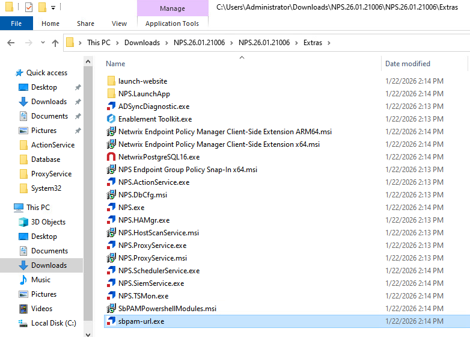
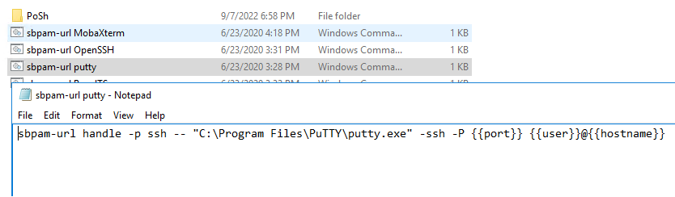
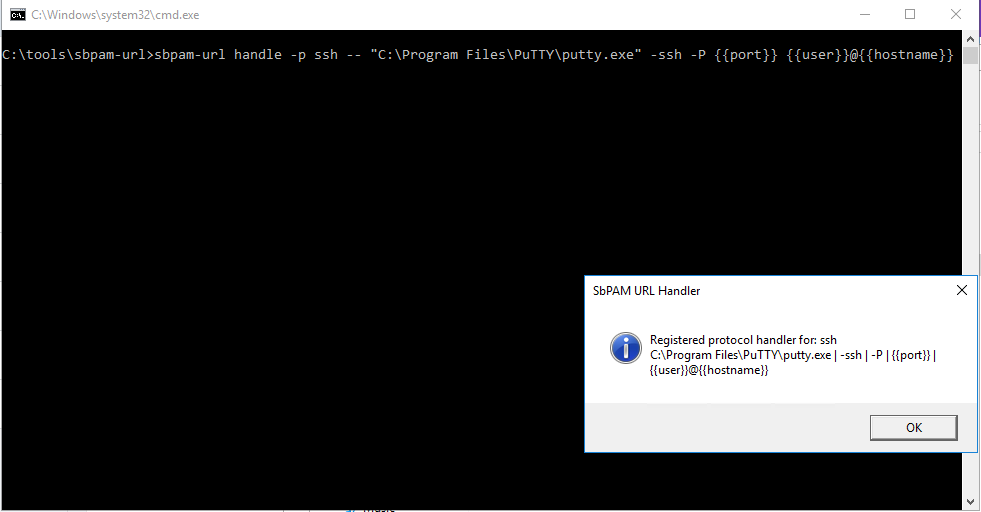
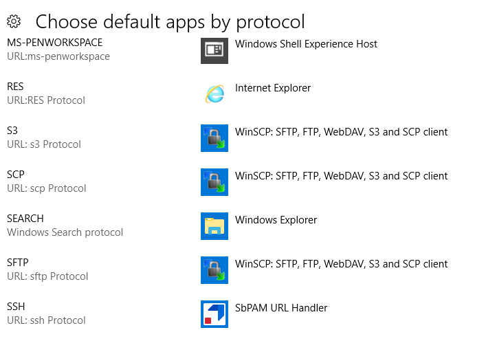

# Invoking Desktop SSH Client Automatically

## Overview

To automatically invoke a local SSH client for sessions, you need to register a URL handler on your desktop. This article provides step-by-step instructions to configure this handler using `sbpam-url`.

## Instructions

> **IMPORTANT:** Do not move the command file after registering it. The registry entry points to the file's original location and will break if the file is moved.

1. To register a URL handler on your desktop, locate `sbpam-url.exe` in the **Extras** folder of the full NPS-AM download and copy it to a permanent folder on your file system.
   - For example, `C:\Tools\sbpam-url\`. Avoid temporary or user-managed locations such as `Desktop` or `Downloads`.

   

   > **NOTE:** The **Extras** folder also includes batch files with known configurations for popular SSH clients. For information about the full NPS-AM package and its contents, see [Privilege Secure Components](https://docs.netwrix.com/docs/privilegesecure/25_12/install/components).

2. Ensure that your preferred SSH app (for example, PuTTY) is installed and note its installation location.

3. Right-click the Windows command file corresponding to the application you wish to register. Ensure that it is configured with the correct installation directory you noted in the previous step. If it is not, edit the file with the correct path and save it.

   

4. Double-click the command file you previously opened to execute it.

   

5. The command file will modify the registry and register the application to the URL handler. Your registered SSH client will now be invoked automatically when starting SSH sessions from the Netwrix Privilege Secure user interface.

6. Ensure that your SSH handler is indicated in Windows' **Choose default apps by protocol** settings as **Netwrix Privilege Secure URL Handler**.

   

7. If none of these built-in command files are successful, then you may refer to the following provided options: [Registering and Using the sbpam-url SSH Protocol Handler](/docs/kb/privilegesecure/client-tools-and-integrations/registering-and-using-the-sbpam-url-ssh-protocol-handler.md).

