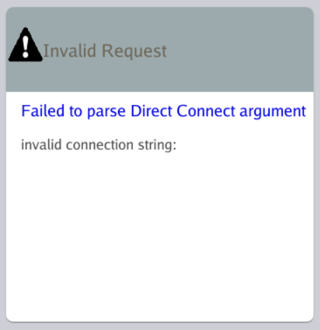
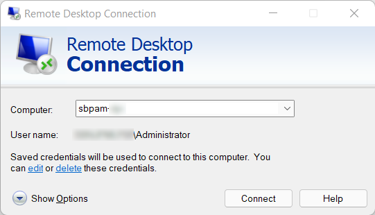

# Resolving "Invalid Connection String" for DirectConnect in mRemoteNG

## Summary
In a specific scenario, valid Netwrix Privilege Secure `DirectConnect` strings used in mRemoteNG will result in an invalid connection string error, stating the connection string is empty.

## Instructions
This error is caused by having credentials saved for the Netwrix Privilege Secure server (for example, the Netwrix Privilege Secure Proxy Server) in the Windows built-in RDP client, **Remote Desktop Connection**, on the same host that is running mRemoteNG.

To resolve the issue, you have two options:

1. Delete the credential saved in **Remote Desktop Connection**. After you delete that credential, the valid `DirectConnect` string will work as expected in mRemoteNG.
2. Fill in a password for each `DirectConnect` connection saved in mRemoteNG. This resolves the issue without deleting any credentials from **Remote Desktop Connection**.
