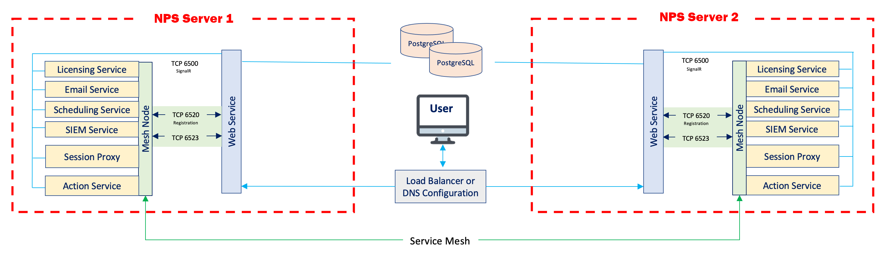

# How to Configure a Multi-Server NPS Environment With a Shared Database Server

## Summary

This article will guide the user through the process of setting up a deployment with multiple Netwrix Privilege Secure servers communicating with a single Postgres server. Instructions are included for configuring TLS for all network traffic to the Postgres server. Optional migration steps are included for users who wish to use a Postgres database from an existing Netwrix Privilege Secure deployment.

This diagram illustrates the desired network architecture.


## Instructions

### Configuring the Postgres Server

1. On the Postgres server, open the `NPS_Setup.exe` installer, and install Postgres 12. Next, use the `NPS_Setup.exe` installer to install Netwrix Privilege Secure. (This is necessary for the Postgres database to be properly configured. There will be no need to launch Netwrix Privilege Secure on the Postgres server at any point in this process, and the Postgres database can be entirely administered from the remote Netwrix Privilege Secure servers.)
2. (Recommended) Now that the Postgres database is properly configured, you may uninstall Netwrix Privilege Secure on the Postgres server. This will conserve disk space and computing resources.
3. Open the `sbpam_node.json` file. On a default installation to the C: drive, it will be located here:
```text
C:\ProgramData\Stealthbits\PAM\ProxyService\sbpam_node.json
```
4. Ensure that both `localhost` and the FQDN of your Postgres server are populated under `advertise`:
```json
{
		"advertise": ["testlab-pg01.sbpamtestlab.com", "localhost"],
		"tags": []
}
```
5. Navigate to the TLS certificate directory. On a default installation to the C: drive, it will be located here:
```text
C:\ProgramData\Stealthbits\PAM\tls\certs\
```
6. Copy the `\ProgramData\Stealthbits\PAM\tls\certs\sbpam-node.crt` and `\ProgramData\Stealthbits\PAM\tls\keys\sbpam-node.pem` files into the root of the Postgres data directory. On a default installation to the C: drive, the Postgres data directory will be located here:
```text
C:\ProgramData\Stealthbits\Postgres12
```
(If you wish to copy the .crt and .pem files to a subdirectory of the data directory, you will have to specify their relative subpaths later on in these instructions, when configuring the postgresql.conf file.)
7. Open the **Certificate Manager**. Import the `\ProgramData\Stealthbits\PAM\tls\cacerts\sbpam-region.crt` certificate into the **Trusted Root**.
8. Open the `pg_hba.conf` file. On a default installation to the C: drive, it will be located here:
```text
C:\ProgramData\Stealthbits\Postgres12\pg_hba.conf
```
Edit the file to contain one or more entries which allow connections from your Netwrix Privilege Secure application servers. For instance, to allow all IP addresses in the `10.2.0.x` range, add an entry ending in `/24`:
```text
host  all  all  10.2.0.0/24  md5
```
Or, for granular access on a per-IP basis, add a line for each IP address ending in /32:
```text
host  all  all  10.2.0.1/32  md5
host  all  all  10.2.0.2/32  md5
```
9. Open the `pg_hba.conf` file. On a default installation to the C: drive, it will be located here:
```text
C:\ProgramData\Stealthbits\Postgres12\postgresql.conf
```
10. Under `# - SSL -`, edit the SSL settings as follows:
```text
# - SSL -

ssl = on
#ssl_ca_file = ''
ssl_cert_file = 'sbpam-node.crt'
#ssl_crl_file = ''
ssl_key_file = 'sbpam-node.pem'
```
11. Restart the Postgres service. Your Postgres server should now be ready to accept TLS-encrypted traffic.

### Configuring the NPS Servers

1. On each Netwrix Privilege Secure server, open the `SB_Setup.exe` installer, and install Postgres 12. Next, use the `SB_Setup.exe` installer to install Netwrix Privilege Secure.
2. Once Netwrix Privilege Secure is installed, open the `appsettings.json` file. On a default installation to the C: drive, it will be located here:
```text
C:\Program Files\Stealthbits\PAM\Web
```
Edit this file so that the `Database` key references the hostname of the Postgres server:
```json
"Database": {
	"Host": "testlab-pg01.sbpamtestlab.com",
	"Port": 5432
	}
```
3. Obtain a copy of the `\ProgramData\Stealthbits\PAM\tls\cacerts\sbpam-region.crt` certificate from the Postgres server. Open the **Certificate Manager**. Import the `sbpam-region.crt` certificate into the **Trusted Root** of the local machine.

You should now be able to access the Netwrix Privilege Secure console at `https://[yourNPSServerIP]:6500`, and all traffic should be TLS encrypted. *Note: if you are receiving an IIS certificate warning from your browser, install an IIS certificate using [Install an IIS Certificate](https://docs.netwrix.com/docs/kb/privilegesecure/installing-an-iis-certificate)

### Key Export/Import

*In order to ensure that encryption keys are in agreement between Netwrix Privilege Secure servers, please follow the instructions outlined in [How to Configure Encryption Keys in Multiple NPS Server Environments](/docs/kb/privilegesecure/high-availability-and-clustering/how-to-configure-encryption-keys-in-multiple-nps-server-environments.md).*
