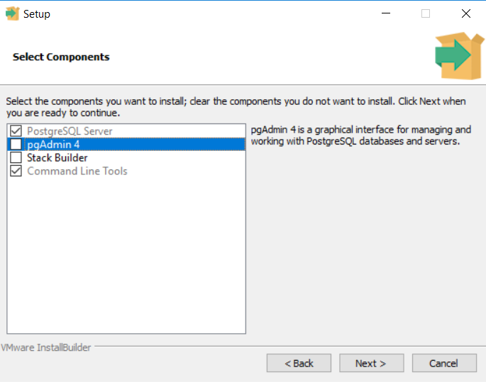
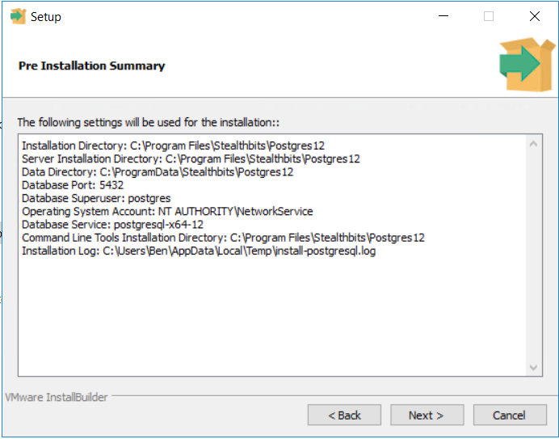

# Netwrix Privilege Secure: Performing an In-Place Postgres Upgrade

## Overview

This article provides guidance on how to perform an in-place upgrade for the Netwrix Privilege Secure (NPS) server's Postgres backend.

> **NOTE:** This article applies exclusively to build updates for Postgres 12. As the upgrade may take considerable time and require a server reboot, it is recommended to schedule this process outside of regular operational hours.

## Instructions

1. Determine your current Postgres version by launching a PowerShell terminal and running the following commands:

```powershell
cd 'C:\Program Files\Stealthbits\Postgres12\bin\'
.\psql.exe -V
```

> **NOTE:** You may need to modify the path to the Postgres12 directory depending on your installation.

2. This command should return your Postgres version number. For example, if your current version is 12.8, upgrade to the latest 12.X release.

3. Visit the Postgres download page: https://www.postgresql.org/download/windows/. Click the "Download the Installer" link at the top of the page, and download an executable installer from the EnterpriseDB website. Ensure the version matches the one determined in Step 2.

4. Run the `postgresql-[versionnumber]-windows-x64.exe` file on your Netwrix Privilege Secure (NPS) server. This will launch the Postgres Setup Wizard. Click **Next** on the initial splash page.

5. On the **Select Components** page, select only **PostgreSQL Server** and **Command Line Tools** to install/upgrade:



6. Proceed through the prompts until you see the **Pre-Installation Summary** window and confirm that it matches your server's settings:



7. Once satisfied with the **Pre-Installation Summary** window, click **Next** two more times to proceed with the installation.

8. Once the installation is finished, you will be prompted to restart your server. Restart your server.

9. To confirm the success of your installation, use the PowerShell commands from Step 1 to verify that your version number matches the installer.
