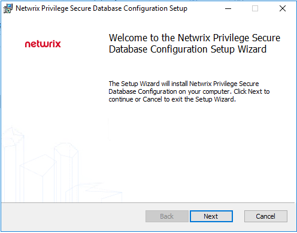
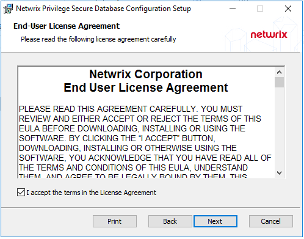
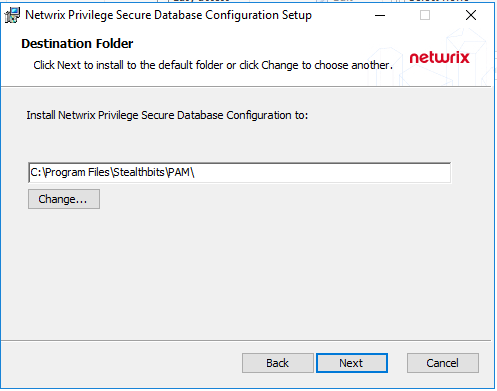
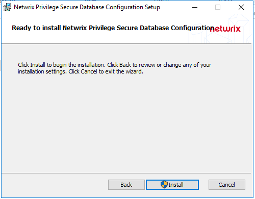
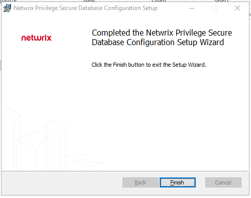
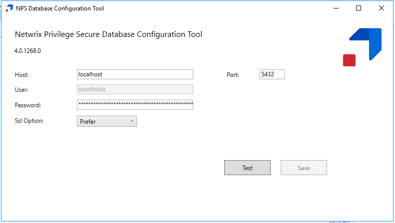
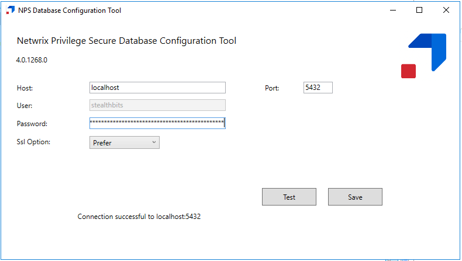
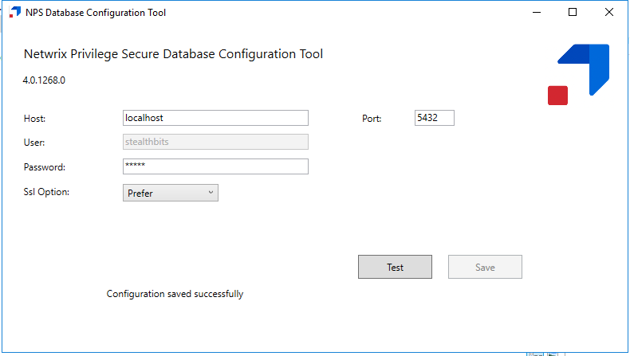

# Using the Database Configuration Tool to Change the Postgres DB Password

## Summary

While it is essential that remote access to the Netwrix Privilege Secure (NPS) server be locked down, as an additional layer of security, you may wish to further harden your NPS server by periodically changing the password to the NPS Postgres database. As such, Netwrix Privilege Secure includes a Database Configuration tool (`DbCfg.msi`) that allows changing the privileged Postgres service account password used by NPS.

**_The changed password should be securely vaulted, and local Administrator access to the DbCfg tool should be tightly controlled._**

## Instructions

1. On the Netwrix Privilege Secure (NPS) server, navigate to the "Extras" folder in the NPS installer download directory. The Database Configuration tool installer (`DbCfg.msi`) is included in this directory. Launch the installer, and select **Next**.  
   

2. Review and accept the EULA. Select **Next**.  
   

3. Choose an installation path. The default installation path is `C:\Program Files\Stealthbits\PAM\`. Select **Next**.  
   

4. Select **Install**, and confirm any UAC prompt that occurs.  
   

5. The installation will complete shortly.  
   

6. Navigate to the installation directory and launch `DbCfg.exe` from your chosen installation directory.  
   

7. You can click **Test** to confirm your connection to the Postgres DB.  
   

8. Set a new password in the Password field and hit **Save** to change the Postgres password. If your Test connection from step 7 was successful, you should receive a "Configuration saved successfully" response, which indicates a successful password change. This change will propagate to any NPS service that needs to use the database password.  
   
