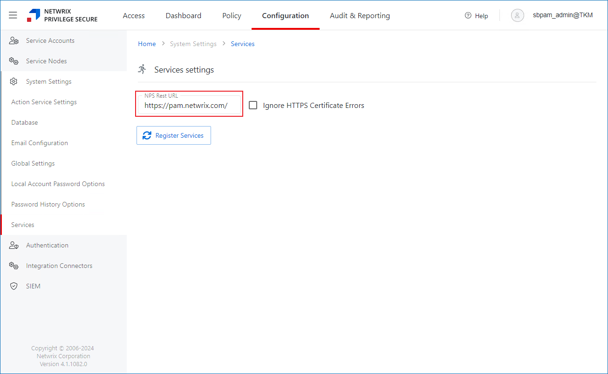

# Index Was Outside the Bounds of Array Error

## Symptom

Netwrix Privilege Secure generates the following error on each launch of the High Availability (HA) Configuration tool (`NPS.HAMgr`):

```
Index was outside the bounds of the array.
```

## Cause

The HA Configuration tool expects a port value at the end of the NPS Rest URL. If you configured your NPS Rest URL without a port, the HA Configuration tool prompts an error because it expects a port.

> **NOTE:** To verify how your NPS Rest URL is set up, refer to the following steps:
>
> 1. On the main Privilege Secure screen, click the **Configuration** tab.
> 2. In the left pane, select **Services**. The page will include the **NPS Rest URL** field. To learn more about the **Services** page in Netwrix Privilege Secure, refer to the following article: System Settings Pages − Services Page · v4.0.
>
> 

## Resolution

Specify the `443` port in the NPS Rest URL. Refer to the following code block for the Rest URL syntax and example:

```
FQDN:port
https://pam.netwrix.com:443
```
