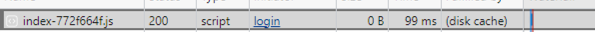

# Add Cache Settings for JavaScript Files to Improve NPS Page Load Performance

## Summary

The main ReactJS bundle for the Netwrix Privilege Secure website is 6.5MB. This is sent with the HTTP header `Cache-Control: no-cache, no-store`. This causes SAML Logins to sometimes fail, as downloading the ReactJS module during each login can cause the SAML token cache to expire.

To address this issue, you can create an IIS configuration setting that will update the `Cache-Control` header for all JavaScript files that are downloaded from the Netwrix Privilege Secure web service. This will improve the performance of the website and lower the burden on the webservice.

## Instructions

1. On all NPS servers, download and install the Url Rewrite module.

   https://www.iis.net/downloads/microsoft/url-rewrite

2. Navigate to your NPS Web directory (by default, `C:\Program Files\Stealthbits\PAM\Web\)` and make a copy of the web.config file.

3. Open the file `C:\Program Files\Stealthbits\PAM\Web\web.config` in a text editor. Find this line:

   `<system.webServer>`

4. Add the following XML after that line:

   ```xml
   <rewrite>
     <outboundRules>
       <rule name="Set cache for JS">
         <match serverVariable="RESPONSE_Cache_Control" pattern=".*" />
         <conditions>
           <add input="{REQUEST_URI}" pattern="\.js$" />
         </conditions>
         <action type="Rewrite" value="max-age=604800"/>
       </rule>
     </outboundRules>
   </rewrite>
   ```

5. Save the file

6. Launch a PowerShell window and restart IIS using the command:

   ```
   iisreset
   ```

7. To verify the file is now cached, open Chrome or Edge and then open the developer tools.

8. Open your NPS web page and look at the `Network` tab in the developer tools Window.

9. See the page download:  
   

10. Reload the page, see it is loaded from the cache:  
    

11. Copy the updated `web.config` to `C:\Program Files\Stealthbits\PAM\Web\web.config.rewrite`, you will need this for future upgrades.

## Upgrades

1. After an upgrade of NPS, you will need to copy the `C:\Program Files\Stealthbits\PAM\Web\web.config.rewrite` file to `C:\Program Files\Stealthbits\PAM\Web\web.config` in order to restore the cache settings.
