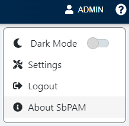
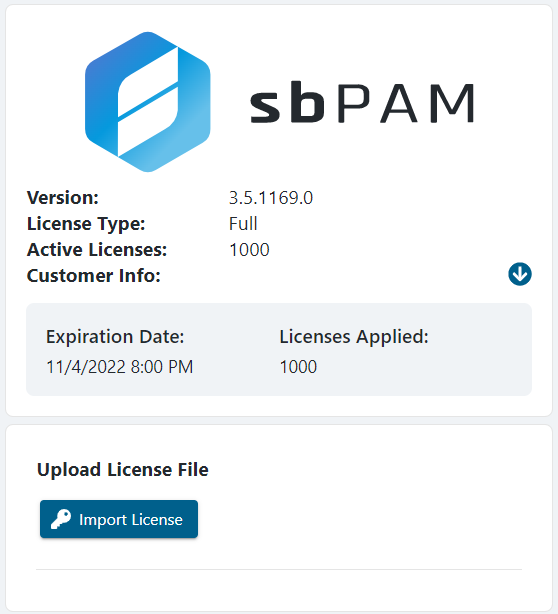

# Apply a New License

## Summary

This article outlines how to apply a new license to the Netwrix Privilege Secure Access Management server.

## Instructions

Netwrix Privilege Secure Access Management comes with a 30-day trial license. Once this trial has expired, a new license key file will need to be imported.

1. Log in to the Netwrix Privilege Secure Access Management web application as an account with the Administrator role.  
   - In Netwrix Privilege Secure Access Management 3.5 or earlier, the built-in Admin account may be used.  
   - In Netwrix Privilege Secure Access Management 3.7 or later, a local user with the Administrator role may be used.  
   - **IMPORTANT:** The `Domain` field must be set to `<none>` in order to log in with the built-in Admin account.

2. In the upper-right of the page, click your account name, and then click **About Netwrix Privilege Secure Access Management**.  

   

   The **About Netwrix Privilege Secure Access Management** page will be displayed, including an **Import License** button that you can use to update the product's license.

   **_IMPORTANT:_** _If a new license key file is needed, please contact your Netwrix or Netwrix Account Manager._

   

3. Click **Import License**. A Windows file dialog will open. Navigate to the location of the new license key file, select it, and click **Open**. The license will be imported, and the displayed license information will be updated.

### Alternate Instructions (PowerShell)

1. Open an elevated PowerShell window.  
2. Modify the following PowerShell script so that the second line contains the correct local path for your license file:

```powershell
Add-Type -AssemblyName System.Web
$licenseFilePath = "path to license file" ## Change to match the local path to the license file
$license = Get-Content $licenseFilePath
$encoded = [System.Web.HttpUtility]::UrlEncode($license)
$sbpamURI = "http://localhost:6501"
Invoke-RestMethod -Method POST -URI "$($sbpamURI)/api/v1/LicenseInfo?License=$encoded"
```

3. Copy and paste the modified script into PowerShell and execute it. Your license should now be imported into Netwrix Privilege Secure Access Management.
