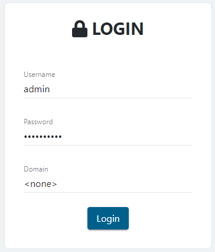
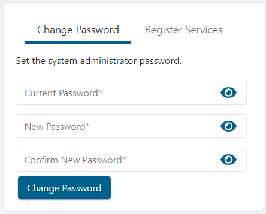

# Change the Built-In Admin Password

## Summary

This article outlines how to change the password of Netwrix Privilege Secure's built-in Admin account.

## Instructions

1. Sign in to Netwrix Privilege Secure using the Admin account.

   

2. IMPORTANT: The `Domain` field must be set to `"<none>"` in order to log in with the built-in Admin account.

3. In the upper-right of the page, click **Admin** and then **Settings**.

   

4. The **Change Password** menu will appear on the page and can be used to set a new password for the built-in Admin account.

   

5. If the password change is successful, you will be immediately logged out of Netwrix Privilege Secure and presented with the log-in page.

   IMPORTANT: Previously used passwords cannot be used and will result in an error when attempting to change the password.
