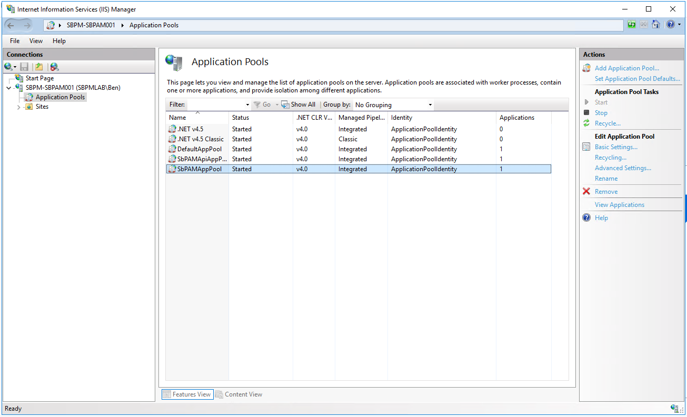
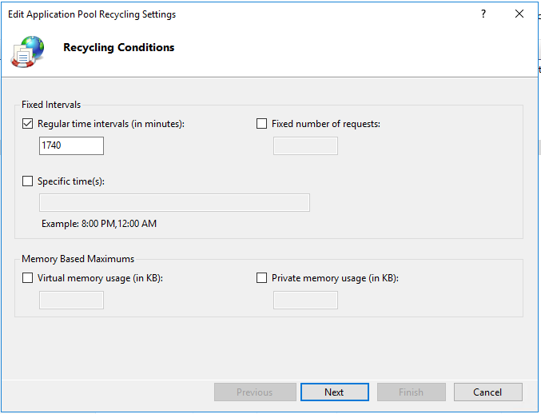
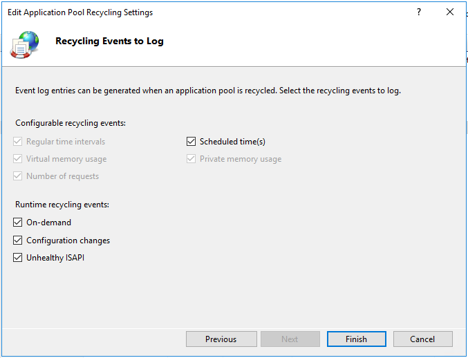

# Rescheduling IIS App Pool Recycling

## Summary
Periodic app pool recycling is a necessary IIS process, and as such the Netwrix Privilege Secure web service deploys with the default IIS app pool recycling settings (every 29 hours) enabled. In some Netwrix Privilege Secure environments, especially those with periods of high peak usage, you may want to schedule IIS app pool recycling to occur at specified times of off-peak usage. This reduces the likelihood of recycling interacting with Netwrix Privilege Secure services.

## Instructions
1. On the server hosting Netwrix Privilege Secure, launch IIS Manager (`inetmgr.exe`).
2. In the left-hand menu, select **Application Pools**, and in the main window, select **SbPAMAppPool**  
   
3. On the right-hand menu, select **Recycling** to open the Recycling settings.  
   
4. You can change the default value of `1740 minutes (29 hours)` to **Specific time(s)** in order to recycle the application pool either less frequently, and/or to recycle the application pool during off-peak hours. Click **Next**.
5. Click **Finish** to save your new app pool recycling schedule.  
   
