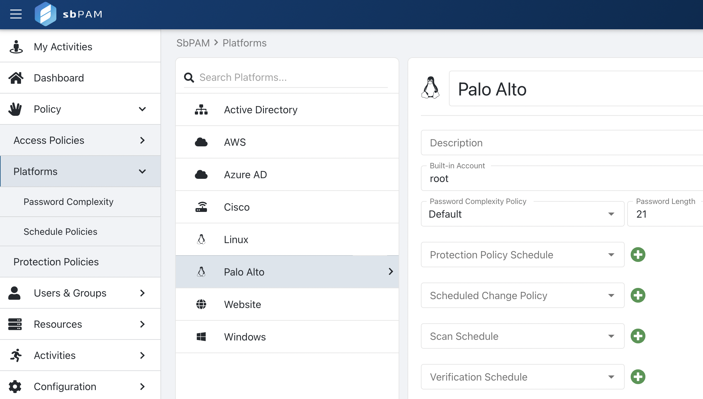
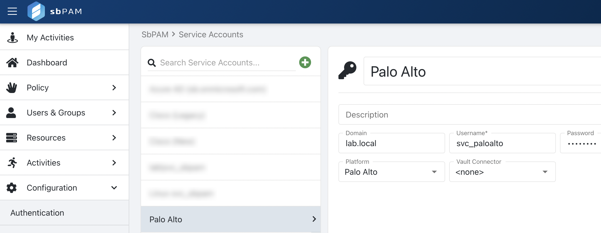
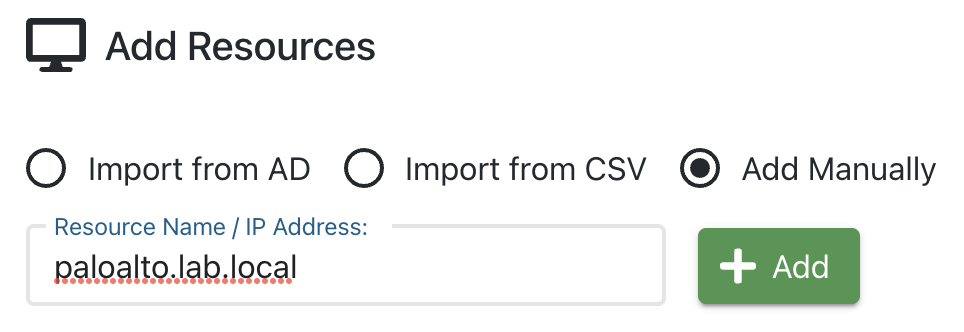
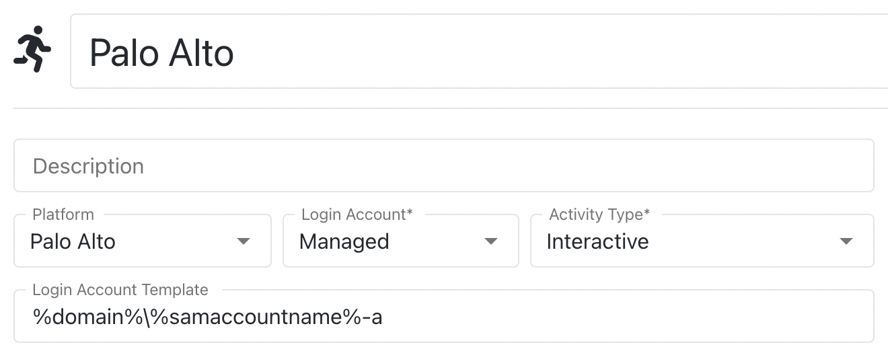

# Creating a Custom Platform for SSH Activity Sessio

## Summary

Platforms in SbPAM can be customized to meet specific SSH Activity Session workflow needs. As an example, in this article we will duplicate the out-of-the-box Linux Platform to create a Platform for Palo Alto (PAN-OS).

## Instructions

1. As an SbPAM admin user, navigate to the **Policy > Platforms** page. Locate the Linux Platform, duplicate it, and name it as desired. In this case, we will name the new Platform "Palo Alto".

   

2. Navigate to the **Configuration > Service Accounts** page and add a domain-level account as the Palo Alto service account.

   

3. Navigate to the **Resources** page and manually add the Palo Alto resource by IP or DNS name (using the Service Account created above). In this step, it's expected for the Host Scan to fail. Simply close the Host Scan window and proceed to the next step.

   

4. Navigate to the **Activities** page and create a new Activity. For **Login Account**, "Activity Token", "Managed Account", or "Requester" can be used. For the Login Account Template, remove the domain element (ex. ` %targetdomain%`) or use ` %domain%` instead of ` %targetdomain%`.

   

5. Navigate to the **Access Policy** page, create a new resource-based Access Policy that includes SbPAM users, the new Activity created above, and the new Resource manually added above.

6. Navigate to **My Activities** as an SbPAM user in the Access Policy, and you will be able to launch an SSH Activity Session for the Palo Alto resource.
