# Onboarding Mac devices for VNC via RDS (Remote Desktop Services)

## Overview

This article provides instructions for onboarding macOS devices into Netwrix Privilege Secure (NPS) so that VNC connections can be established by way of an RDS server. The VNC session will leverage RealVNC, run as a RemoteApp. The target resource will automatically be selected, and the user will enter credential information as part of the login process.

**Note:** This article applies only for Netwrix Privilege Secure 4.2 or higher, as it requires the `%token%` variable for the **Application to Launch** activity setting.

**Note:** The `nps_realvnc` file used in these instructions must be obtained from Netwrix Support.

## Before You Begin

Ensure that VNC access to the target host works. [This documentation](https://support.apple.com/en-au/guide/remote-desktop/apdbed09830/mac) offers some general instructions.

## Instructions

### Creating the macOS Platform

1. In Netwrix Privilege Secure, navigate to **Policy > Platforms**.
2. Select the **Windows** platform, and click the **Copy** icon.  
   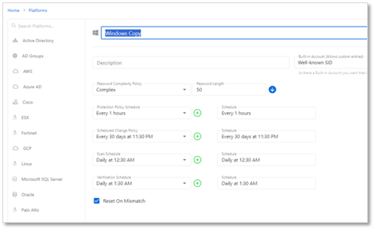
3. Change the name of the new platform to **macOS**. Ensure that the schedules are all set to `<none>`. Then click **Save**.  
   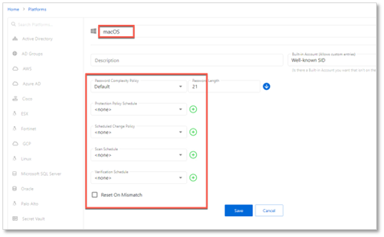

### Creating Service Accounts

1. On the **Configuration > Service Accounts** page, click the **+** icon and create a **macOS** service account. Note that the username and password do not matter - the macOS devices cannot be scanned, but a service account must be supplied to onboard the macOS resources.  
   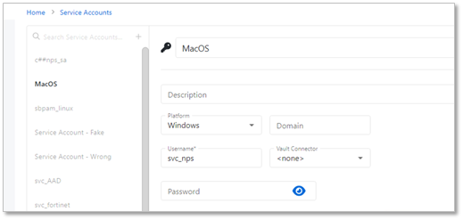

### Onboarding macOS Resources

1. Navigate to **Resources**. Click the **Add** button, and click **New Server**. On the **Add Resources** page, click the **Import from CSV** radio button, and click the **Download CSV Template** button. This will download a CSV template, which you can then populate with macOS resources, as in this example -  
   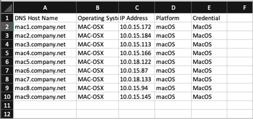
2. Note that it is crucial that the **Platform** exactly matches the Platform configured earlier, and that the **Credential** exactly matches the Service Account name configured earlier. The **Operating System** value is for informational purposes only, and will not be matched to any other values.
3. Return to the **Add Resources** page in step 1 of this section. Click the **Import CSV** button and upload the CSV file that was just configured. The resources will be displayed on the Add Resources page.  
   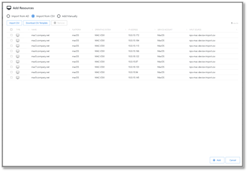
4. Select the desired resources (the **Select All** checkbox may be used) and click **Add**.
5. The dialogue will show that a scan is **Pending** on all of the resources - this scan will end in an **Error**. This is expected as macOS cannot be scanned by NPS, and this error will only occur during initial onboarding.  
   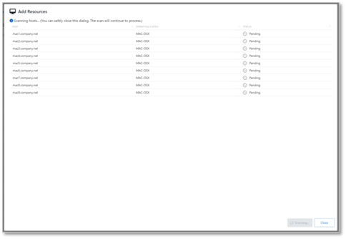
6. Navigate to the **Resources** page and observe that the onboarded macOS resources are present.  
   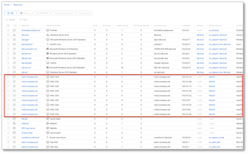

### Registering the nps_realvnc RemoteApp

1. Copy the `nps_realvnc.zip` file to the desktop of the RDS host where the RemoteApp will be published. Copy the contents to a folder where they can be accessed, for example `C:\npslaunchers`.  
   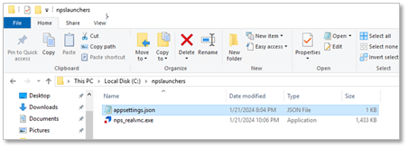
2. Edit the `appsettings.json` file and specify the address(es) of your NPS App Server(s).  
   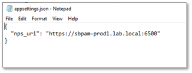
3. Open **Server Manager** on the RDS host where the RemoteApp will be published and select the **Publish RemoteApp Programs** option as indicated.  
   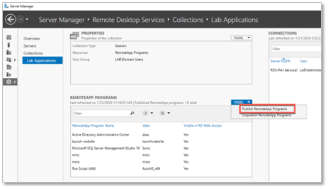
4. Select the indicated option to **Add a RemoteApp program**.  
   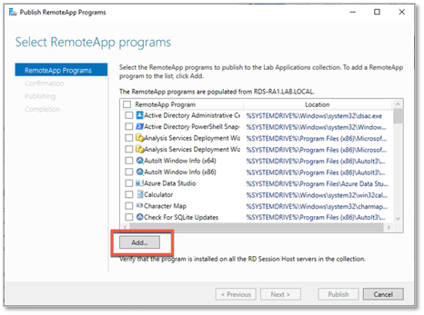
5. Navigate to the location where the `nps_realvnc` launcher was installed, and publish the RemoteApp.  
   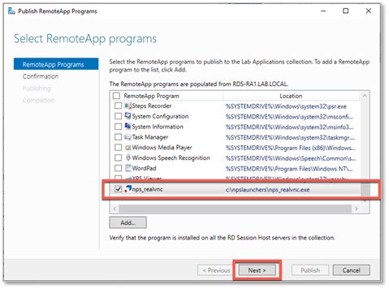
6. In Server Manager, right-click the published RemoteApp and select **Edit Properties**.  
   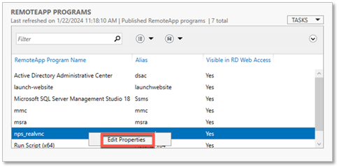
7. Select **Parameters** and choose **Allow any command-line parameters**. The RemoteApp will be published.  
   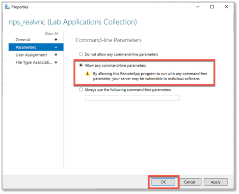

### Creating an Activity for VNC Access

1. Navigate to the **Activities** page and click the **+** icon to create a new Activity. The **Activity Type** of this activity must be set to **Interactive App Launch**, as this will allow VNC sessions to be launched through the `realvnc.exe` launcher configured in RDS.
2. Ensure that the following values are configured:
   - **Activity Type** - Interactive App Launch
   - **Login Account Template** – the account that will be used to connect to the RDS host, not the target macOS resource. Be sure to specify a domain, as `%targetdomain%` will not always work. (For example, `mydomain\managedaccountname`)
   - **Application to Launch** – Specify the same path and filename you used to publish the RemoteApp, and append the `%token%` and `%sessionid%` parameters. For example:

```
C:\npslaunchers\nps_realvnc.exe %token% %sessionid%
```

3. If the above steps have been followed, your activity configuration should resemble the following:  
   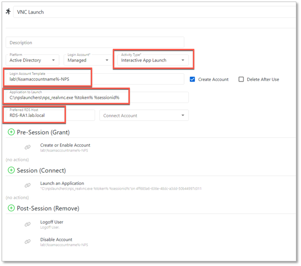

### Running the Activity

1. Once your Activity is created and added to an access policy containing your onboarded macOS resources, you can provision a session as normal.  
   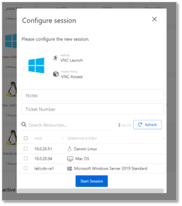  
   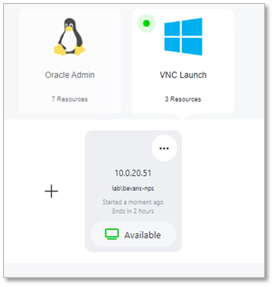
2. Depending on whether you have installed VNC Connect on the MAC device, you may get a warning similar to the following:
   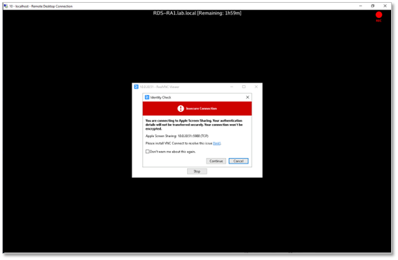
3. Enter your credentials when prompted.  
   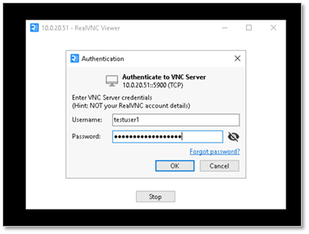
4. A VNC connection will now be established to the resource, and the session will be recorded by the NPS proxy service.  
   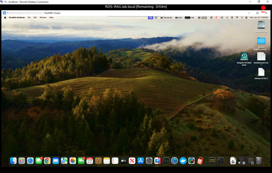
