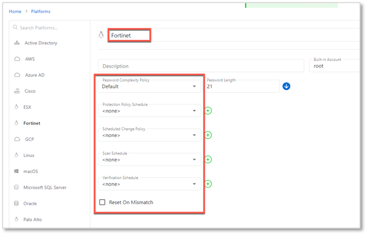
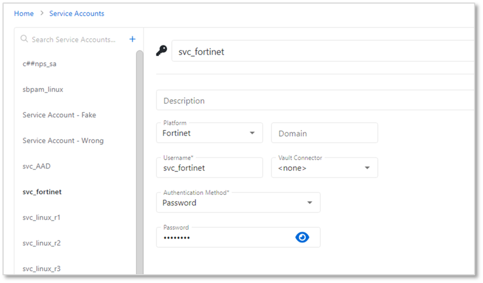
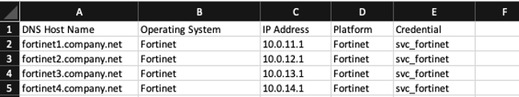
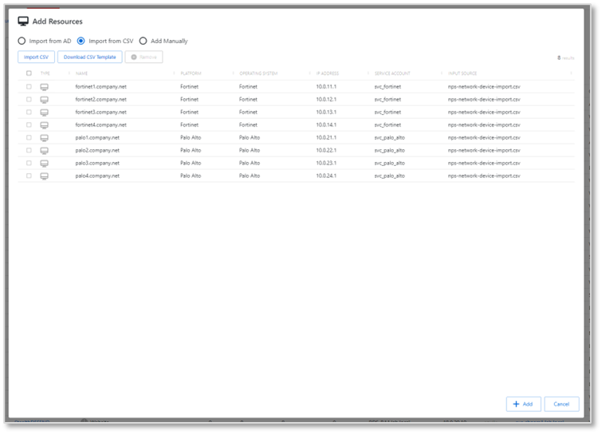
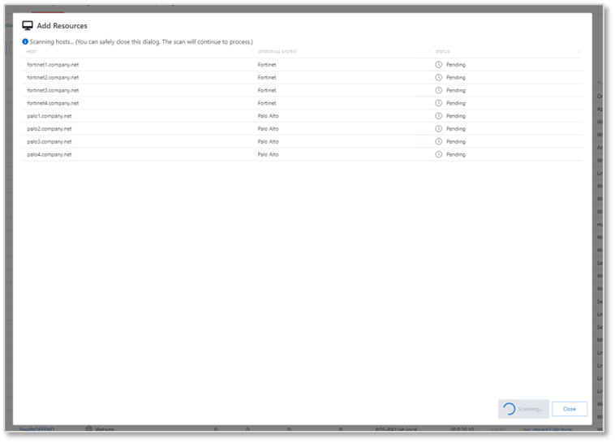
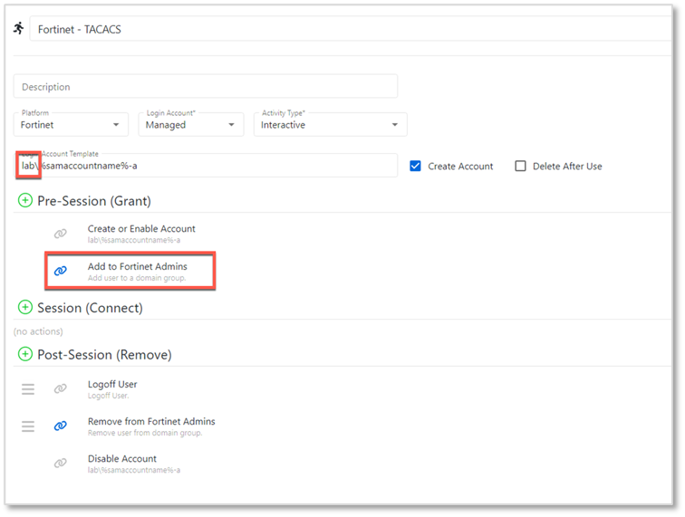
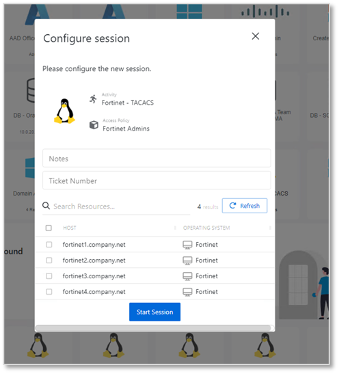

# Onboarding Network Devices Using TACACS Access Control

## Summary
This article provides instructions on how to onboard TACACS-enabled network devices as Netwrix Privilege Secure resources. It will be necessary to create a custom Platform for the device, and a corresponding service account. If multiple types of devices are to be onboarded, multiple sets of custom Platforms and service accounts can be used.

## Instructions

### Creating a Platform
1. Navigate to the **Policy > Platforms** page. Select the **Linux** platform, and click on the **Copy** icon.  
   
2. Rename the `Linux Copy` platform that was just created. The name should reflect the device you intend to onboard, in this case `Fortinet`. Set the **Password Complexity Policy** to `Default` and all change policies to `<none>`.

### Creating a Service Account
1. Navigate to the **Configuration > Service Accounts** page. Click the **+** icon and create a new Service Account whose name corresponds to the device you intend to onboard (again, `Fortinet` in this example).  
   

Note that this service account will not be used to scan the target device since it is not a supported Platform, so any username/password can be provided.

### Onboarding the Network Devices
1. Create a CSV file with the following columns: `DNS Host Name`, `Operating System`, `IP Address`, `Platform`, `Credential`.  
2. Populate the CSV file with information for all devices that will be onboarded. Note: Ensure that the `Platform` exactly matches the custom Platform you have configured in Netwrix Privilege Secure (NPS). Ensure that the `Credential` exactly matches the service account you have configured in Netwrix Privilege Secure (NPS).
   
3. Navigate to the **Resources** page. Click the **+Add** button, and select **New Server**. On the **Add Resources** page, select **Import from CSV**, and select the CSV file you have created. Note that there is a 50-resource batch size limit for CSV import.  
   
4. Your resources should be displayed. Click **Add**.  
   
5. The resources will be added and a host scan will be attempted for each one. This host scan will fail - this is expected for unsupported platforms during initial onboarding.  
   

Your resources should now be visible on the **Resources** page.

### Notes for Creating an Activity
When creating an Activity that uses domain credentials, it is important not to use the `%targetdomain%` variable in the **Login Account Template**. Rather, use the name of the domain, as indicated.  

Note that group membership add/remove operations will be needed if access control groups are used for the target devices.

Once the activity is configured, it can be added to an access policy in the usual manner, and used to run an activity.  
  

