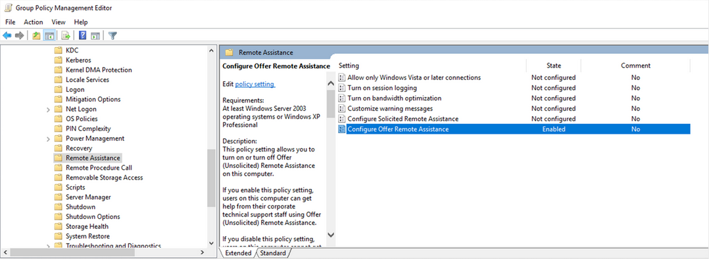
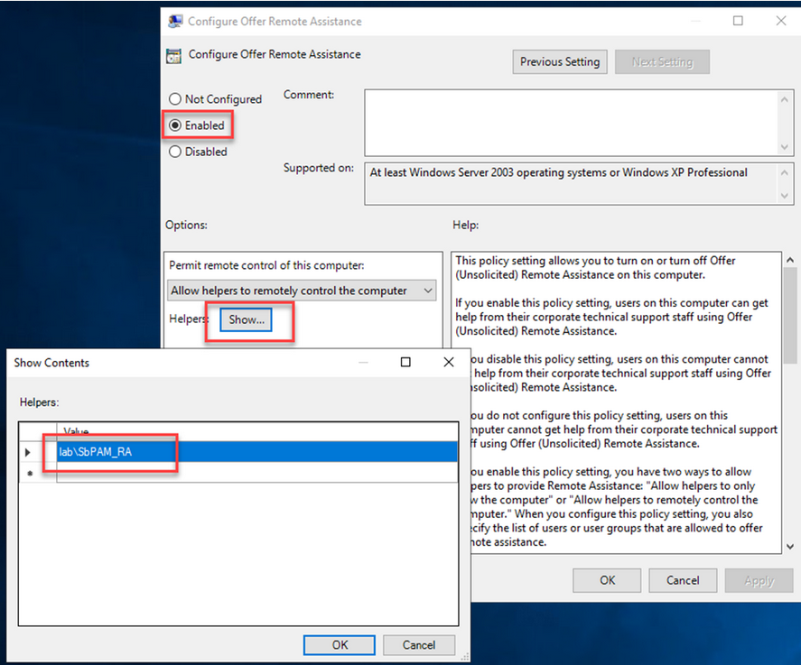
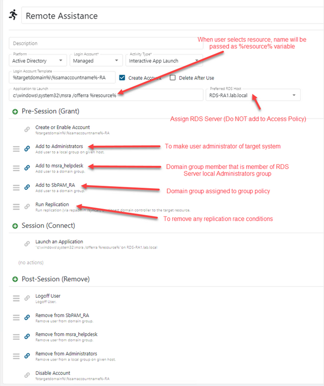
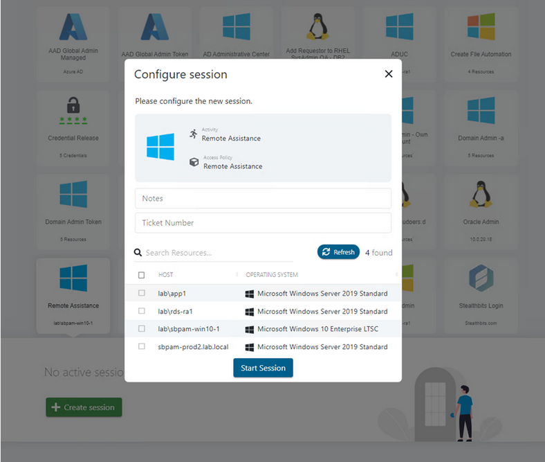
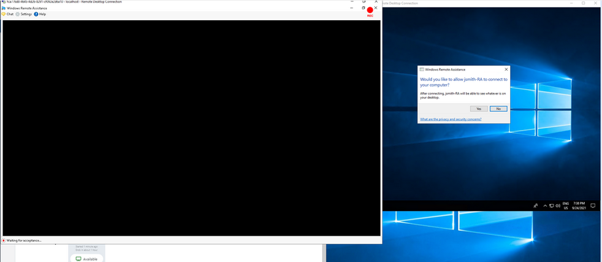
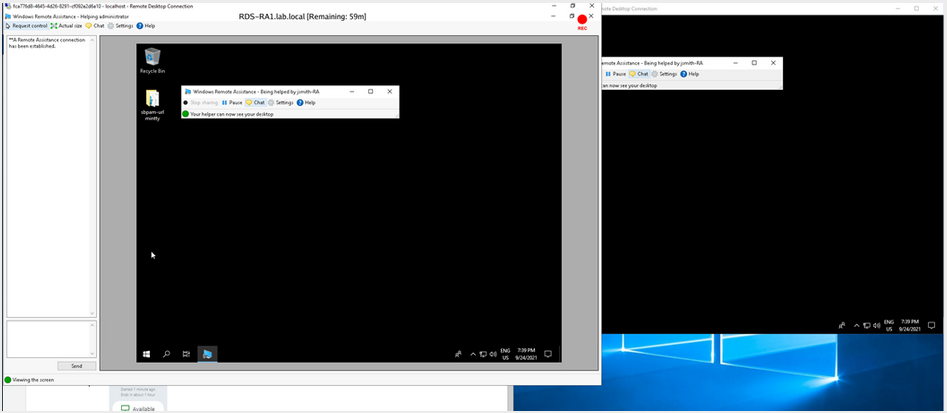
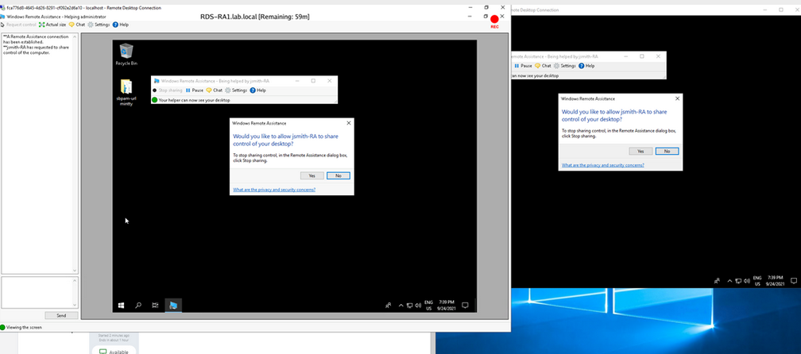
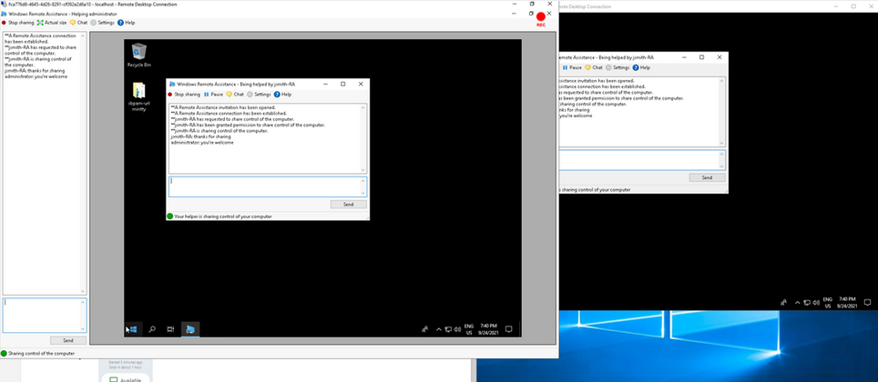
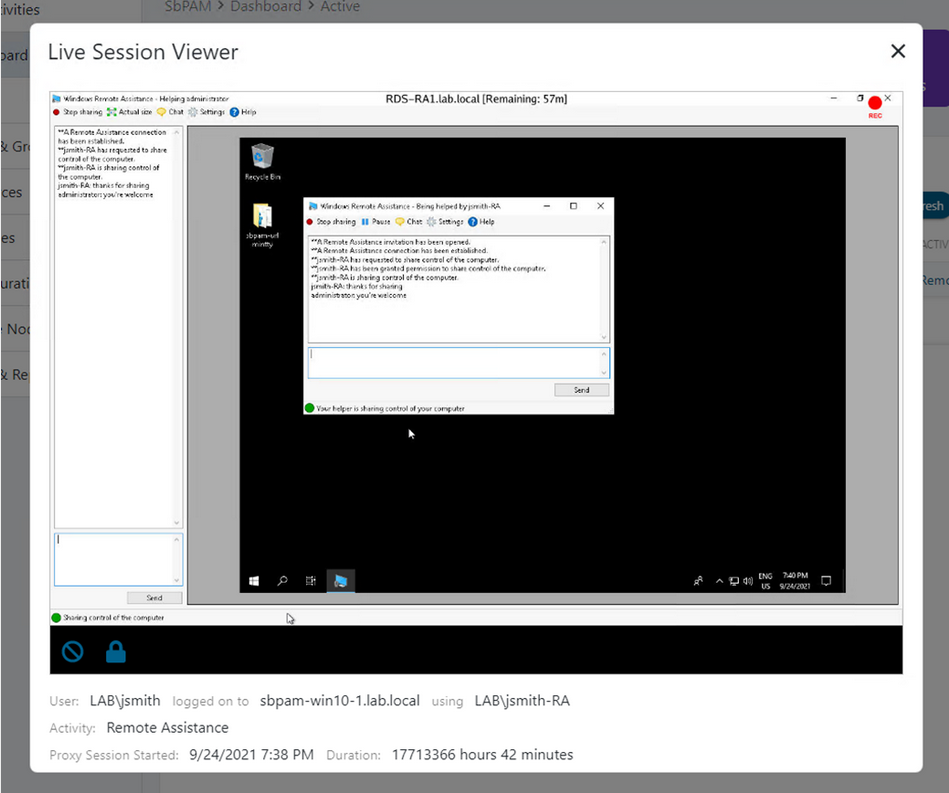

# How to Configure Windows Remote Assistance Integration

## Summary

This document provides an outline and guide for Netwrix Privilege Secure integration with Microsoft Remote Assistance.

## Enrollment

- Netwrix Privilege Secure Server
- RDS Server with RemoteApp – single machine CAL license

## Pre-requisites

- Group Policy to configure **Offer Remote Assistance**
- Domain group to be mapped to Configure Offer Remote Assistance policy
- Domain group that will be member of RDS server local Administrator group
- Remote Assistance Feature added to RDS server

## Instructions

### Group Policy

Enable **Configure Offer Remote Assistance** policy.

```text
Policies > Administrative Templates > System > Remote Assistance > Configure Offer Remote Assistance
```



Enable the policy and assign a domain group to control access.



### Activity Setup

Create an Interactive App Launch Activity making note of the highlighted areas below.

**NOTE:** The Domain groups for Group Policy and RDS server local admin will have been created in the previous steps.



### Use Case

Via Netwrix Privilege Secure UI or DirectConnect, the helpdesk admin selects the Remote Assistance Activity and chooses the resource to which remote assistance is to be provided.



When the Activity has been provisioned, the session is launched, and the target users’ desktop displays a message asking permission for the helpdesk admin to connect.



The helpdesk admin can now view the target users’ desktop and can establish a chat session.



If the helpdesk admin needs to take control of the remote system, they select **Request Control** and the end user is prompted for permission.



Once shared, control can be terminated at any time by the helpdesk admin or the end user.



The live session may be viewed via the Netwrix Privilege Secure administrator dashboard or reviewed later as a recording at any time.


