# How to Integrate Activities with Remote Desktop Services (RDS)

## Summary

This article outlines how to integrate Netwrix Privilege Secure activities with Microsoft Remote Desktop Services (RDS) to launch interactive application sessions with temporary elevated privileges.

## Licensing

Remote Desktop Services will run without a license for a period determined by Microsoft. For long-term use, you must install and set up RDS licensing based either on named users or RDS clients — this is not covered in this article.

## Instructions

### Configure Remote Desktop Services

1. On the Remote Desktop Services / Terminal Services (RemoteApp) server launch **Server Manager**, click on the **Manager** tab and select **Add Roles and Features**.
2. Follow the wizard, select **Remote Desktop Services installation**, and click **Next**.

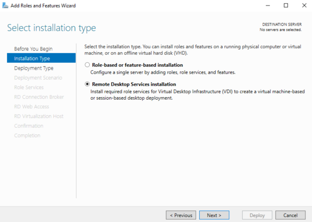

3. Select either **Standard Deployment** (as in this guide) or **Quick Start** if you intend to install all RDS role services on the same server. Click **Next**.

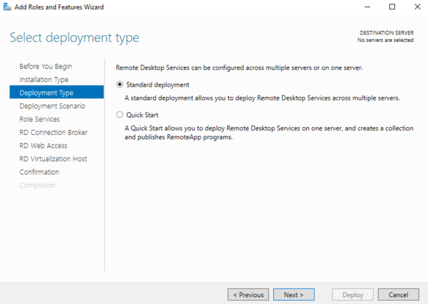

4. Select **Session-based desktop deployment**, and click **Next**.

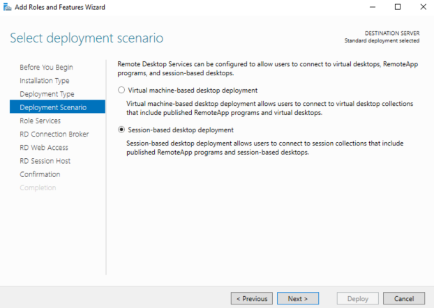

5. Follow the wizard without making any changes until you get to the **RD Connection Broker** tab. Specify the server intended for the RD Connection Broker server and click **Next**.

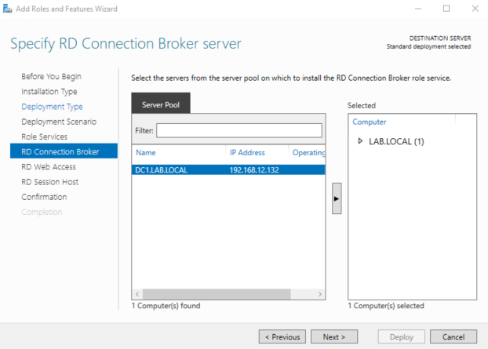

6. Specify the server intended for the **RD Web Access server** and click **Next**.

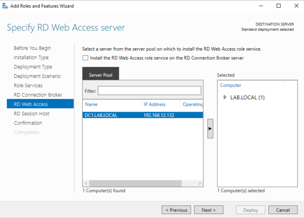

7. Specify the server intended for the **RD Session Host server(s)** and click **Next**.

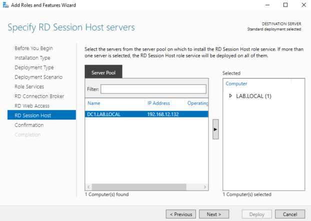

8. Review RDS role server selection, check the **Restart the destination server automatically if required** box, and click **Deploy**.

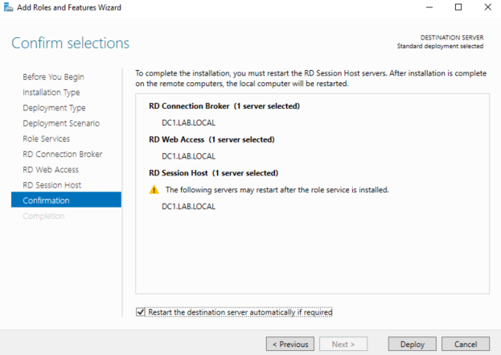

The RD role services installation begins, and about halfway through the server will automatically reboot. Once the server has rebooted, log in with the same account used when the installation was first started, open **Server Manager**, and the installation dialogue window will resume.

9. After completion of RDS role services installation, launch **Server Manager**, navigate to the RDS overview window, and click on **3 Create session collections**.

10. Follow the wizard until you get to the **Collection Name** tab. Enter a name, such as "NPS Applications", and click **Next**.

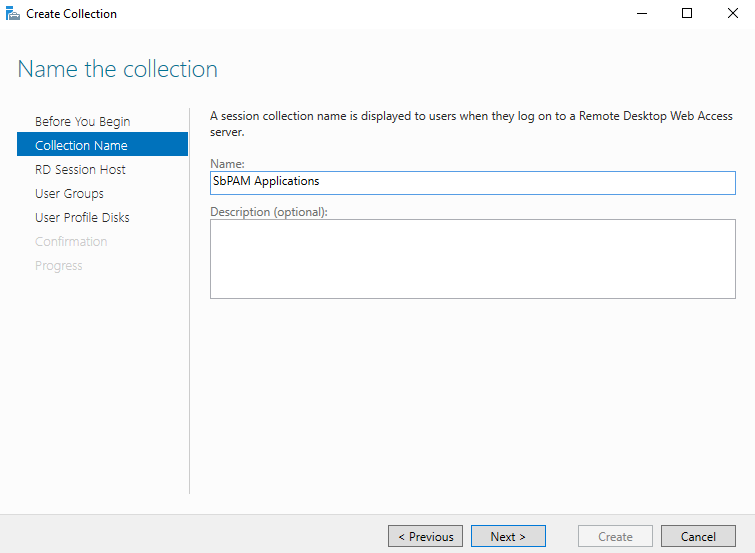

11. Specify the RD Session Host server (the server you specified earlier during installation of the RD Session Host role) and click **Next**.
12. Add the user groups who will access RemoteApps in the session collection. Click **Next**.

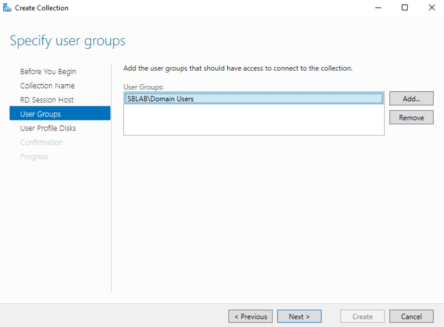

13. Optionally specify and enable user profile disks (not used in the test environment for this guide). Review the defined session collection parameters and click **Create**. Once the session collection is created, close the **Create Collection** wizard.
14. In **Server Manager** navigate to the **Remote Desktop Services Overview** and note the new session collection created under the RD Session Host icon.

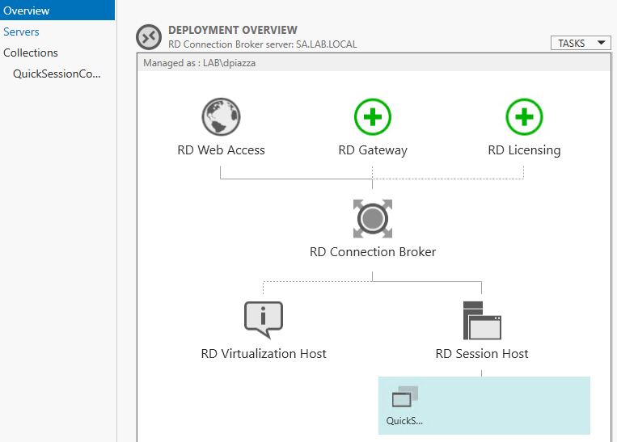

15. Publish RemoteApps by navigating to the **Collections** tab of **Server Manager** and selecting **Publish RemoteApp Programs** from the **Task** menu.

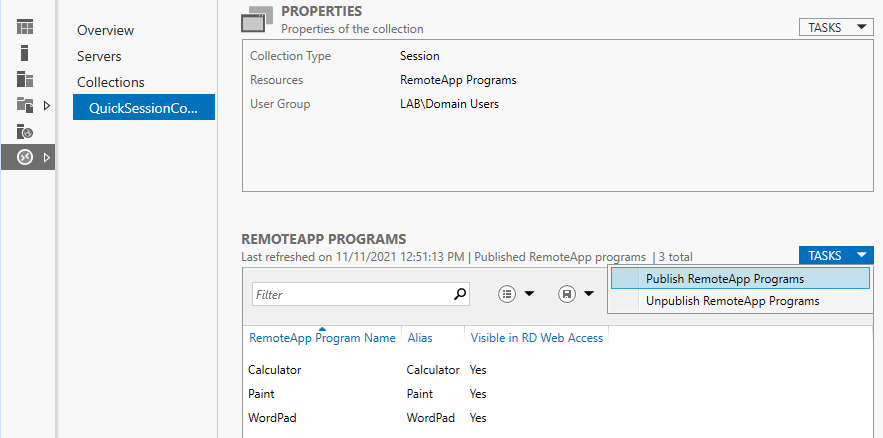

16. If the required application is listed, select it. For applications such as ADUC (Active Directory Users and Computers) you will need to specify the executable name and path. Click **Add**.

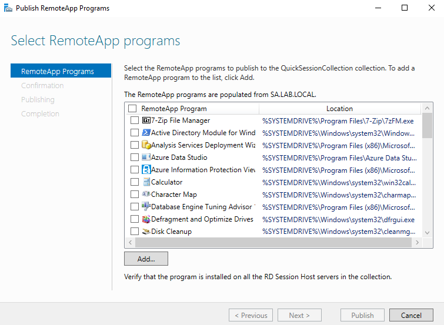

17. For ADUC, add **MMC (\<rds_server>\c$\Windows\System32\mmc.exe)**.

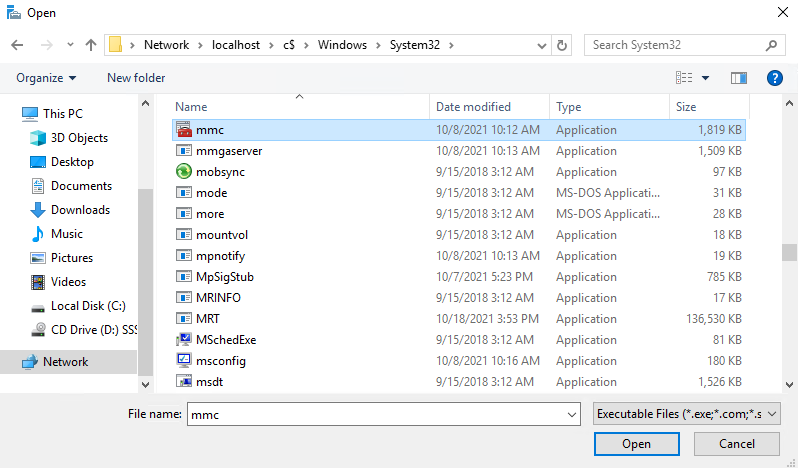

18. After adding all desired programs, click **Next**, click **Publish**, and then click **Close**.
19. Rename the RemoteApp and specify a parameter to launch ADUC. For additional security, you can assign groups of users to RemoteApps. For example, assign the ADUC RemoteApp to an AD group called `RAUsers_ADUC`.
20. Right-click the **RemoteApp** and select **Edit Properties**.

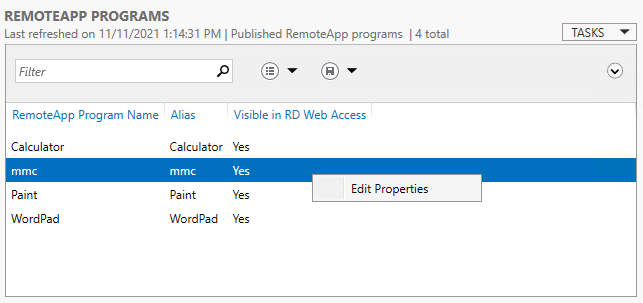

21. Edit the RemoteApp name and set it to "ADUC", then click the **Parameters** tab in the left sidebar.

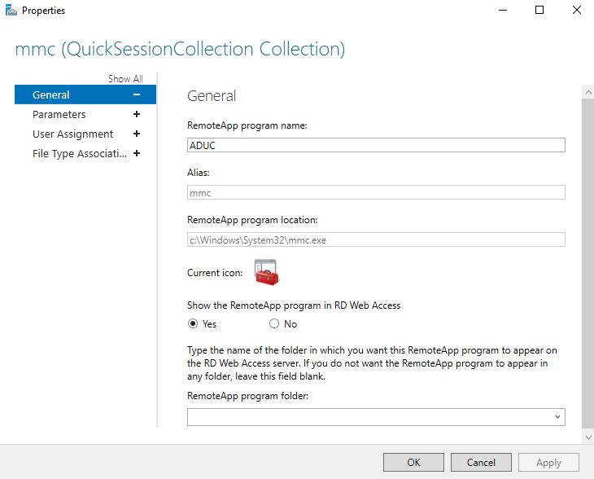

22. On the **Parameters** tab, select the **Always use the following command-line parameters** radio button. For the path use: `dsa.msc`
23. Click the **User Assignment** tab in the left sidebar. Select the user access control group for the RemoteApp. In this case, specify that users must be a member of the `RAUsers_ADUC` group to run the ADUC RemoteApp.

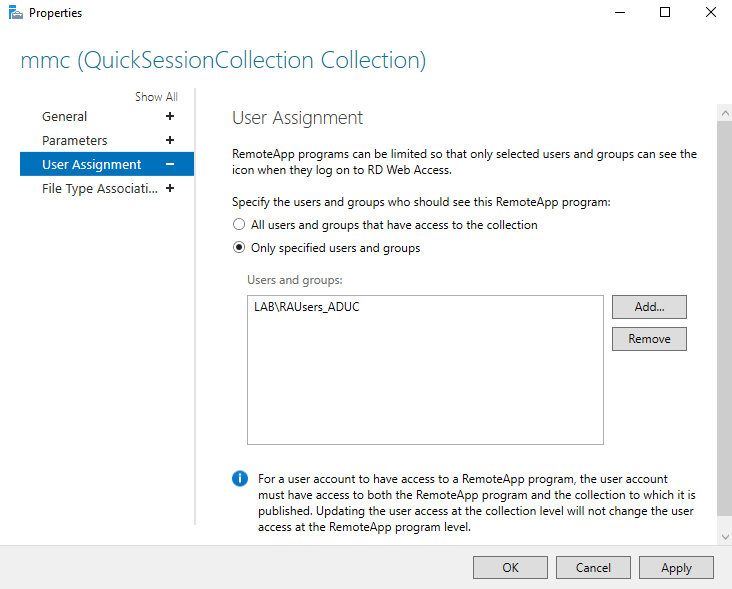

24. Click **OK**. Configuration of ADUC as a RemoteApp that can be accessed via a Netwrix Privilege Secure activity is now complete. Next, perform the necessary setup in a Netwrix Privilege Secure activity.

25. Log in to Netwrix Privilege Secure (NPS) as an Administrator. You will create an activity to execute the ADUC RemoteApp you created earlier. Ensure **Interactive App Launch** is selected and the full application path to the RemoteApp on the RDS host is specified — but do not use the full path for MMC extensions such as `dsa.msc`.

For example:
`C:\Windows\System32\mmc.exe dsa.msc`

***IMPORTANT:*** Double check that the Application to Launch field exactly matches the application and parameter you published with the RemoteApp. Note that for the application value you should always use implicit drive/folder names, i.e., use `C:\Windows\` and NOT relative identifiers such as `%SYSTEMROOT%`.

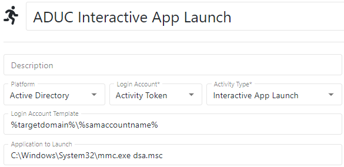

26. For this example, add the Login Account to the `RAUsers_ADUC` domain group specified for the RemoteApp by adding an **Add User to Domain Group** action to the activity's pre-session.

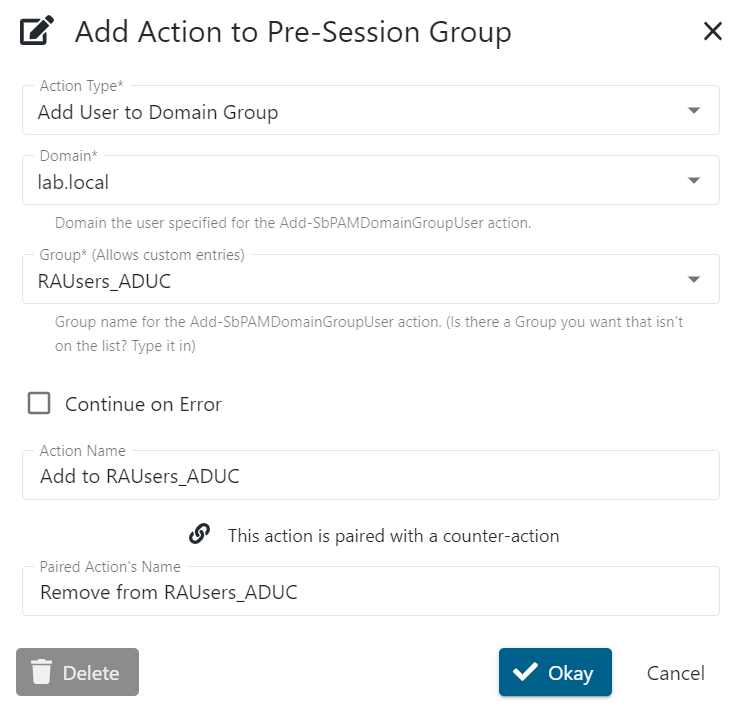

27. For temporary privilege elevation, you may also want to add a step to add the Login Account to `Domain Admins`.
28. Create an access policy in Netwrix Privilege Secure that contains the recently created activity, the users who should have access to use it, and the Remote Desktop Services server resource. You can now provision this activity to any user granted privilege to use it.
29. When you connect to the Remote Desktop Services server, you will only have access to the published RemoteApp (in this case, ADUC). The RDP session does not offer a full desktop environment, since this is an Interactive App Launch for a specified program.

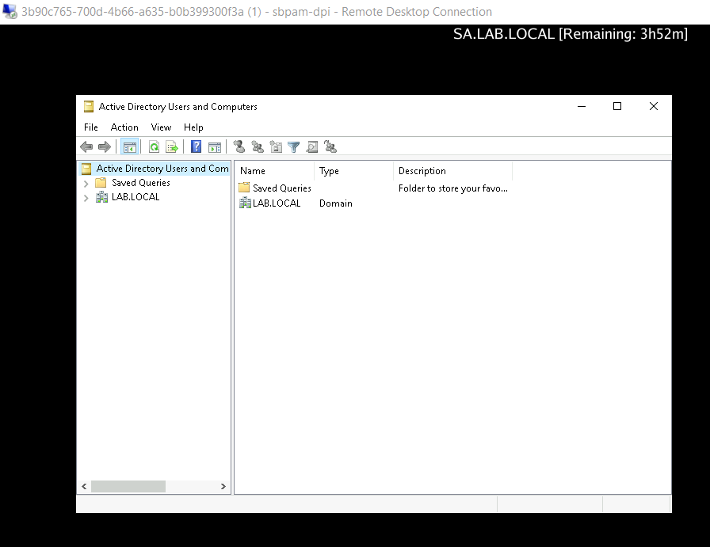
