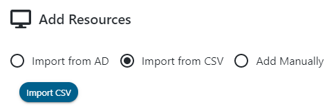
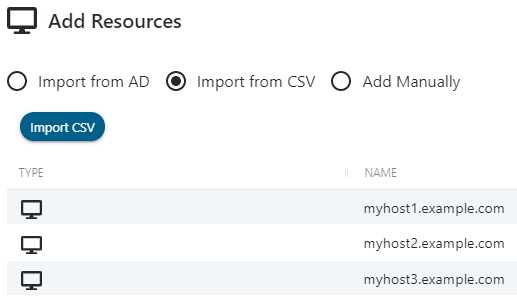

# Adding Resources From a CSV File

## Summary

Resources can be imported to Netwrix Privilege Secure from a CSV file, where each line of the CSV is a distinct DNS hostname.

## Instructions

1. Create a CSV file that contains the distinct DNS hostname of the resources you would like to add to Netwrix Privilege Secure. For example:

2. In Netwrix Privilege Secure, navigate to the **Resources** page. Click **+ Add**, then select the **Import from CSV** radio button at the top of the dialog that appears.

   

3. Click **Import CSV**, then browse to and select the CSV of DNS hostnames you would like to import to Netwrix Privilege Secure.

   

4. The **Add Resources** page will now list the resources found in the CSV, with a row for each DNS hostname.

   - In the bottom-right dropdown, select a **Service Account** that has previously been added to Netwrix Privilege Secure. This Service Account will be used to scan each resource being added.
   - When the desired Service Account is selected, click **+ Add** to start the resource import. You can wait and view the status of each host scan, or close the window to allow scanning to continue in the background.
   - As resources are imported, you will see them appear on the **Resources** page, along with information gathered by the host scan such as Operation System, DNS Host Name, and IP Address.
