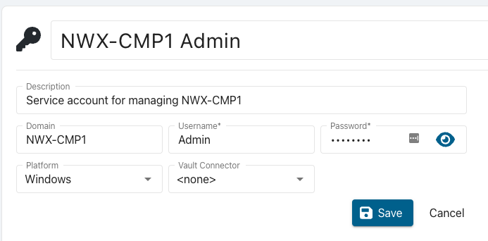
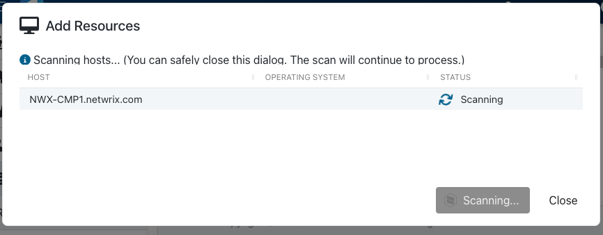
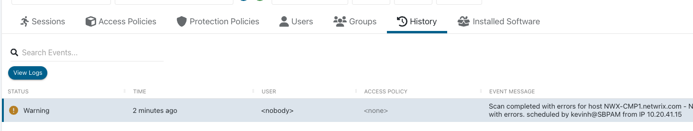
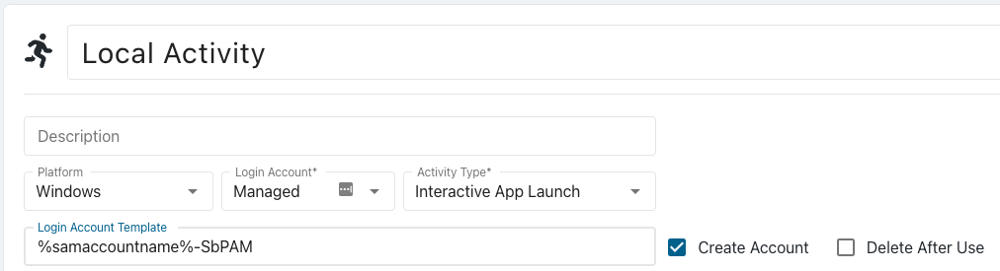

# Managing Non-domain-joined Windows Computers with Netwrix Privilege Secure

## Overview

This article describes the process for managing a non-domain-joined Windows computer with Netwrix Privilege Secure.

## Before You Begin

Make sure that you have the following:

- A local Administrator account on the target computer, for which you know the password
- PowerShell Remoting enabled on the target computer (`Enable-PSRemoting` ⸱ Microsoft) (https://learn.microsoft.com/en-us/powershell/module/microsoft.powershell.core/enable-psremoting?view=powershell-7.2)
- Port 5985 open for connections from the Netwrix Privilege Secure server (and any hosts running remote action services, if applicable)

## Instructions

### Adding the Netwrix Privilege Secure Service Account

1. As a user with the Administrator role, open Netwrix Privilege Secure. Navigate to the **Configuration > Service Accounts** page.
2. Click the green plus button to create a new Service Account
3. Enter the required information
   1. Name (a friendly name that is displayed in the rest of the UI for this account)
   2. Description (additional text for identifying this account)
   3. Domain (This MUST be the `NETBIOS` name of the target computer)
   4. Username (A Local Administrator account on the target computer)
   5. Password (The password for the local administrator account)
   6. Platform (`Windows`)
   7. Vault Connecter (`<none>`)
4. Click **Save**

### Adding the Computer to Netwrix Privilege Secure

1. Navigate to the **Resources** page
2. Click the **Add** button
3. Select **New Server** from the dropdown list
4. Click the **Add Manually** radio button
5. Enter the FQDN of the target computer
6. Click **Add**
7. In the lower right, select the Service Account you created above.
8. Click **Add**

This will start the scanning step, you can close the dialog or wait for the scan to complete. If there are failures during the scan you can review the logs by navigating to the resource page.

### Troubleshooting a Failed Scan

If the scan fails, you can troubleshoot it by viewing the scan logs on the **Resources** page.

1. Search for the computer you attempted to add

2. Click on the Resource name of the computer
3. Click on the **History** tab
4. Select the last scan event and click **View Logs**

### Additional Troubleshooting: "Access Denied""

In the event that you see "Access Denied" when investigating the logs, refer to Netwrix Privilege Secure: Resolving "Access Denied" When Connecting to a Non-domain-joined Windows Resource (https://kb.netwrix.com/8526).

## Summary

After going through this process, you can use this computer's resource in Activities. A non-domain joined Windows computer can be used in any activity that doesn’t require Active Directory. You can create local Activity Token users and local managed accounts. Requester and accounts that require Active Directory will not work.

To configure a local Activity Token/Managed Account activity, when creating the activity remove the “%targetdomain%\” portion of the default Login Account Format. Make sure to use the **Windows** Platform as well.

