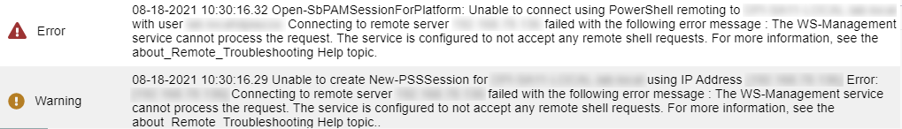
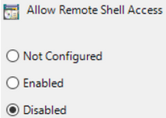
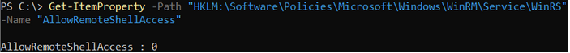

# Resolving failed Actions on a Windows resource due to error "The WS-Management service cannot process the request. The service is configured to not accept any remote shell requests."

## Summary

If remote shell access is disabled on a Windows resource, Netwrix Privilege Secure's Action Service cannot perform actions on that host. You can confirm this when an action's logs contain the following error:

```
Unable to connect using PowerShell remoting to <hostname> with user <domain>\<user>: Connecting to remote server <ip_address> failed with the following error message : The WS-Management service cannot process the request. The service is configured to not accept any remote shell requests.
```



This is caused by a Group Policy, configured at the local or domain level, that disables remote shell access on the resources the GPO targets:



## Instructions

You can verify this GPO in the Group Policy Editor on the target resource (or in the domain GPO configuration). Remember that domain configuration takes precedence over local configuration.

```
Computer Configuration > Administrative Templates > Windows Components > Windows Remote Shell > Allow Remote Shell Access
```


You can also verify the setting in PowerShell, but the GPO must first have been **Enabled** or **Disabled** so the correct registry key exists:

```
Get-ItemProperty -Path "HKLM:\Software\Policies\Microsoft\Windows\WinRM\Service\WinRS" -Name "AllowRemoteShellAccess"
```

- If the value is set to **0**, then remote shell access is **Disabled**.
- If the value is set to **1**, then remote shell access is **Enabled**.



To resolve the error, set this GPO to either **Enabled** or **Not Configured**. In a domain environment, you should make this change via a domain-configured GPO rather than manually modifying the registry key on the target resource.
