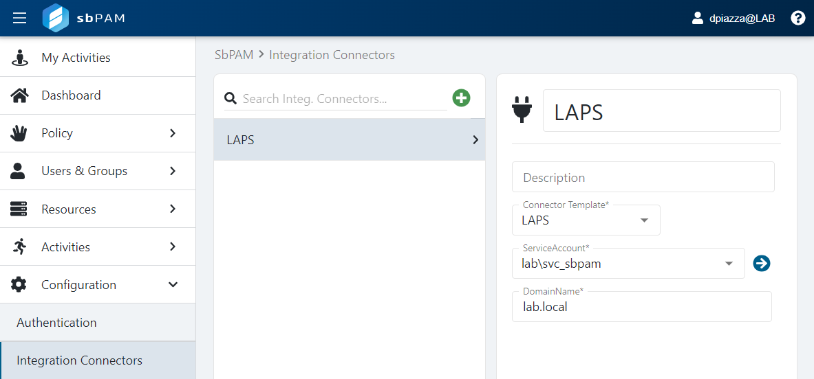
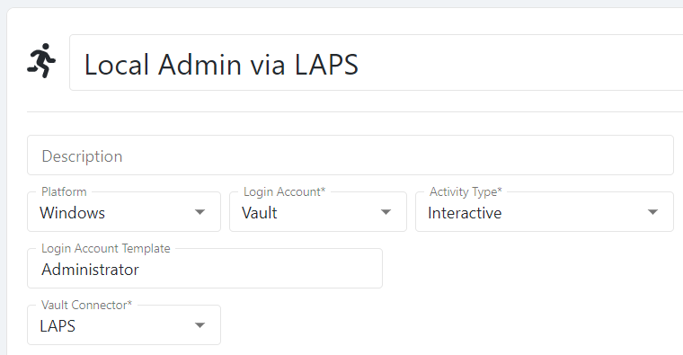

# How to Configure Local Administrator Password Solution (LAPS) Integration

## Summary
This article outlines how to integrate Netwrix Privilege Secure activities with the Microsoft Local Administrator Password Solution (LAPS), enabling activities to access Windows resources using the built-in Administrator account managed by LAPS.

## Instructions

1. Ensure prerequisites
   - Install LAPS on the target Windows workstations and servers.
   - Place the computers in the appropriate Organizational Units (OUs) in Active Directory.

2. Prepare a service account
   - Create a service account, or identify an existing account, that Netwrix Privilege Secure will use to integrate with LAPS.
   - Delegate the ability to read and reset LAPS passwords to that service account by using the Microsoft PowerShell cmdlets available with the LAPS UI fat client installer: https://www.microsoft.com/en-us/download/details.aspx?id=46899

   Use the following PowerShell commands (replace `<laps_ou>` and `<service_account>`):

   ```powershell
   Set-AdmPwdReadPasswordPermission -OrgUnit "<laps_ou>" -AllowedPrincipals "<service_account>"
   ```

   ```powershell
   Set-AdmPwdResetPasswordPermission -OrgUnit "<laps_ou>" -AllowedPrincipals "<service_account>"
   ```

   - In these commands, replace `<laps_ou>` with the OU containing the computers managed by LAPS, and replace `<service_account>` with the service account that you will use during the LAPS integration configuration in Netwrix Privilege Secure.

   Example: if the computers managed by LAPS are in an OU named "LAPS PCs" and the service account is `svc_sbpam@lab.local`, run:

   ```powershell
   Set-AdmPwdReadPasswordPermission -OrgUnit "LAPS PCs" -AllowedPrincipals "lab\svc_sbpam"
   ```

   ```powershell
   Set-AdmPwdResetPasswordPermission -OrgUnit "LAPS PCs" -AllowedPrincipals "lab\svc_sbpam"
   ```

3. Configure the LAPS connector in Netwrix Privilege Secure
   - Log in to Netwrix Privilege Secure as an admin.
   - If the service account you granted permissions to is not yet added to Netwrix Privilege Secure, add it via **Configuration > Service Accounts**.
   - Navigate to **Configuration > Integration Connectors**.
   - Create a new connector and select **LAPS** from the **Connector Template** dropdown.
   - Select the service account that has read and reset permissions for the LAPS OU(s) from the **ServiceAccount** dropdown.
   - Add the domain name (for example, `lab.local`) in **DomainName** and click **Save**.

   

4. Create an activity that uses the LAPS connector
   - Navigate to **Activities** to create an activity that provides the built-in Administrator access to a Windows resource managed by LAPS.
   - Create a new activity and set the **Login Account** dropdown to **Vault**.
   - For **Vault Connector**, select the LAPS connector you created in the previous step.
   - Set **Platform** to **Windows**.
   - Ensure the **Login Account Template** matches the expected built-in admin account name (in most cases this is the default value `Administrator`).

   

   - Add any other desired actions to the activity.

5. Create Access Policies
   - Create one or more **Access Policies** to determine which Netwrix Privilege Secure users can provision this activity session and which resources they can access.
   - Configure policies with combinations of Netwrix Privilege Secure users, the LAPS activity you created, and the Windows resources managed by LAPS.

6. Provision and use LAPS-integrated sessions
   - Users added to the appropriate **Access Policies** can now provision the LAPS activity.
   - Provisioned sessions allow users to RDP to Windows resources managed by LAPS as the built-in Administrator account.
   - When a LAPS-integrated session ends, Netwrix Privilege Secure triggers a password rotation via LAPS, ensuring the built-in admin account for the accessed resource is secured.
