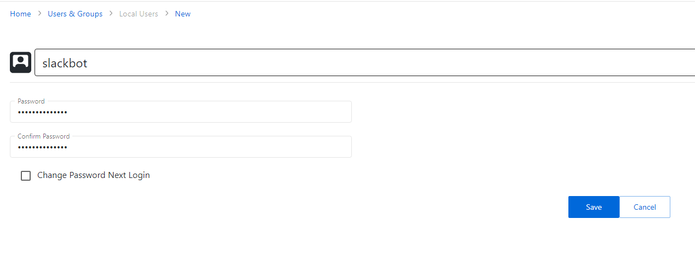
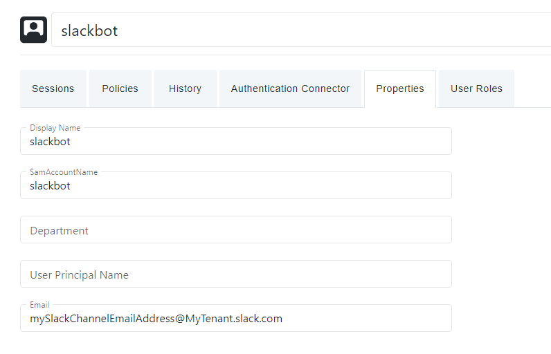

# Slack Integration: Send Approvals to Slack

## Summary
This article describes the process for setting up an Approval workflow in which a Slack channel receives an approval notification.

## Instructions
1. In Slack, inspect the channel you wish to message. The **Integrations** pane will have a **Send emails to this channel** setting. Copy the email address.  
2. In Netwrix Privilege Secure, navigate to the Users and Groups page. Click the **Add** button and create a new **Local user**. **Note: this user will not need to log in to Netwrix Privilege Secure.**  
     
3. Set the local user's email address to the Slack channel's email address from step 1:  
     
4. You may now add this local account as an additional approver in any approval workflow. It will not be used for approvals, but its email address value will allow the configured Slack channel to receive approval messages.
