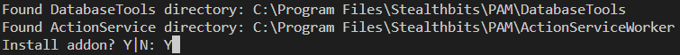
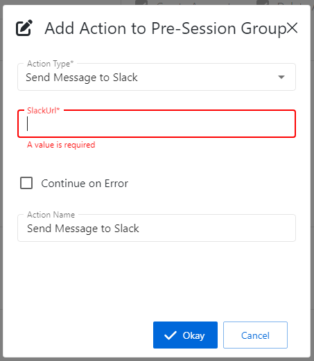

# Slack Integration: Send Slack Message

## Summary

This article describes how to set up a custom "Send Slack Message" action step in Netwrix Privilege Secure, which you can then add to activities.

## Instructions

### Preparing Your Slack App

A custom Slack application must be created for this integration.

1. In Slack, navigate to the **Your Apps** page: https://api.slack.com/apps/
2. Click **Create New App**
3. Select **From an app manifest** and paste the following YAML into the provided field:

```yaml
display_information:
  name: NPS App
settings:
  org_deploy_enabled: false
  socket_mode_enabled: false
  is_hosted: false
  token_rotation_enabled: false
```

4. On the **Your Apps** page, select **Incoming Webhooks**.
5. Under **Activate Incoming Webhooks**, click **Add New Webhook to Workspace**.
<a id="URL2"></a>
6. Search for the channel you would like Netwrix Privilege Secure (NPS) to message. Click **Allow**. Copy the provided URL.

### Importing the Action Step

1. Download the Send-SlackMessage.zip archive to the SbPAM server: https://dl.netwrix.com/additional/Send-SlackMessage.Addon.zip
2. Extract the archive, which contains a README file, an ActionTemplates directory, and an `Install-Addon.ps1` script file. Right-click `Install-Addon.ps1` and select **Run with PowerShell**.
3. When prompted, select `Y` to proceed.

4. The PowerShell window should quickly execute the script and close.
5. Log in to the SbPAM console. (If SbPAM was already open, be sure to refresh the console.)
6. In SbPAM, navigate to **Activities**, select an **Activity**, and click the green plus sign in either the **Pre-Session** or **Post-Session**. Note that the **Send Message to Slack** activity step is now available.
7. Provide the URL from step 6 of Preparing Your Slack App when configuring the action step.

