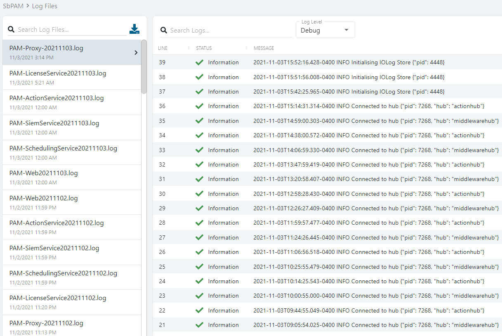

# Logs Location

## Summary

By default, Netwrix Privilege Secure logs are stored on the Netwrix Privilege Secure install drive in:

```
\ProgramData\STEALTHbits\PAM\Log
```

Netwrix Privilege Secure uses the `%PROGRAMDATA%` environment variable to determine the location of the log directory. Command Prompt can be used to locate this directory by running the following command:

```bat
echo %PROGRAMDATA%
```

Netwrix Privilege Secure logs can also be viewed, and downloaded, via the Netwrix Privilege Secure web interface by navigating to **Audit & Reporting > Log Files**.



## Log Descriptions

- **Action Service -** `PAM-ActionService<date>.log`  
  The action service is the component that connects Netwrix Privilege Secure to managed resources. Use cases include Active Directory synchronization, password changes, and account orchestration. If an action experiences an issue, this log should be reviewed.

- **DbUpdater -** `PAM-DbUpdater<date>.log`  
  The DbUpdater updates the database with schema changes and updates to built-in activities and new activity steps (actions). If an upgrade fails or an expected activity update isn't applied, this log should be reviewed.

- **Proxy Service -** `PAM-Proxy-<date>.log`  
  The Netwrix Privilege Secure proxy service connects users to resources via RDP and SSH protocols; the proxy is also responsible for storage of session recordings via its iolog component. When a user cannot access a resource via RDP or SSH, this log should be reviewed.

- **Scheduling Service -** `PAM-SchedulingService<date>.log`  
  The scheduler service is responsible for setting up and maintaining any date/time-specific actions such as password changes and system scans, etc. If a scheduled action fails to execute, this log should be reviewed in addition to the action service log.

- **Siem Service -** `PAM-SiemService<date>.log`  
  The SIEM service forwards events to configured SIEM endpoints. If there's an issue with event forwarding to a SIEM, this log should be reviewed.

- **Web Service -** `PAM-Web<date>.log`  
  The central web service is responsible for database access and communication out to each service component (i.e., licensing, email, action, and proxy). If you experience login failures, this log should be reviewed. Also, if the proxy or action service logs show a failure communicating with the web service, this log should be reviewed for more information.
