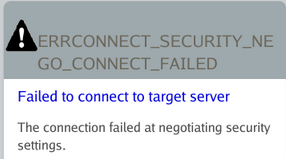
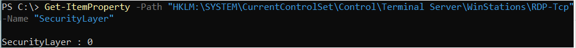
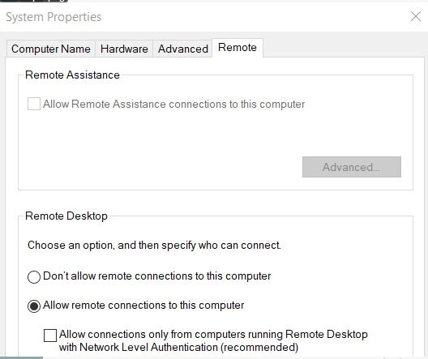
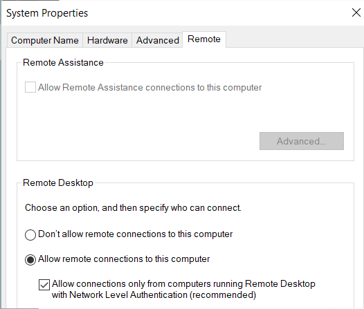

# Resolving ERRCONNECT_SECURITY_NEGO_CONNECT_FAILED for Windows RDP Sessions

## Summary

When connecting via RDP to a Windows resource, the following error may occur depending on the RDP security settings configured on the target resource:

```
ERRCONNECT_SECURITY_NEGO_CONNECT_FAILED
Failed to connect to target server
The connection failed at negotiating security settings
```



## Instructions

This error is caused by the following combination of RDP settings on the target Windows resource:

1. The RDP **SecurityLayer** setting is set to `0` (RDP is used by server and client for authentication). You can verify this by running the following in PowerShell and checking the resulting **SecurityLayer** on the target Windows resource:

```powershell
Get-ItemProperty -Path "HKLM:\SYSTEM\CurrentControlSet\Control\Terminal Server\WinStations\RDP-Tcp" -Name "SecurityLayer"
```

If the output for **SecurityLayer** is `0`, then this condition has been met.



2. **Network Level Authentication (NLA)** has been disabled for RDP.

To check this setting on the target Windows resource, press Windows+R to open a Run menu or open Command Prompt. In either Run or Command Prompt, execute the following:

```
sysdm.cpl
```

In the menu that opens, navigate to the Remote tab. The control **Allow connections only from computers running Remote Desktop with Network Level Authentication** is the correct control.

If this control is disabled, then this condition has been met.



There are two ways to resolve the error, depending on the desired security settings for your environment:

1. Change the RDP **SecurityLayer** value to `1` (server and the client negotiate the method for authentication) or `2` (Transport Layer Security (TLS) protocol is used by the server and the client for authentication), while leaving **Network Level Authentication (NLA)** disabled:

```powershell
Set-ItemProperty -Path "HKLM:\SYSTEM\CurrentControlSet\Control\Terminal Server\WinStations\RDP-Tcp" -Name "SecurityLayer" -Value 2
```

2. Enable **Network Level Authentication (NLA)** while leaving RDP's **SecurityLayer** value at `0`:



IMPORTANT: For optimal security, it's recommended to have RDP's **SecurityLayer** value set to `2` while enabling **Network Level Authentication (NLA)**.

The following links provide additional information about **SecurityLayer** and **Network Level Authentication (NLA)** from Microsoft:

- https://docs.microsoft.com/en-us/windows-hardware/customize/desktop/unattend/microsoft-windows-terminalservices-rdp-winstationextensions-securitylayer
- https://docs.microsoft.com/en-us/windows-server/remote/remote-desktop-services/clients/remote-desktop-allow-access#why-allow-connections-only-with-network-level-authentication

## Additional Troubleshooting

If the above configuration on the remote computer does not resolve the issue, apply the following configuration change to Netwrix Privilege Secure.  

1. Open the `sbpam_rdp.json` proxy configuration file in a text editor: `C:\ProgramData\Stealthbits\PAM\ProxyService\sbpam_rdp.json`  
2. Edit the file to ensure that the following setting is configured. Note: if the file already exists, ensure that all lines in the file are properly comma-separated after editing the file.

```json
{
   "ClientSettings": [{"key":"RdpSecurity", "Value":true}]
}
```

3. If the `sbpam_rdp.json` file does not exist, you can create the default file by executing this command from the Proxy Service installation directory (by default `C:\Program Files\Stealthbits\PAM\ProxyService`):

```
sbpam-proxy.exe cfg -c sbpam_rdp
```

Notes:
- Preserve file paths and executable names exactly as shown above when you edit or run commands.
