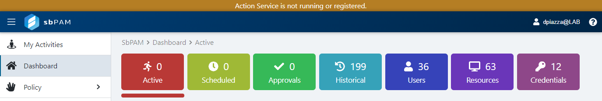
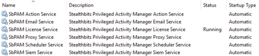
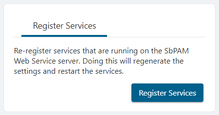

# Services Are Not Running

## Summary

If Netwrix Privilege Secure services are down, you will receive a warning at the top of the user interface. This article outlines steps that you can take to bring Netwrix Privilege Secure services back online.



## Instructions

If a warning appears at the top of the Netwrix Privilege Secure interface stating a service is offline, take the following steps to attempt to bring the affected service back online.

1. Check the services on the server
   - Open **Windows Services** and verify whether any Netwrix Privilege Secure services are not running.  
   - Example screenshot:
     
     

   - If any services are not running, start them using the **Windows Services** interface or run the following in an elevated PowerShell:

     ```powershell
     Start-Service sbpam*
     ```

   - In this instance 1 out of the 5 services are running, so you can manually start the services by opening `services.msc` on the local Netwrix Privilege Secure server.

2. Re-register services in the web UI (if services are running but the UI still shows a warning)
   - If all Netwrix Privilege Secure services are running in **Windows Services** yet there's still a services warning in the Netwrix Privilege Secure web application interface, re-register the services with Netwrix Privilege Secure.
   - Log in to Netwrix Privilege Secure's web application as an Admin.
   - In the upper-right, click the current logged-in user's name, then click **Settings**, and then click **Register Services**.

   

   

3. If issues persist
   - Gather Netwrix Privilege Secure's logs by following the steps in this article: https://kb.netwrix.com/5874
   - Contact Netwrix Support: https://www.netwrix.com/support.html

If issues continue after these steps, provide the gathered logs to Netwrix Support for further assistance.
