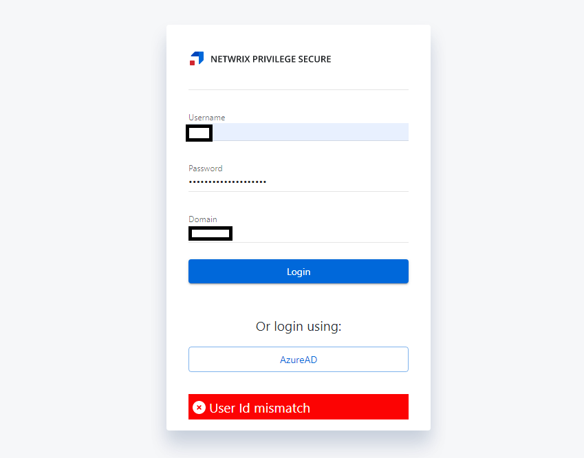

# Troubleshooting a "User Id Mismatch" Error During Login

## Summary

When logging into the Netwrix Privilege Secure console, you may receive a "User Id Mismatch" response that prevents login. This is caused when there is a mismatch between a Netwrix Privilege Secure user stored in a cookie, and the user attempting login. Generally this is caused when multiple sessions are being launched from the same browser using different users.

## Instructions

1. Log out of all active Netwrix Privilege Secure sessions.
2. Clear your browser's cookies.
3. Reattempt login using your desired account. You should now be able to successfully log in.
