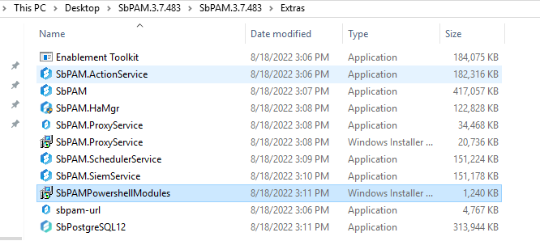
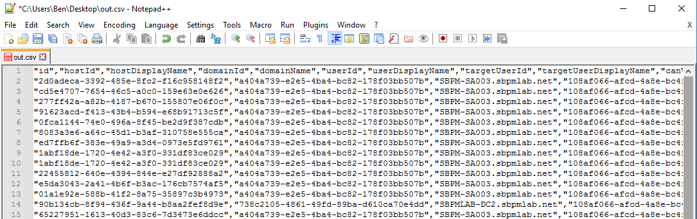

# Exporting the Activity Log as a CSV

## Summary

Exporting the "Activity Log" report is a common auditing and compliance use case. This article provides a scripted method of exporting the Activity Log data from Netwrix Privilege Secure.

## Instructions

1. On your Netwrix Privilege Secure server, ensure that PowerShell 7.1 is installed. It can be obtained from the official PowerShell github repository: https://github.com/PowerShell/PowerShell/releases/tag/v7.1.7. _Note: This specific version of PowerShell is a necessary prerequisite to running the SbPAM API. Do not install PowerShell 7.2+._

2. Locate the "Extras" folder, which was packaged alongside your Netwrix Privilege Secure installer. Run the `SbPAMPowerShellModules` installer.  
   

3. In your preferred text editor, paste the following PowerShell script. Save it as `ActivityReport.ps1`.

```powershell
[cmdletbinding()]
param(
    [Parameter(Mandatory)][PSCredential]$UserCred,
    [Parameter()][String]$UserCode = $null,
    [Parameter(Mandatory)][String]$SbPamUrl,
    [Parameter(Mandatory)][datetime]$StartDate,
    [Parameter(Mandatory)][datetime]$EndDate,
    [Parameter()][string]$FilePath = "out.csv"
)

Import-Module SbPAMAPI -Force

function Renew-Token {
    [CmdletBinding()]
    param (
        [string]
        $Token,
        $Uri
    )
    $mfaObj = Convert-SbPAMToken $Token
    if ($null -eq $global:expiration) {
        $global:expiration = Get-Date -UnixTimeSeconds $mfaObj.exp
    }

    if ($global:expiration -lt (Get-Date).AddMinutes(7)) {
        Write-Host "$(Get-Date) Refreshing token"
        $Token = Invoke-SbPAMRest -Uri "$Uri/api/v1/UserToken" -Token $Token -ErrorAction Stop -SkipCertificateCheck
        $mfaObj = Convert-SbPAMToken $Token
        $global:expiration = Get-Date -UnixTimeSeconds $mfaObj.exp
    }
    return $Token
}

function Get-SbPAMActivitySessionReport {
    param(
        $Uri,
        $Token,
        $StartDate,
        $EndDate
    )
    $Token = Renew-Token -Uri $Uri -Token $Token
    $Skip = 0
    $Take = 100
    $StartDateString = $StartDate.ToUniversalTime().ToString("yyyy-MM-ddTHH:mm:ssZ")
    $EndDateString = $EndDate.ToUniversalTime().ToString("yyyy-MM-ddTHH:mm:ssZ")
    
    $ApiUri = "$($Uri)/api/v1/ActivitySession/Search?skip=$($Skip)&filterText=&filterDateTimeMin=$($StartDateString)&filterDateTimeMax=$($EndDateString)&filterTopUsersType=1&take=$Take"
    $Data = @()
    
    $Results = Invoke-SbPAMRest -Uri $ApiUri -SkipCertificateCheck -Token $Token
    while ($Results.Data.Length -ge $Take) {
        $Data += $Results.Data
        $Skip += $Take
        Write-Progress -Activity "Fetching activity report from $StartDate to $EndDate" -PercentComplete 0 -Status "$Skip of $($Results.recordsTotal) $($Results.Data.Length)"
        
        $ApiUri = "$($Uri)/api/v1/ActivitySession/Search?skip=$($Skip)&filterText=&filterDateTimeMin=$($StartDateString)&filterDateTimeMax=$($EndDateString)&filterTopUsersType=1&take=$Take"
        $Results = Invoke-SbPAMRest -Uri $ApiUri -SkipCertificateCheck -Token $Token
    }
    $Data += $Results.Data
    $Data
}

# "https://192.168.77.99:6500/api/v1/ActivitySession/Search?skip=0&filterText=&filterDateTimeMin=2022-07-01T05:00:00.000Z&filterDateTimeMax=2022-08-24T04:59:59.999Z&filterTopUsersType=1&take=30" 
# Create the web session
$WebSession = New-Object Microsoft.PowerShell.Commands.WebRequestSession
# Set up the user credentials - MFA and JWT objects
$userToken = Get-SbPAMToken -Credential $userCred -Uri $SbPamUrl -WebSession $WebSession -SkipCertificateCheck -ErrorAction Stop
if ("" -eq $UserCode -or $null -eq $UserCode) {
    $userCode = Read-Host -Prompt "Enter MFA code"
}
$userToken = Get-SbPAMMfaToken -Uri $SbPamUrl -Token $userToken -Code $userCode -WebSession $WebSession -SkipCertificateCheck -ErrorAction Stop

Write-Progress -Activity "Fetching activity report from $StartDate to $EndDate" -PercentComplete 0 -Status "Fetching..."
Write-Host "Exporting From $StartDate to $EndDate to $FilePath"

$Data = Get-SbPAMActivitySessionReport -Uri $SbpamUrl -Token $userToken -StartDate $StartDate -EndDate $EndDate

$Data | ConvertTo-Csv -NoTypeInformation -UseQuotes Always | Out-File -FilePath $FilePath
Write-Host "Export complete found $($Data.Length) records"
```

4. Open up PowerShell 7. Navigate to the directory containing `ActivityReport.ps1`, and execute the following command:

```powershell
.\ActivityReport.ps1
```

5. You will be prompted for a Netwrix Privilege Secure administrator username and password, your Netwrix Privilege Secure URL, and an MFA code (if applicable).  
   

6. Your activity data will then be output to a file called `out.csv`.  
   
