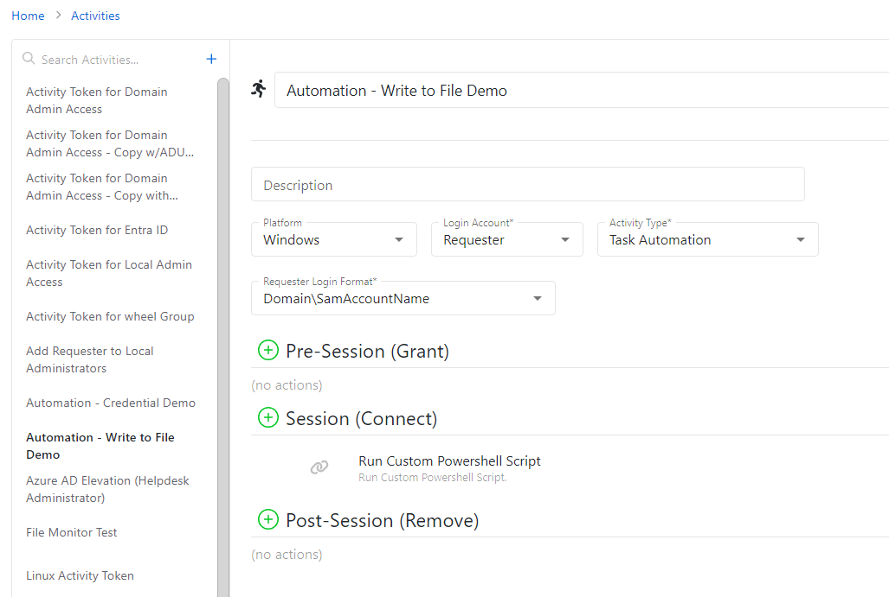

# Task Automation - Write to File on Target Resource

## Overview
This article provides an example of a Task Automation script that can be used to write to a specified file on the targeted resource. This gives a basic framework for using Task Automation to write to files and can be modified as needed. The example provided is a simple find-and-replace script.

## Summary
1. In Netwrix Privilege Secure, navigate to the **Activities** page and create an Activity with the **Task Automation** Activity Type. The activity should be configured to provide sufficient privilege to remotely execute scripts on the target resource, and the **Login Account**, **Requester Login Format**, and **Pre- and Post-Session** action steps should reflect this.  
   

2. In the **Session** of the Activity, click the **+** button and add a **Run Custom Powershell Script** action step.

3. Supply the following script block inside of the action step:

```powershell
$findString = "findMe"
$replaceString = "replaceMe"
$filePath = "C:\sampledir\example.txt" #specify your file path here!

Import-Module (Join-Path $SbPAMScriptDirectory "SbPAMWindows.psm1")
if (![string]::IsNullOrEmpty($HostId)) {
    $targetHost = Get-SbPAMHost -Id $HostId
    if ($null -eq $targetHost -or [string]::IsNullOrEmpty($targetHost.DnsHostName)) {
        Write-Error "Unable to find host."
        exit 2
    }
    Write-Host (ConvertTo-Json $targetHost)
}

$session = New-SbPAMPSSession -RemoteHost $targetHost -Credential (Get-PSCredential -Credentials $Credentials)
if ($null -ne $session) {
	try{
	Add-SbPAMActionLog -Type Info -Message "Running custom powershell script block - Write to File: $filePath - Find: $findString - Replace: $replaceString"
	Invoke-Command -Session $Session -ArgumentList $findString,$replaceString,$filePath `
		-ScriptBlock {
			param($findString,$replaceString,$filePath)

			try {
				(Get-Content $filePath).Replace($findString,$replaceString) | Set-Content $filePath
				Add-SbPAMActionLog -Type Info -Message "Running custom powershell script block - Write to File - SUCCESS"
			}
			catch {
				Add-SbPAMActionLog -Type Info -Message "Running custom powershell script block - Write to File - ERROR"
			} } -ErrorAction SilentlyContinue 
	}
	finally {Remove-PSSession -Session $session}
}

Add-SbPAMActionLog -ActionQueueActionId $ActionQueueActionId -Type Info -Message "Finished custom powershell script block - Write to File: $filePath - Find: $findString - Replace: $replaceString"
```

4. Modify the script block according to your needs. This example is for a find-and-replace, with the ` $findString` and ` $replaceString` containing the original and replacement values, and the ` $filePath` containing the local path for the target file. This is just a basic example and can be modified for different use cases.

5. Save the activity. Ensure that the activity is added to an **Access Policy**. You can now run the activity; it will find/replace strings in the targeted file on the targeted resource.
