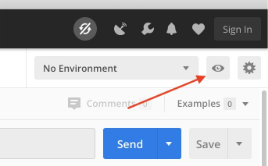
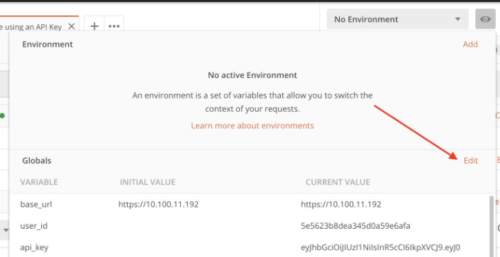
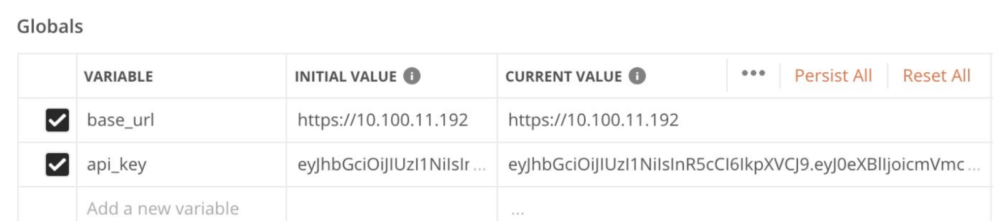
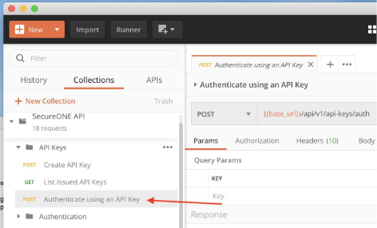
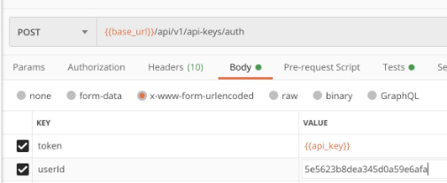
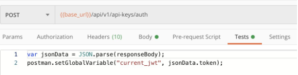
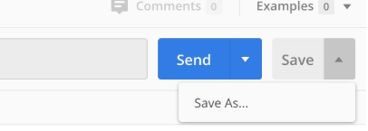
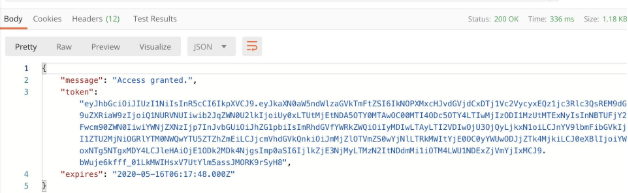

# Authenticate Using an API Key in Postman

## Overview

Postman is free to download at [postman.com/downloads](https://www.postman.com/downloads/). Use these instructions to authenticate against the Privilege Secure Discovery API using an API key and store the resulting JWT token as a global variable.

Refer to the NPS-D API documentation for a full list of available endpoints and usage.

## Prerequisites

You need:
- A valid **userId**
- An **API Key** generated for that user

## Instructions

1. Open Postman.

2. Click the **eye icon** in the upper-right corner.
   

3. Click **Edit** next to **Globals**.
   

   Add the following variables:

   - **api_key**
     - Initial Value: *your API key*
     - Current Value: *your API key*

   - *(Optional)* **base_url**
     - Enter the SecureONE environment URL if required.

   

4. Navigate to the **SecureONE API collection**, expand **API Keys**, and select **Authenticate using an API key**.
   

5. Click the **Body** tab and enter the **userId** associated with the API key.

> **NOTE:** `{{api_key}}` automatically pulls from the global variable.

   

6. Click the **Tests** tab.
   

   Paste the following:

   ```javascript
   var jsonData = JSON.parse(responseBody);
   postman.setGlobalVariable("current_jwt", jsonData.token);
   ```

7. Click **Save**, or use **Save As** to store it separately.
   

8. Click **Send** and verify the response appears at the bottom. You should receive a token in the response.
   

9. You can now send **GET** and **POST** requests using the stored `current_jwt` token.

> **NOTE:** The authentication token expires every 8 hours. Re-run the **Authenticate using an API key** request to refresh it.
