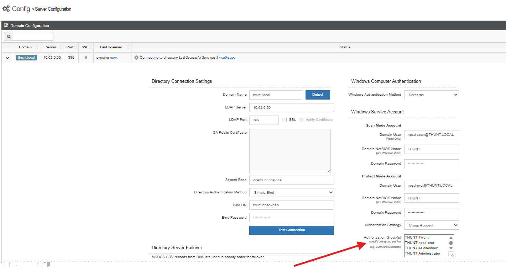

# Authorization Groups Feature

## Overview

The **Authorization Group(s)** feature is available in the UI and was introduced in version **2.20.5**.

It is associated with migration **47**:
- **Name:** `service_account_group_strategy`
- **Description:** Service Account Authorization Strategy

This feature requires a database toggle to be enabled after the migration is applied during an upgrade.



## Instructions

### Enable the Feature

1. Verify migration status:
   ```bash
   s1 migrate status
   ```

2. If migration 47 is present but the feature is not enabled, connect to the database via CLI and run:

   ```javascript
   db.release_toggles.updateOne(
     { "name": "service_account_group_strategy" },
     { $set: { "enabled": true } },
     { upsert: false }
   )
   ```

### Configure the Feature

1. Set **Authorization Strategy** to `Group Account`.
2. Add groups to the **Authorization Group(s)** field.
3. Click **Save** under Domain Configuration.

## Resulting Behavior

After systems are refreshed or rescanned:

* Groups are set to:
  * `onSystem = True`
  * `Persistent = True`
* In the UI:
  * The **Action** button is removed.
  * No modifications can be made by users or admins.
* Account type is set to **SecureONE** (service account).

> **WARNING:** This effectively grants **full access to all members of the group**. This feature is designed for service account protection scenarios only — misuse can unintentionally grant broad access. Use with caution and proper validation.

## Known Limitations

This feature is being used beyond its original design, so the full extent of limitations remains unknown. Current unknowns:

* Maximum number of groups supported
* Behavior may vary depending on system refresh or rescan
* Locks configuration, preventing further UI changes

### Verify the Configuration

#### Group and Account Update Steps

1. Log in to the UI using an AD account.
2. Navigate to:

   ```
   Configure → Server
   ```
3. Expand **Domain Configuration**.
4. Ensure:

   ```
   Authorization Strategy = Group Account
   ```

#### Bulk Group Testing

Groups can be added in batches using the format:

```
DOMAIN\GroupName
```

Tested batch sizes:

* 30 groups
* 60 groups
* 90 groups
* 200 groups

To add a batch:

1. Copy the group list from a text editor.
2. Paste into the **Authorization Group(s)** field.
3. Scroll down.
4. Click **Save**.
