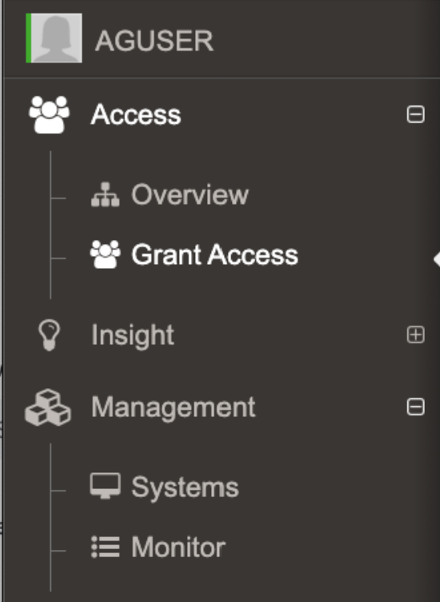

# How MySystems Works for Netwrix Privilege Secure for Discovery (formerly SecureONE) Users

Formerly SecureONE

## Question
For Netwrix Privilege Secure for Discovery (formerly SecureONE) users, how does MySystems work?

## Answer

> **IMPORTANT:** This relates to the 2.16 change* where user accounts can only see the systems they have proper access to

### Main Document
When you sign in, you will have access to:

- **Overview**
- **Grant Access**
- **Insight**
- **Systems**
- **Monitor**

> **NOTE:** Insights may or may not be available depending on how the environment is configured. This can be an Admin only feature

The change from 2.16 implemented a cache called **MySystems** which is created upon login*.



### JITA / Persistent Access
If you have a **User role**, searches for computers in **Grant Access**, **Insights** or **Systems Management**, or queries via the API, will be restricted to systems where you have JITA access or where you are Persistent.

JITA access is provided when an AD user account is in the Administrators Inventory for a system. The user can be in the Administrators Inventory for a system in three ways:

- Directly in the Administrators Inventory
- Being a member of an AD group that is in the Administrators Inventory
- Being a member of an AD group that is nested in an AD group in the Administrators Inventory

You are considered Persistent on a system when:

- Your user account is directly in the Administrators Inventory and set to persistent
- You are a member of an AD group in the Administrators Inventory that is set to persistent
- You are a member of an AD group that is nested in a persistent AD group in the Administrators Inventory

### Appendix
The API endpoint associated to creating the cache for MySystems is:

```
/api/v1/mysystems/createcache
```

### User Role only sees My Systems
When a User role searches for computers in **Grant Access**, **Insights** or **Systems Management**, or via API, the results will be restricted to computers on which you have Persistent or JITA access. Prior to this change (2.16) when a user attempted to JITA or interact to an endpoint where they lacked access they would receive `403 Forbidden`.

> * This has changed in versions 2.17.2 and onward, where it's generated after login when a user interacts with the Grant Access search or the Management > Systems. There is a toast notification that pops up when the mySystems cache is being generated indicating it's not yet complete.


