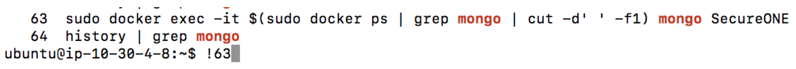
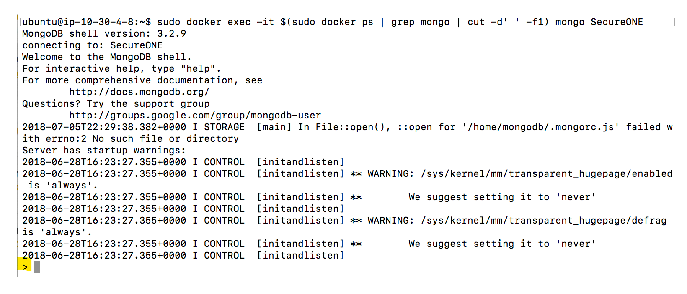

# How to Access MongoDB

Netwrix Privilege Secure Discovery (formerly SecureONE)

## Overview

Access the MongoDB shell by first logging in to the Netwrix Privilege Secure Discovery appliance directly via SSH. The appliance must already be running and properly configured in order to connect to MongoDB.

> **NOTE:** Only utilize the connection approach in this section if the query data being returned is small, such as a **.count()** function or a small data set, as this approach will not export the information but will only display it in the Terminal window.

## Connect to the MongoDB shell

From the terminal, enter the following command, which executes the Docker container by specifying the container ID, and then automatically begins using the SecureONE document collection once the shell is established:

### Single Node:

```bash
sudo docker exec -it $(sudo docker ps | grep mongo | cut -d’ ‘ -f1)
mongo SecureONE
```

### Cluster:

```bash
sudo docker exec -it $(sudo docker ps | grep mongo | cut -d’ ‘ -f1)
mongo mongodb://mongo1,mongo2,mongo3/SecureONE?replicaSet=secureone
```

## Use command history to re-run previous commands

If this command has ever been entered before, another option is to enter:

```bash
history | grep mongo
```

This will return a list of numbered results. Locate the line above, and either copy and paste it into the terminal window or enter an `‘!’` followed by the number located next to the history line. Executing the command this way will execute the command located on the specified line number from the `‘history’` output.



Once a successful MongoDB shell connection has been established, the following screen will appear indicating a successful establishment of a MongoDB shell. The '>' character at the bottom indicates a fresh line waiting for commands.

Example:



Now, the shell is ready to run the queries that follow.

> **NOTE:** Some queries may require moderate computing resources, and scanning may slow down while they are running.
