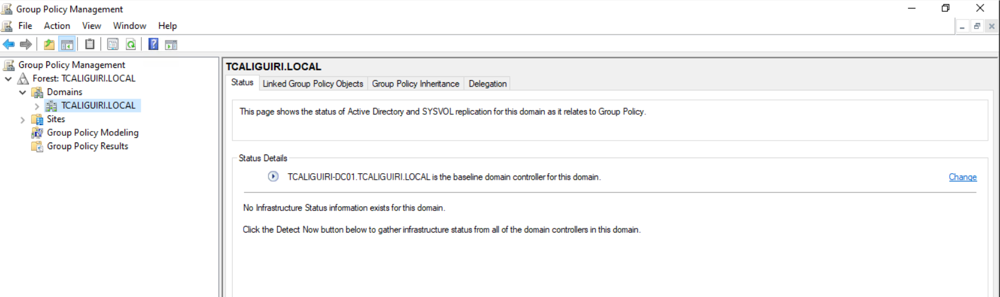
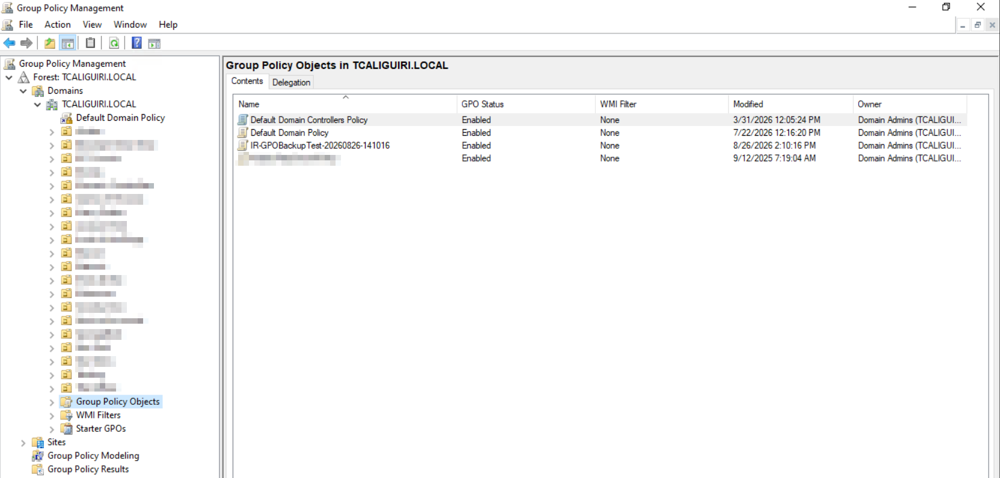
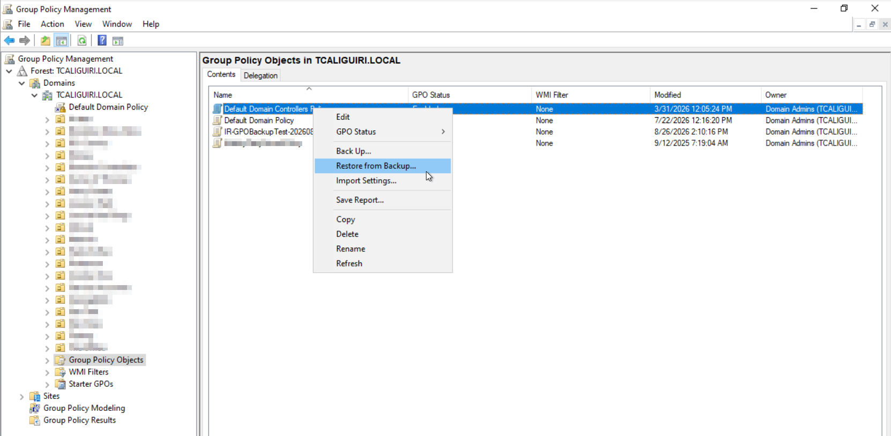
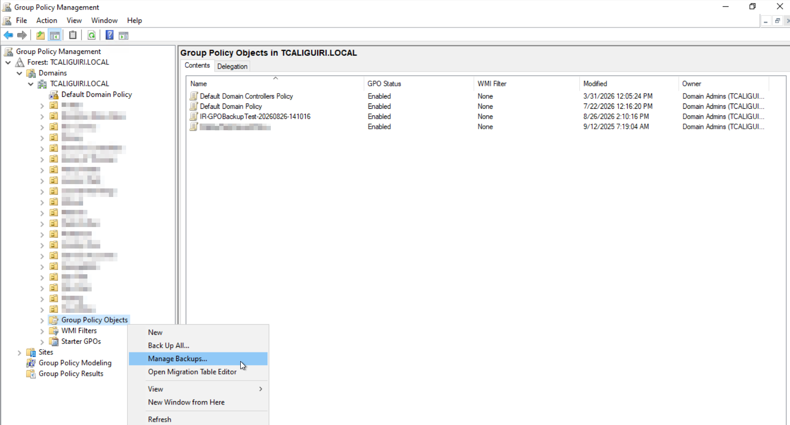
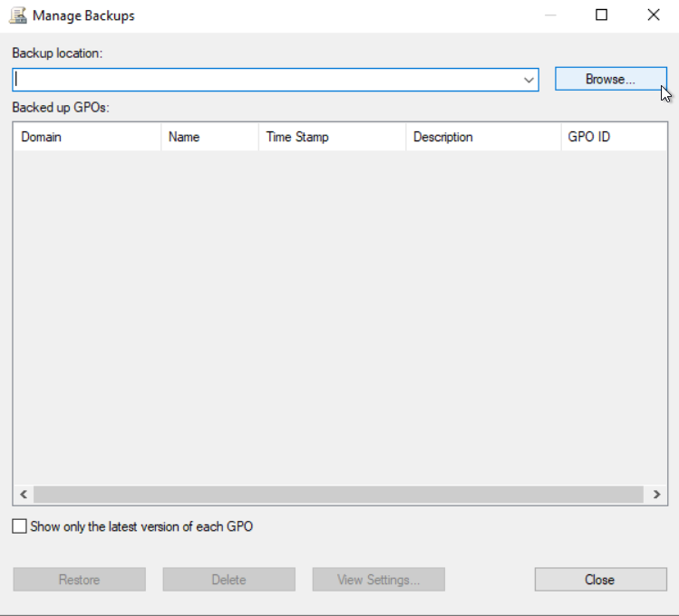
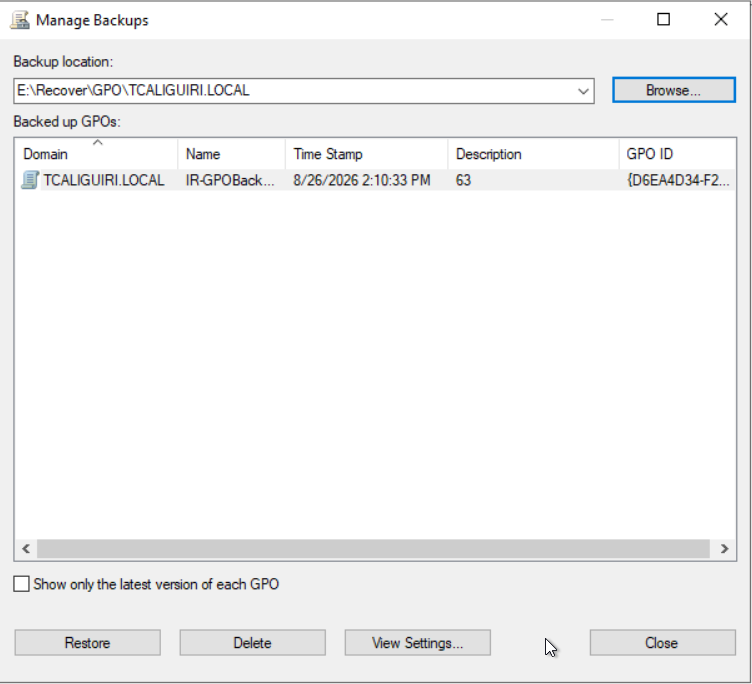
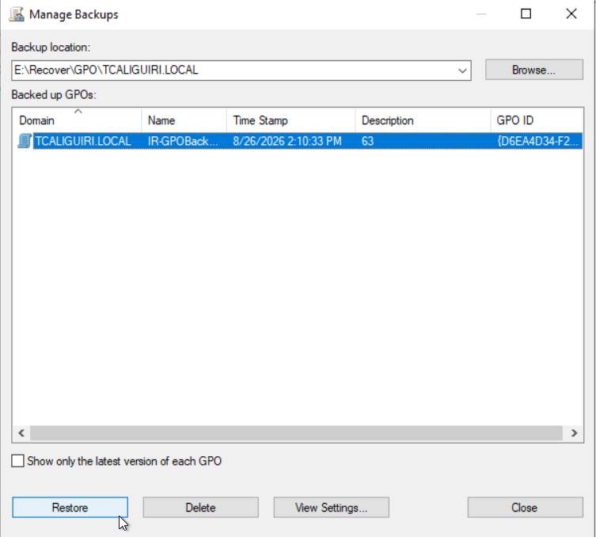
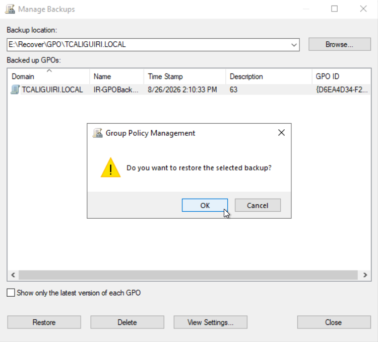
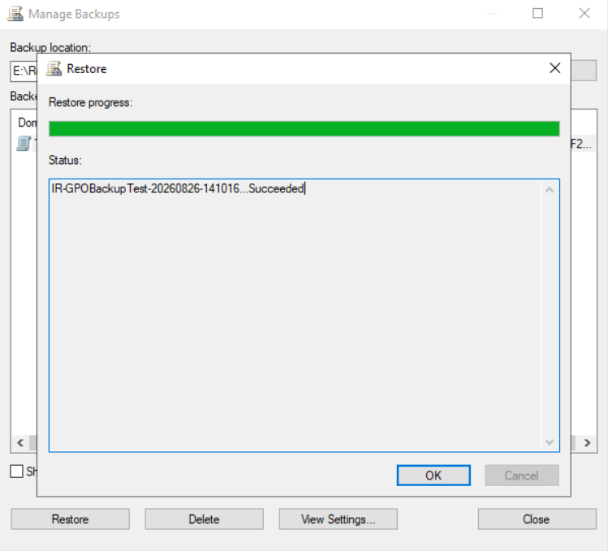

# Restoring a GPO from Backup Using GPMC

## Overview

This article describes how to restore a GPO's actual settings from an Identity Recovery GPO backup using the Group Policy Management Console (GPMC), pointed at the Identity Recovery GPO backup path. This restores the GPO's actual settings, not just its AD-side permissions or linking. Rollback and recovery actions inside the Identity Recovery console only ever restore AD attributes, never settings content.

### Before You Start

- You will need permissions to manage Group Policy in the target domain. See [Identifying Service Accounts and Required Permissions](/docs/kb/recoveryad/configuration-and-administration/identifying-service-accounts-and-required-permissions) to confirm which accounts have this access.
- Locate the backup share/path configured for GPO backups on the domain configuration page in Identity Recovery.
- Know which GPO you need to restore.

> **NOTE:** Folder names under the backup path are not the GPO's own GUID. They are a separate ID per backup instance. To match a folder to a GPO, check `manifest.xml` in the root of the backup location. Each `<BackupInst>` entry lists the backup instance ID (matching the folder name), the real `<GPOGuid>`, and the `<GPODisplayName>`.

## Instructions

1. Open **GPMC** on a machine with access to the target domain.

   

2. Expand your domain and click **Group Policy Objects**.

   

3. GPMC offers two ways to start the restore, depending on whether the GPO still exists:

   - **If the GPO still exists**, right-click it and select **Restore from Backup**.

     

   - **If the GPO was deleted** (including reanimated from the AD Recycle Bin and showing as broken or unmodifiable), right-click **Group Policy Objects** and select **Manage Backups** instead.

     

4. Click **Browse** and point it at the backup path for this domain.

   

5. GPMC lists the available backups at that location. GPMC already filters the **Restore from Backup** list to the current GPO, but the **Manage Backups** list shows every backed-up GPO. Use the name, timestamp, or the GUID lookup above to find the right one.

   

6. Select the backup you want and click **Restore**.

   

7. Confirm the restore.

   

   

8. Open the GPO in the Group Policy Management Editor to confirm the settings match the expected backup point.

### What This Does and Does Not Restore

- **Restores:** the GPO's settings content, its ACL/permissions, and its WMI filter link.
- **Does not restore:** where the GPO is linked (links live on the OU/domain/site, not the GPO itself). If the GPO shows up unlinked after this restore, re-link it manually using one of the following options:
   - In GPMC, right-click the OU or domain and select **Link an Existing GPO...**.
   - Use the `Set-GPLink` PowerShell cmdlet.

> **IMPORTANT:** Do not use Identity Recovery's rollback feature to restore a lost link by rolling back the OU's `gPLink` attribute. `gPLink` is a plain string, but its contents follow a specific bracketed format GPMC expects (`[LDAP://<GPO DN>;<link options>]`). Writing it back through a generic attribute rollback can result in AD accepting the value while GPMC still does not recognize the link, even after `gpupdate /force`. Re-linking manually in GPMC is the reliable path.

### If the Backup Location Is Empty or the GPO Is Not Listed

The backup for this GPO likely does not exist yet. Confirm with your Identity Recovery administrator that GPO backups are working for this domain before troubleshooting the restore itself further.
