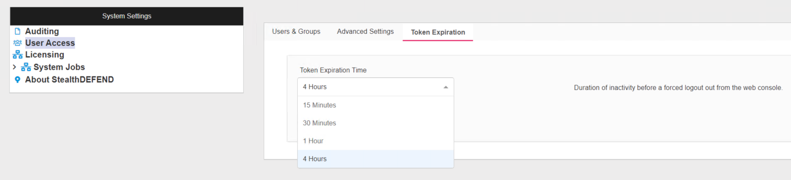

# How to change Netwrix Threat Manager’s inactivity timer

## Issue
It can be annoying for users when their Netwrix Threat Manager console times out due to inactivity.

## Instructions
1. Log into Netwrix Threat Manager with an admin account
2. Click the **settings wheel**
3. Click **System Settings**
4. Click into **User Access** then select the **Token Expiration** tab
5. Adjust timer from the drop down

