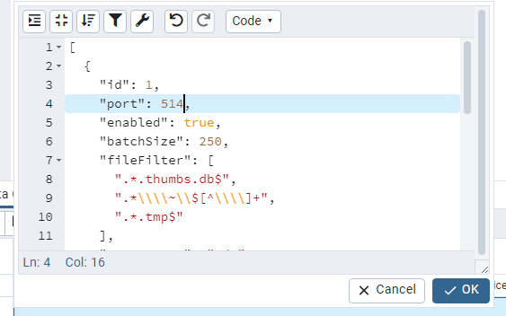

# How to Customize Event Service Listening Port(s)

## Symptoms
You need to customize Threat Manager listening ports for the Event Service due to customer or environmental requirements.

## Cause
Customer or environmental requirements dictate that the default Netwrix Threat Manager Event Service listening port(s) must be changed.

## Resolution
Alter the default Netwrix Threat Manager Event Service listening port(s) via PGAdmin:

1. Install the latest PGAdmin Console: https://www.pgadmin.org/download/
2. Reach out to Netwrix support to gain access to the Netwrix Threat Manager database.
3. Select **Tables** > **defend_config table**
4. Right click and select **View/Edit Data** > **First 100 Rows**
5. Change the Value for the port in question on line 2 (`10000` is the Default FS Port and `10001` is the Default AD Port):

```json
[{"id":1,"port":10000,"enabled":true, ...}{"id":2,"port":10001,"enabled":true, ...}{...}]
```

For example, change the FS port to `514` and click **OK**:  


6. In the window below click the **Save Data Changes** icon.
7. Restart the Netwrix Threat Manager Event Service.
