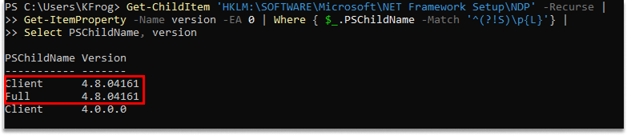

# .NET Dependencies for Netwrix Threat Manager

## Related Query

- ".NET on the Netwrix application server is End-Of-Life (EOL). Is it safe to remove it?"

## Question

Which version of .NET is required for Netwrix Threat Manager?

## Answer
For NTM Versions running PostgreSQL version 14.X Netwrix Threat Manager requires ASP.NET Core 8.0.11 (or newer) and .NET Desktop Runtime 8.0.11 (or newer). 
For NTM version running PostgreSQL version 18.X Netwrix Threat Manager requires ASP.NET Core 10.0.10 (or newer) and .NET Desktop Runtime 10.0.10 (or newer).

See also [Netwrix Threat Manager Requirements Version 3.0](https://docs.netwrix.com/docs/threatmanager/3_0/requirements/server) in **Getting Started**.
[Netwrix Threat Manager Requirements Version 3.1](https://docs.netwrix.com/docs/threatmanager/3_1/requirements/server)
[Netwrix Threat Manager Requirements Version 3.2](https://docs.netwrix.com/docs/threatmanager/3_2/requirements/server)
[Netwrix Threat Manager Requirements Version 3.3](https://docs.netwrix.com/docs/threatmanager/3_3/requirements/server)

:::note
.Net componments may be upgraded within the same major release independent of Netwrix Threat Manager. 

.NET Framework and ASP.NET Core are separate components — installing one does not install the other. ASP.NET Core and .NET Desktop Runtime appear in the list of installed Apps & features. .NET Framework does not appear on that list. You can check which versions of .NET Framework you have installed by running the following command in PowerShell:
:::

```powershell
Get-ChildItem 'HKLM:\SOFTWARE\Microsoft\NET Framework Setup\NDP' -Recurse | 
    Get-ItemProperty -Name version -EA 0 | Where { $_.PSChildName -Match '^(?!S)\p{L}'} | 
    Select PSChildName, version
```

Example:



## Related Articles

- [Netwrix Threat Manager Requirements](https://docs.netwrix.com/docs/threatmanager/3_0/requirements/server)
- [.NET Dependencies for Netwrix Access Analyzer](/docs/kb/accessanalyzer/installation-and-upgrades/net_dependencies_for_netwrix_access_analyzer)
- [.NET Dependencies for Netwrix Activity Monitor](/docs/kb/activitymonitor/best-practices-and-reference/net_dependencies_for_netwrix_activity_monitor)
- [.NET Dependencies for Netwrix Threat Prevention](/docs/kb/threatprevention/configuration-and-administration/net_dependencies_for_netwrix_threat_prevention)
- [.NET Dependencies for Netwrix Recovery for Active Directory](/docs/kb/recoveryad/configuration-and-administration/net_dependencies_for_netwrix_recovery_for_active_directory)