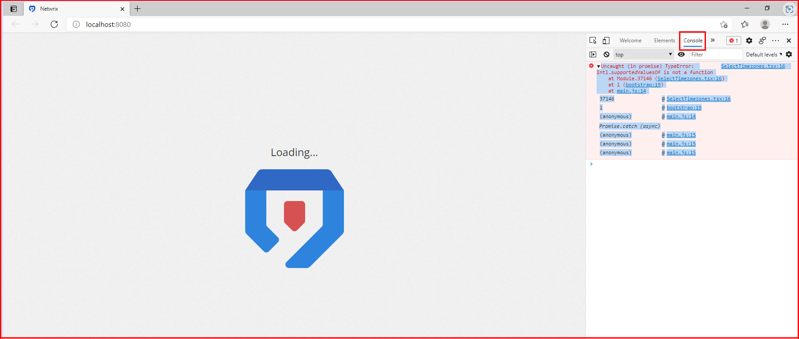

# Dashboard Stalls at Initial Loading Screen in Microsoft Edge

## Symptoms

- The Netwrix Threat Manager Dashboard in Microsoft Edge stalls at the loading screen and does not proceed to the login screen.
- The following error is present in the Developer Tools **Console** panel. To access the panel, navigate to **Settings (...) > More tools > Developer tools** (or press `CTRL + SHIFT + I`) > **Console** tab:

## Cause

The version of Microsoft Edge being used is outdated.

## Resolution

Follow the steps below to update Microsoft Edge to the latest version:

1. In Microsoft Edge, navigate to the **About** window by selecting **"..." > Settings > About**.
2. At the top of the window, click the button to update or check for updates.

> **NOTE:** An offline installer for the latest version of Microsoft Edge is available here:  
> [Download and Deploy Microsoft Edge for Business ⸱ Microsoft &#129125;](https://www.microsoft.com/en-us/edge/business/download?form=MA13FJ)

## Related Article

- [Download and Deploy Microsoft Edge for Business ⸱ Microsoft &#129125;](https://www.microsoft.com/en-us/edge/business/download?form=MA13FJ)