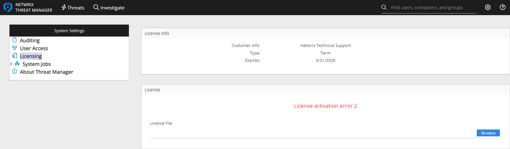

# Netwrix Threat Manager Licensing Error: License Activation Error 2

## Symptom

After navigating to the **Licensing** page when attempting to update the license in Netwrix Threat Manager, you receive the following error:

```
License activation error 2.
```



## Cause

There is a corruption in the existing license file.

## Resolution

1. Stop all **Netwrix Threat Manager** services.
   - You can stop each service individually.
   - Alternatively, stop them all at once by running this PowerShell command:

   ```powershell
   Stop-Service -DisplayName "Netwrix Threat Manager*" -verbose
   ```

2. Delete the `StealthDEFEND.lic` file from Netwrix Threat Manager's data directory.
   - Depending on your deployment, the file may be located in either of these paths:

     - `C:\ProgramData\STEALTHbits\StealthDEFEND\LicenseService`
     - `C:\ProgramData\Netwrix\Netwrix Threat Manager\LicenseService`

   - Delete the `StealthDEFEND.lic` file from the appropriate directory.

3. Restart all **Netwrix Threat Manager** services.
   - You can restart each service individually.
   - Or restart them all at once with this PowerShell command:

   ```powershell
   Start-Service -DisplayName "Netwrix Threat Manager*" -verbose
   ```

4. If you now see an error or a red message that the license is not uploaded, navigate to the **Netwrix Threat Manager Web Console** and add the license again.
   - For assistance applying the license, see the Configuration Guide: Licensing Page.

## Related Article

- Licensing Page